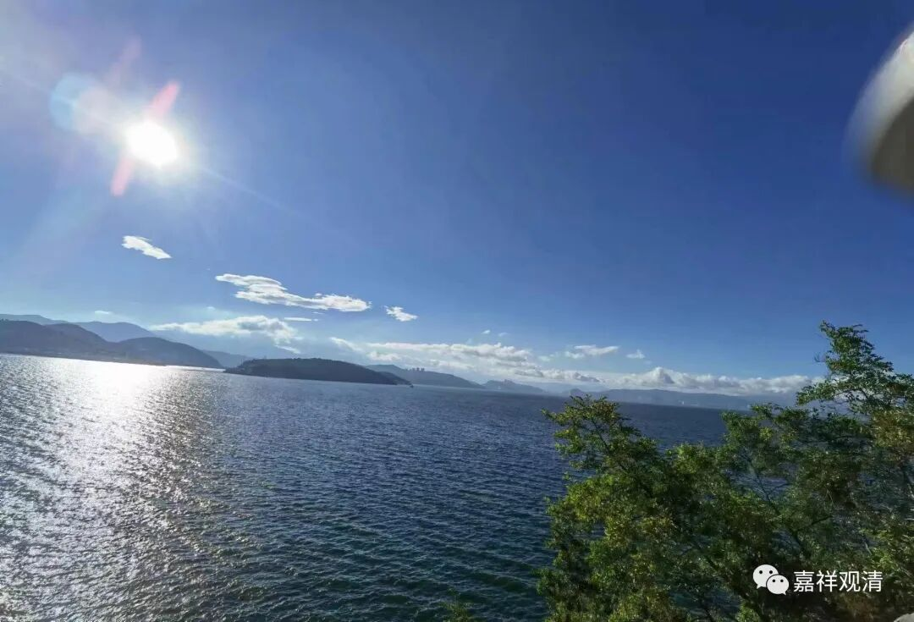

**罗筌寺、罗筌塔**

这些年大理来了两次，两次都没有逛成大理古城。上回是被一个学堂拉去交流，这次法师们去用膳+夜游古城，我则被留在宾馆念经……

第二天一早，法师们便一起退了房，继续点卯游……

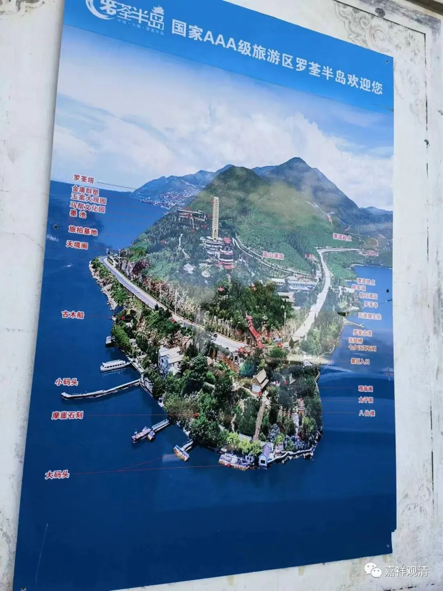

罗筌半岛

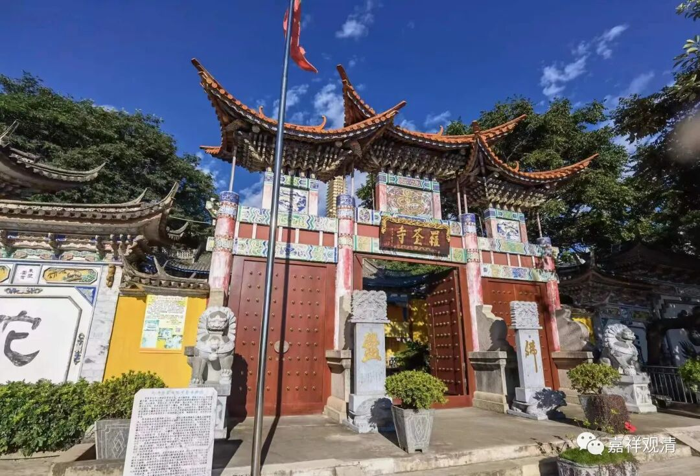

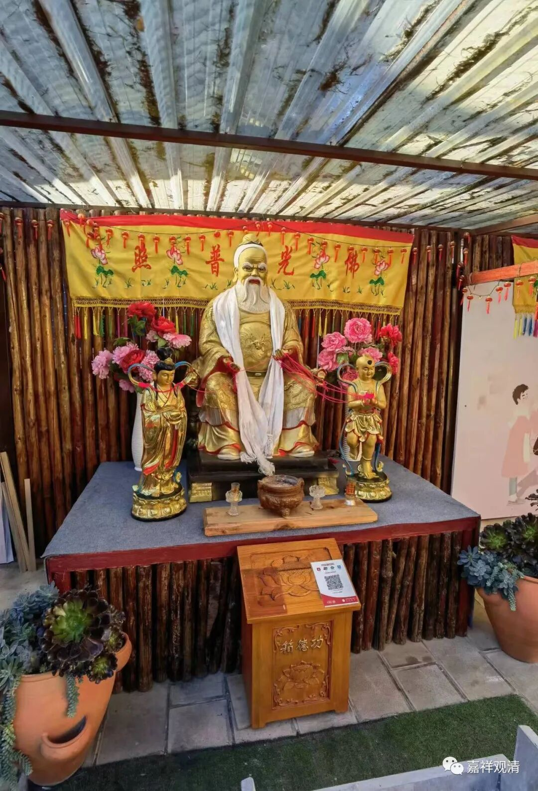

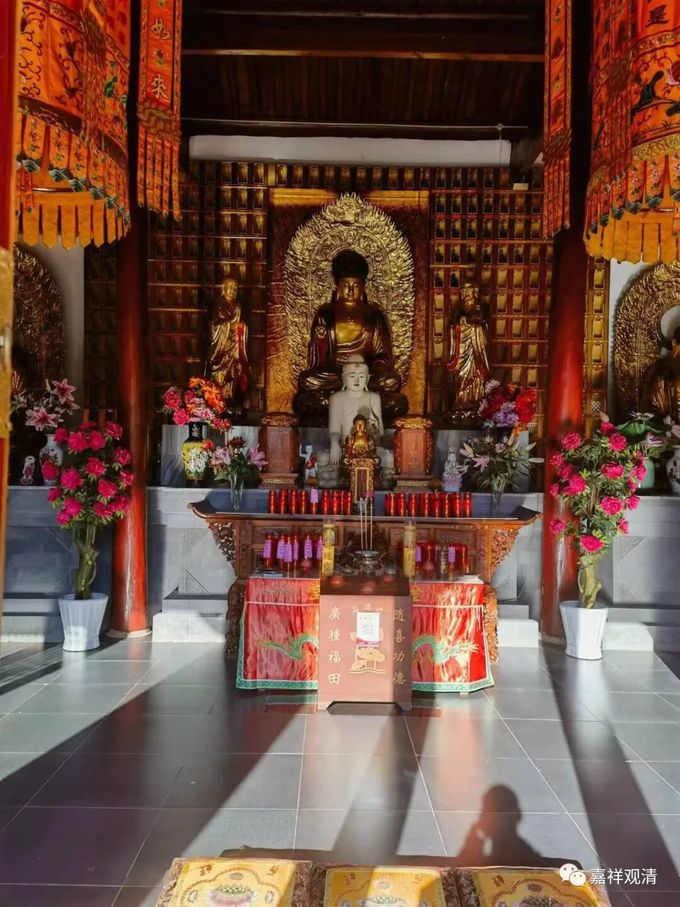

罗筌寺

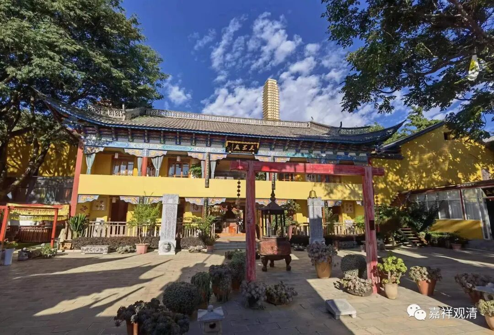

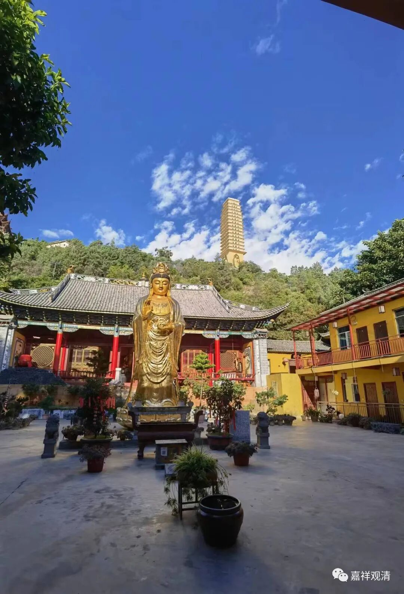

罗筌塔

关于罗筌寺（罗荃寺）罗筌塔（罗荃塔），我看过几篇论文，也有一块罗荃塔砖，大概可以算略知一二吧。

云南博物馆的梵砖

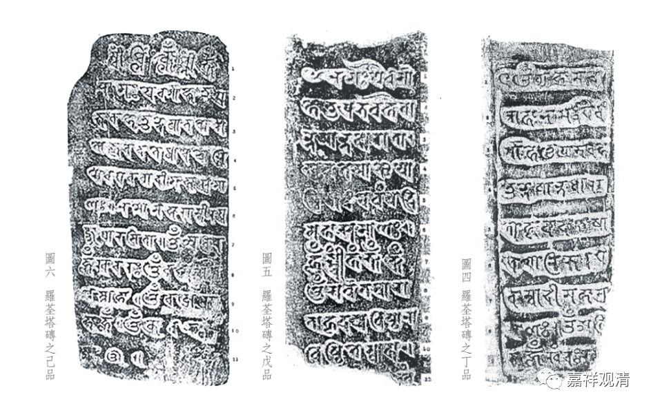

罗荃塔砖拓片之三

罗筌寺和罗筌岛（今天的罗筌半岛）早先可能没有直接关系，而据文献来看，很可能历史上称为“罗筌塔”的不止一座（可能由道安和杨都师分别建立，当然也不能完全说这俩就不能是一个人）……不过“文献不足征”的问题在云南很常见，难以确定；而在口头的传说中，几位佛教“神僧”的故事又大致趋同，所以……不确定的事儿还让他不确定吧……

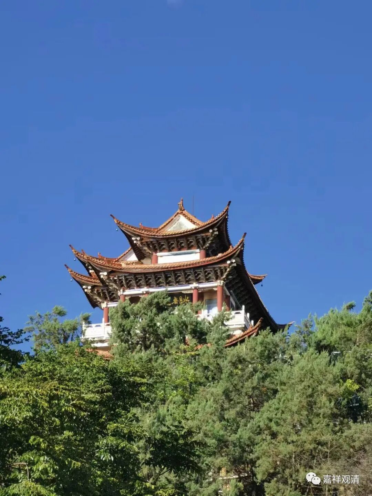

水月无边

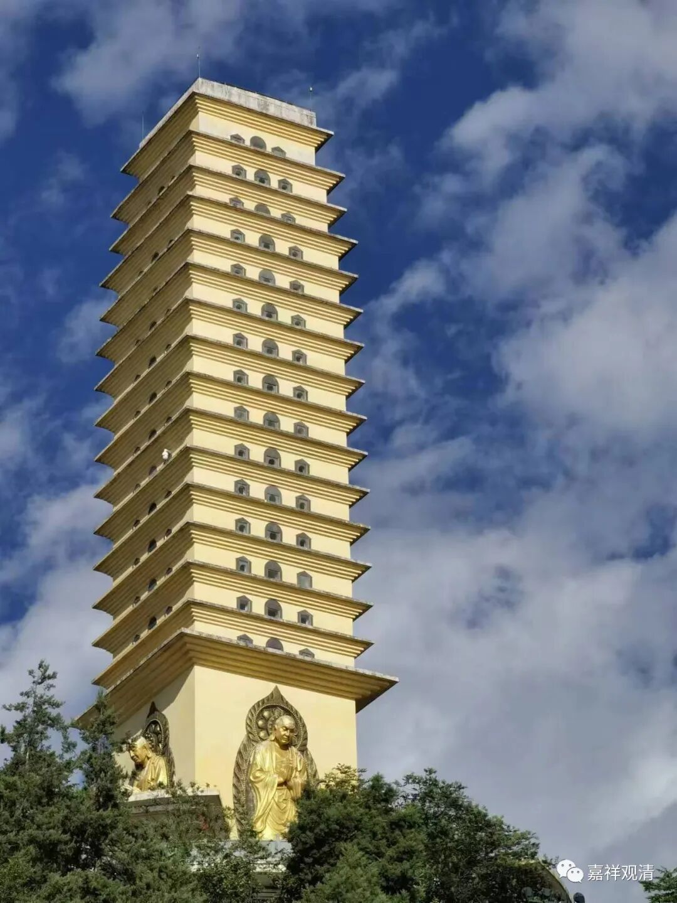

今天的罗筌寺可以看到罗筌塔，但罗筌塔已经不属于罗筌寺而单独划归景区了。所以这个“塔”最后搞成** 没有顶（或者叫平顶）**的模样也就能“理解”了（也不知道设计师和主管部门都是怎么长的脑子）。

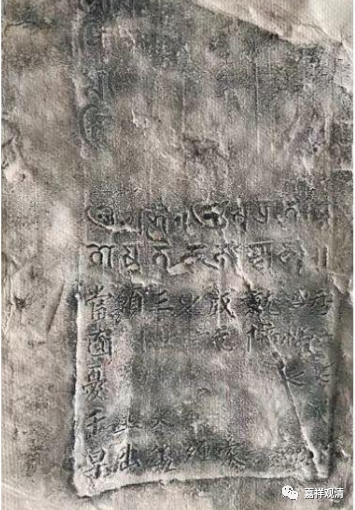

罗荃塔砖拓片

我记得罗筌塔在解放后尚有部分留存，文革时完全被毁，所以民间有塔砖流出。而现在的罗筌塔则是后来重建的。

