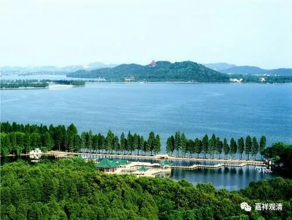

**微课堂佛教史 408·1

我们继续佛教史——禅宗史，现在讲到五祖法演禅师。

这个五祖是指五祖山，也就是我们前面讲过的“东山法门”的东山，在湖北黄梅。你们有人去过吗？我去过一次，四祖寺和五祖寺都去过一次。是什么时候呢？是在武汉新洲的时候，那里举办了一次夏令营，是禅宗的夏令营。

那么我们继续讲五祖法演禅师，他的师父是白云守端禅师。

昨天讲到五祖法演禅师跑到浮山法远禅师这里（一个是法远，一个是法演，别搞混了）。当时浮山法远禅师年纪大了，就说：“这样吧，我给你推荐一个人，白云守端禅师。这位禅师年纪比我小，虽然没有遇到过，但是看他的一些文字就知道是一个很厉害的，有过人之处，你去见他会比较好。”

既然大佬这么说了嘛，五祖法演禅师就听话地去了舒州白云山海会院见白云守端禅师。舒州在哪里呢？在安徽。我在查阅我们白云寺的履历的时候，曾经想看看有过哪些高僧，一看到白云守端禅师：“他的白云是不是就是我们这个白云？”后来一看——虽然不远，但也不是。这也说明叫“白云寺”的还是挺多的。

五祖法演禅师就是这样见到了白云守端禅师，然后呢——关于这个内容，不同的记载有点不一样，但是性质都差不多。那个时候，禅客们经常来来往往地去拜见大师，又会问一些有点像机锋的问题，或者是江湖上的一些公案之类的。于是，就有人问白云守端禅师，问他关于南泉的摩尼珠的公案。摩尼珠的出典应该是《法华经》，后来又出现“我有明珠一颗”这种事情，大致上来说，跟佛性的意思有点关系。

有一种说法是说别人在问，还有一种说法是说五祖法演禅师自己在问。不管怎么样，就是问这个相关的公案。说是被白云守端禅师呵斥，也就是骂他，被一骂以后，汗直接下来了，说是马上有所领会，开悟了。五祖法演禅师就此写了一首偈子呈上去，文字上怎么说的呢？说他** “领悟，汗流被体”**，全身透汗，然后** “乃献投机颂云”**，这个“投机”不是我们今天讲的投机，“投”就是类似于投篮或者投名状的投，“机”就是指的机锋，或者当机（这个时候的意思）。这个“投机”不是我们今天讲的偷机，也不是投机取巧的投机。

这个时候呢，就相当于后世说的开悟或者类似的情况。五祖法演禅师自己呈上了一首偈子：

** “山前一片闲田地，

**叉手叮咛问祖翁；

** 几度卖来还自买，

**为怜松竹引清风。”

具体的意思大家自己猜，我也不是很清楚。“卖来还自买”，是不是说起承转合最重要？是不是说最后还是自家的东西？所以摩尼珠嘛，自己的口袋里面本来就有，是不是这个意思？

说这个时候呢，白云守端禅师就印可他了，承认他了：“可以，可以。”就让他担任侍者。侍者有好多，哈哈，就让他磨墨、掌墨。这个时候到底算不算终极开悟？应该还不是，实际上并没有最后开悟。所以禅宗很多麻烦的地方也在于此——到什么程度才是大悟？

