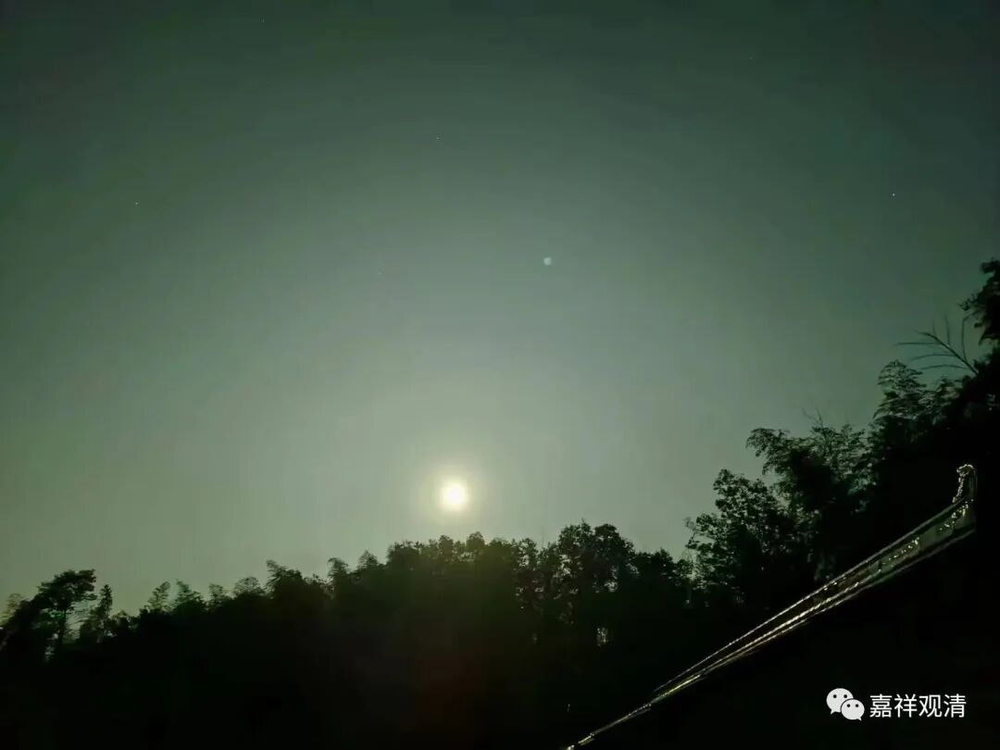
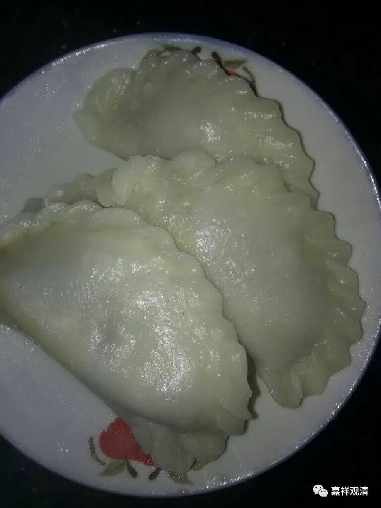
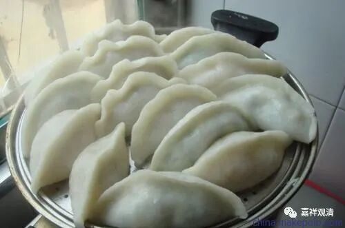
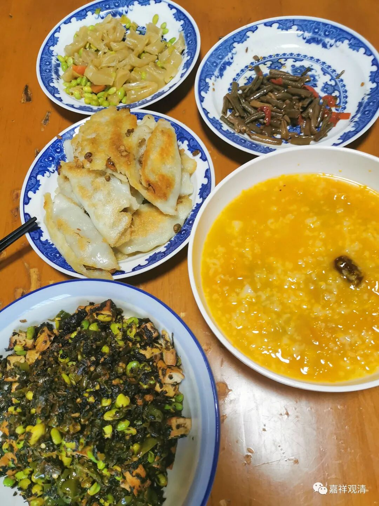
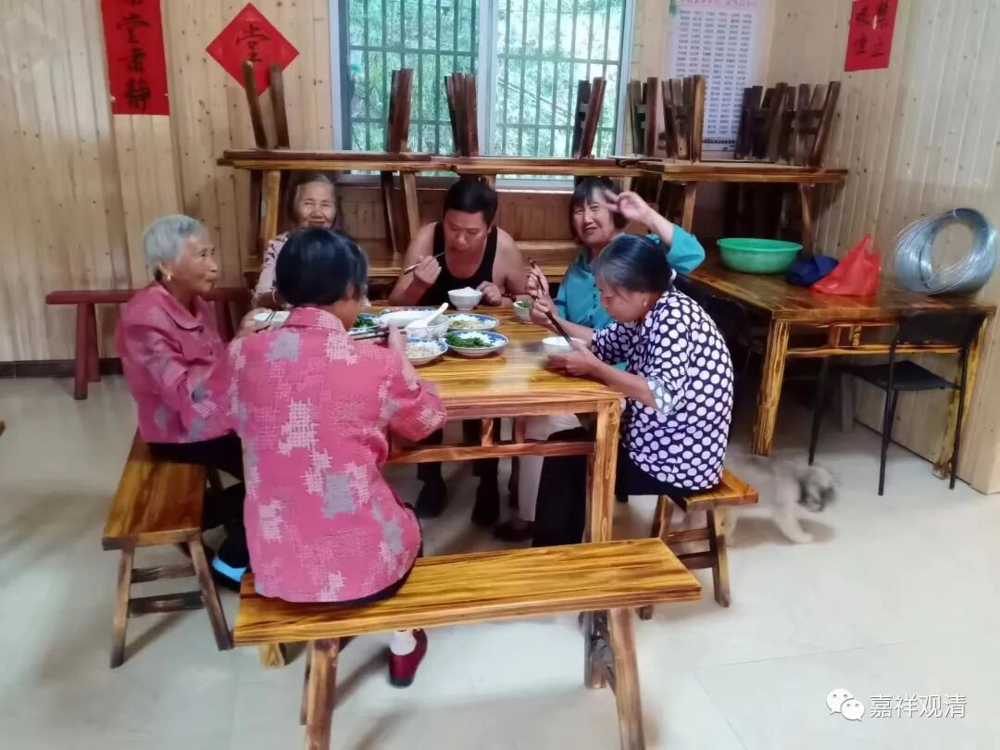
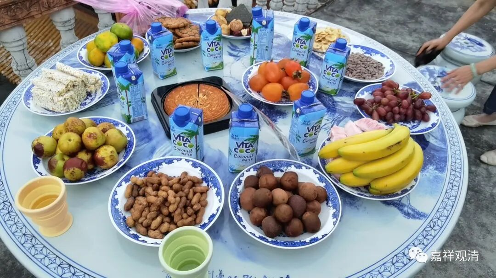
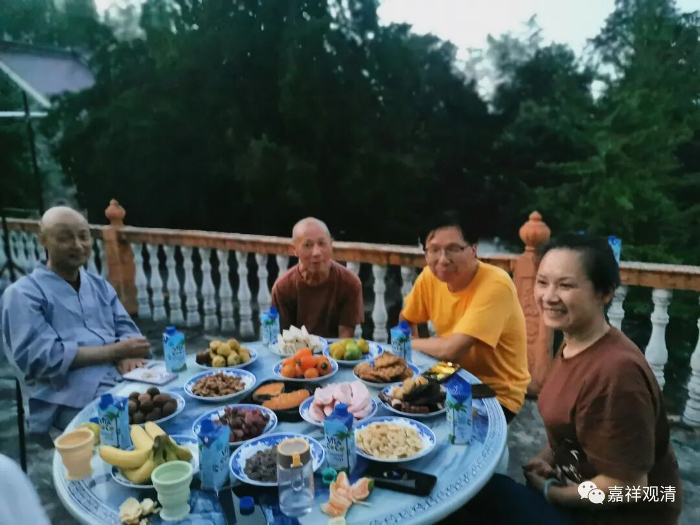
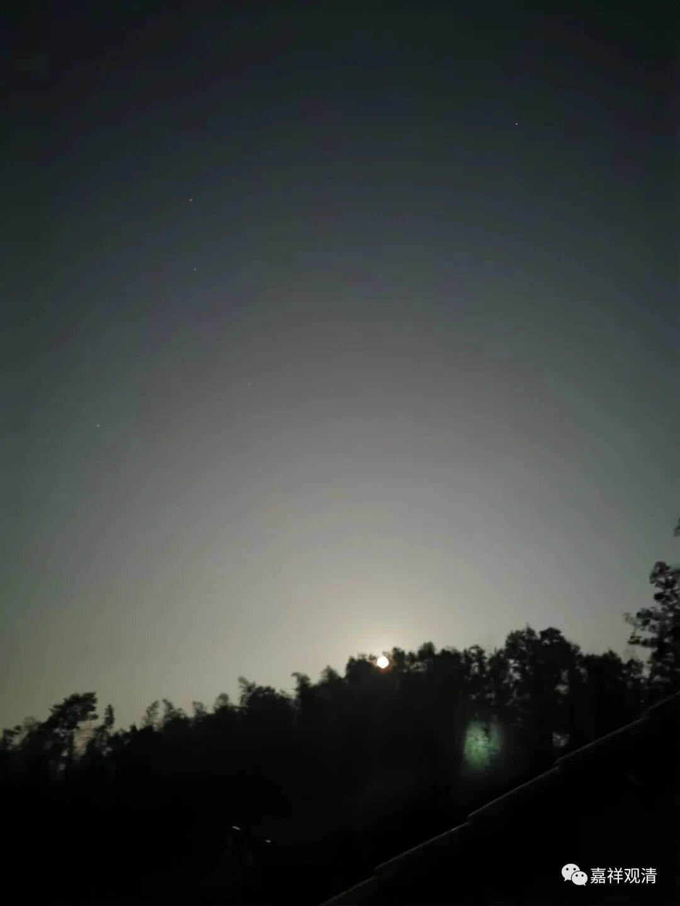
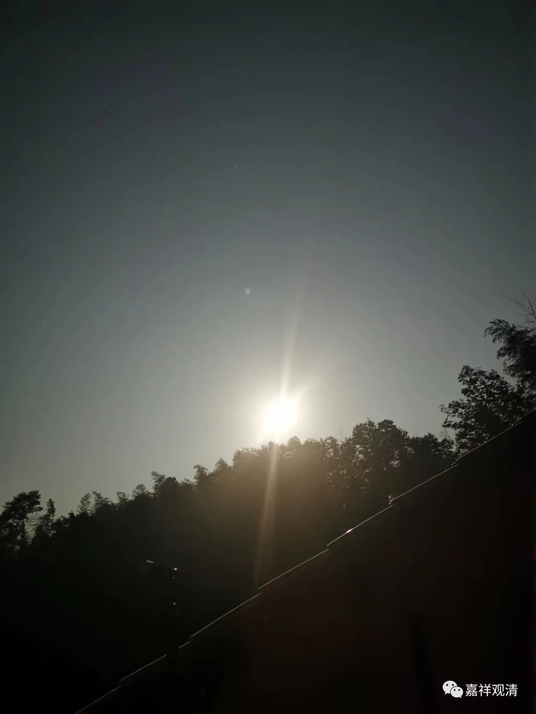

**我们的中秋赏月**

今天中秋节，老菩萨们上来“陪我过节”。

今天上午有两个人皈依，其中LQJ要皈依的原因是：“我的师父走（圆寂）了，我没有师父了！我要重新皈依！”他的意思是：“师父圆寂了，我要再找个师父，以后可以给我超度……”这个朴素的“被超度意识”也有点道理，但他以为“师父”是唯一且排他的，这就不对了。我说：“以前的师父还是你的师父，一个人可以有很多师父。”其他一些居士则趁机表忠心：“我就你一个师父！”

前两年庙里定了很多素月饼，还给周围几个秒的老和尚送去。今年没想起来定月饼这事儿，就留大家吃了一顿米饺粑粑——

这可以理解为是米粉（不是面粉）做的大号素饺子，我不知道这中秋吃米饺粑粑算不算此地风俗，但今天很多居士专门送这个来，我觉得有可能是当地过中秋的风俗。（鄱阳一代很喜欢用米粉做食物过节，春节就有米糕。）

晚上大家随便对付了一顿，就上楼摆开“赏月”的“姿势”了……东西不需要多，但仪式感要拉满。

我说：我们这一桌有柿子、月饼、花生……但是缺毛豆、石榴、芋头。中秋，在中国佛教的“仪式”里面，要有“长寿”“月亮”“时令”几大内容，一般还会加入祈求“多子多福”的“传统内容”，在明清以来中国佛教的中秋节里，主要得有“拜月”、“斋天”、拜“药师佛”、拜“月光菩萨”，祈求长寿等几种内容。

边“赏月”，边聊聊因明、中观，哈哈。这算本门最合适的“过节”套路了。

