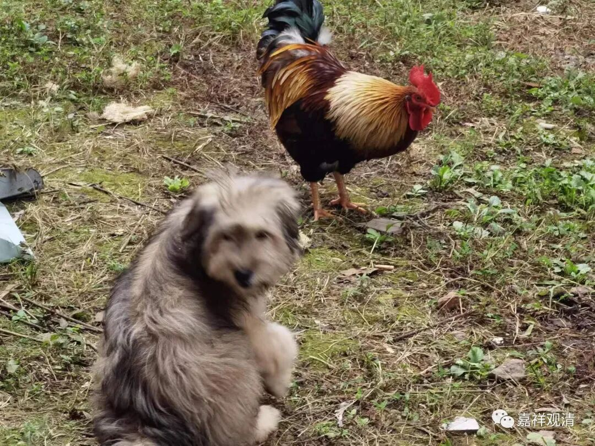
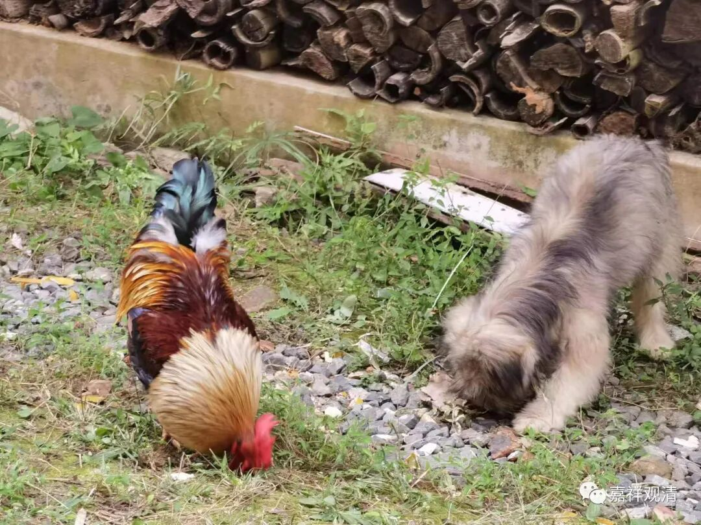
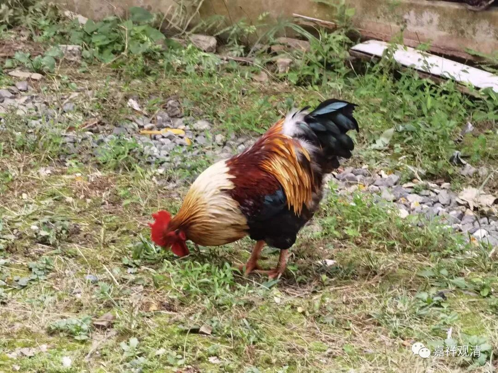
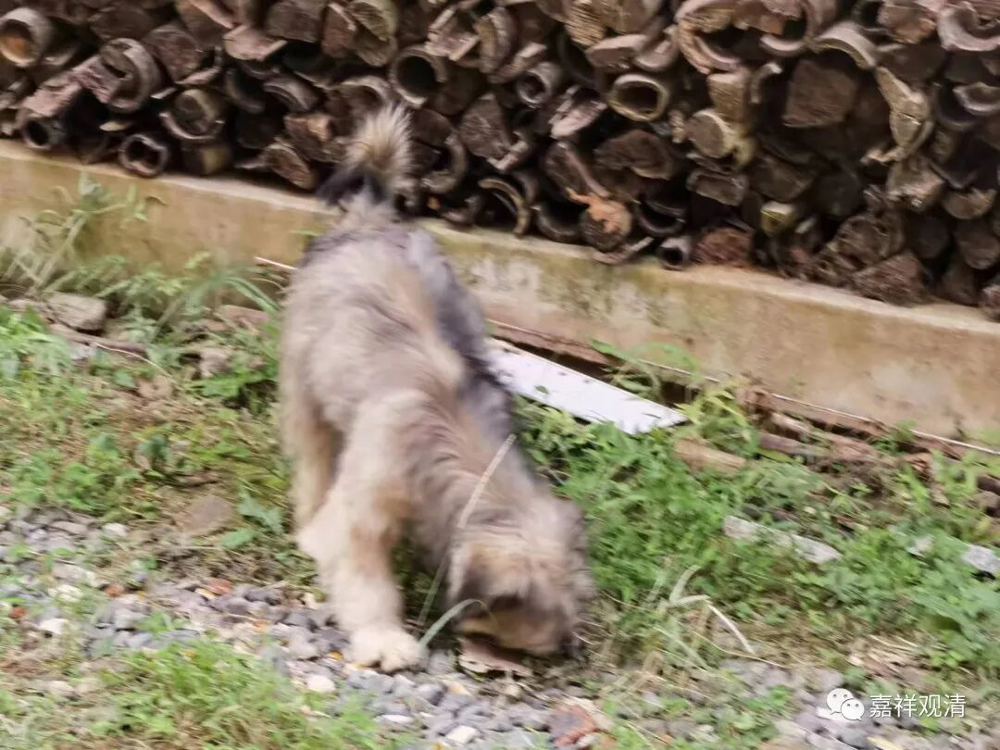
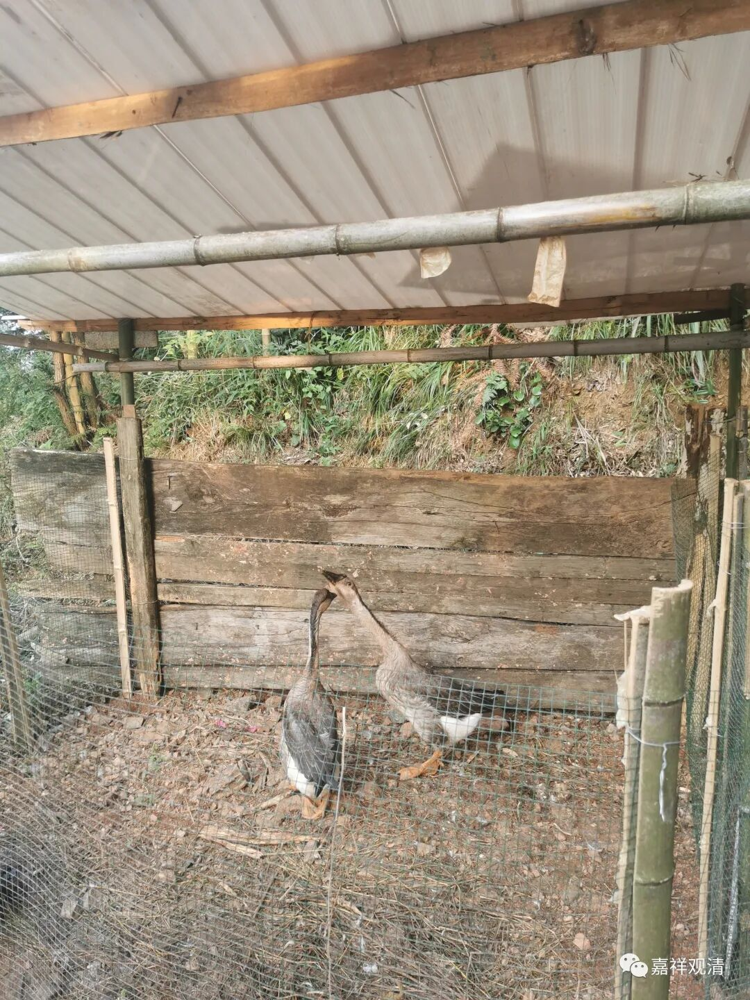
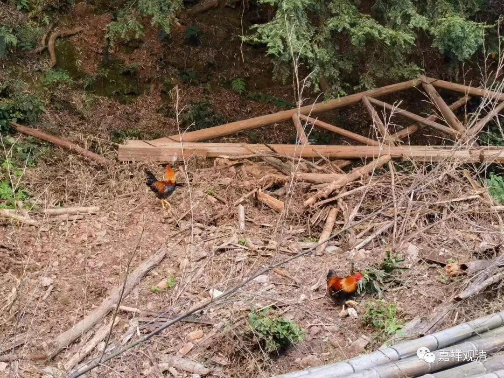
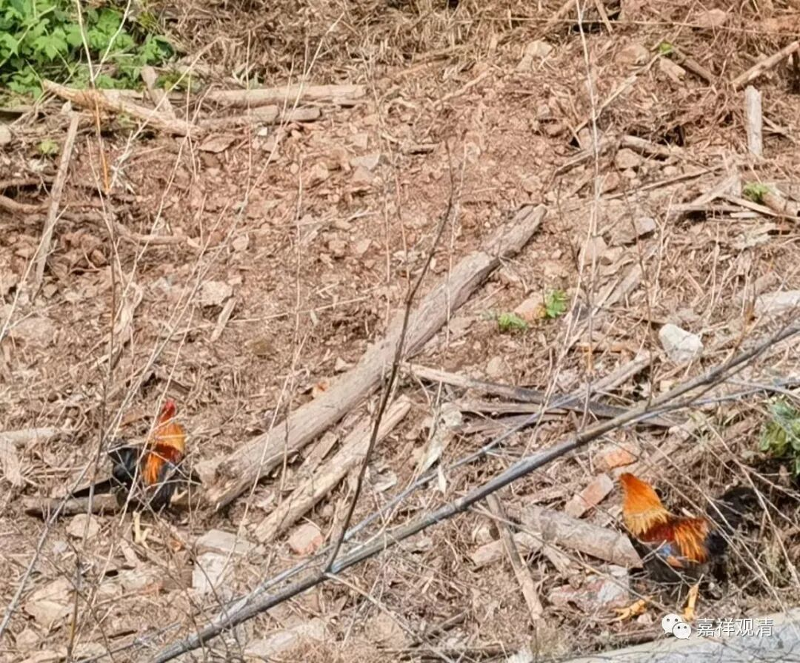

**莲花山二货**

今天庙里来人挺多……下午突然听到有孩子哭，我和ls都向外张望——是不是那只大公鸡和小黑又闯祸了？

大公鸡和小黑现在已经成为庙里二霸，它们看到稍微软弱一点的小朋友就敢追上去，你越跑它们追得越凶，大公鸡还会啄你，都把好几个小朋友给弄哭了（所以我们现在听到小孩哭就担心——是不是那俩货又闯祸了？）。前任大公鸡就是因为把一个小孩给啄哭了，隔天家长特地上来验明正身，押赴他们家里厨房给剁了……

胆大的孩子则喜欢追着鸡和狗，会说“好好玩呀，我要跟它们玩”。呵呵，人类的悲欢各不相同。

就前几天，我一回寺院就接到“报案”了：小黑咬死一只鸡！小黑成了“杀鸡犯”！

上次说过，开山会的时候有人来放生了俩鹅（圈养着）、四只鸡，那几只鸡当时“越狱”上了山……但经常回来在院子里找东西吃（我们的鸡毛菜只剩杆杆了）。小黑的领地意识还很强，看它们下来就飞步冲过去。我出去这几天，新放生的四只鸡被小黑咬死一只，另三只都躲着不敢下来了。

这两天还是拍到有两只鸡下来找吃的。

