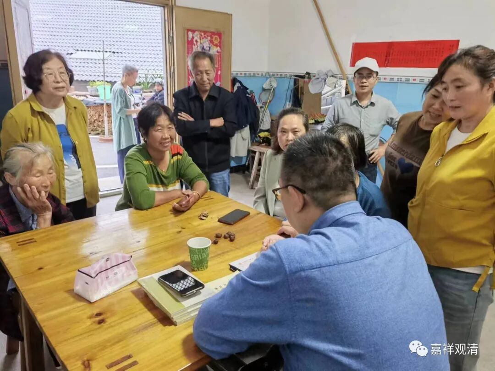
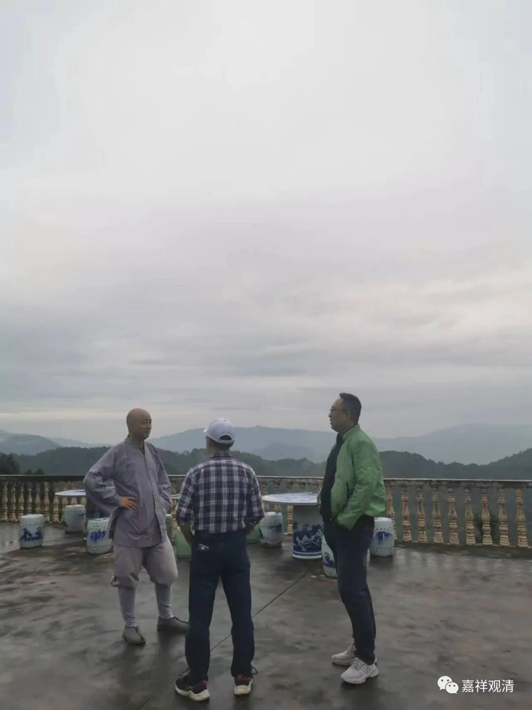
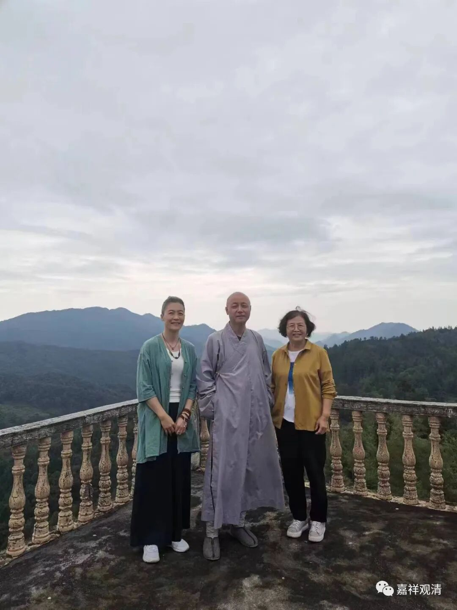
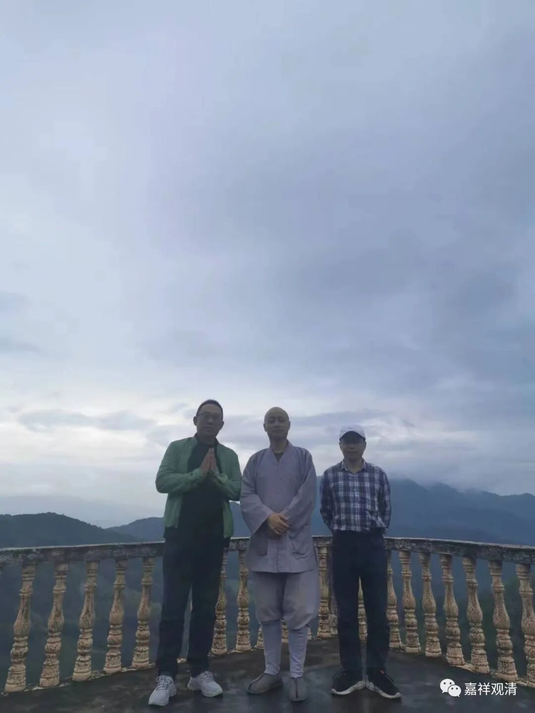
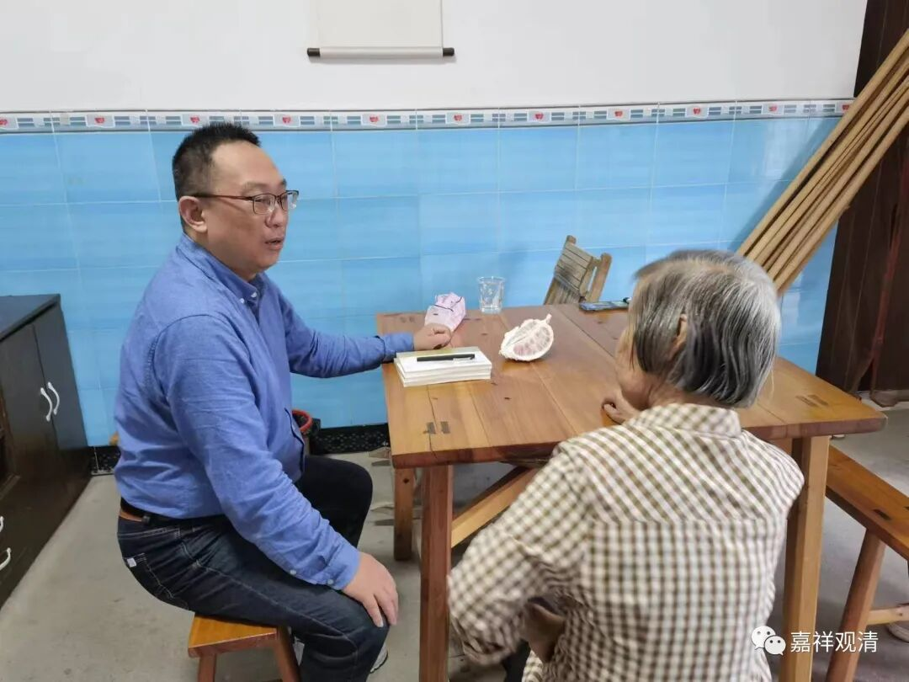
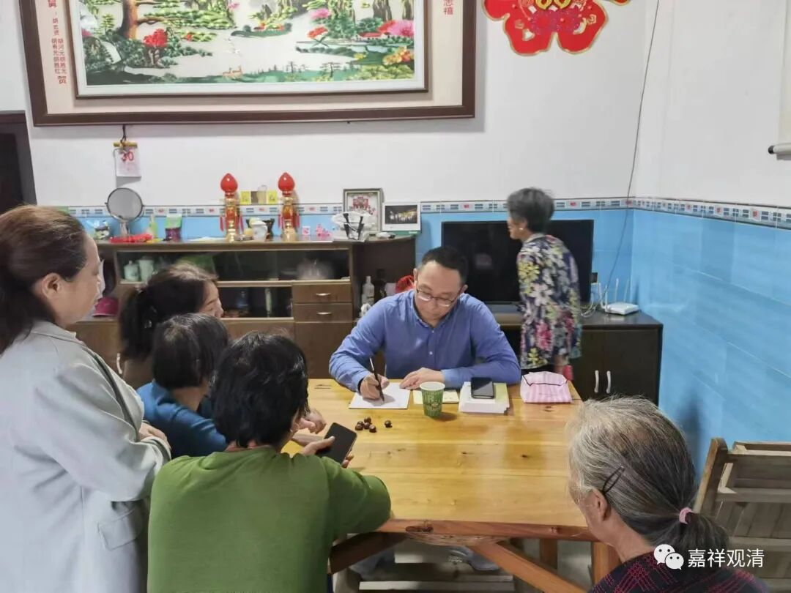
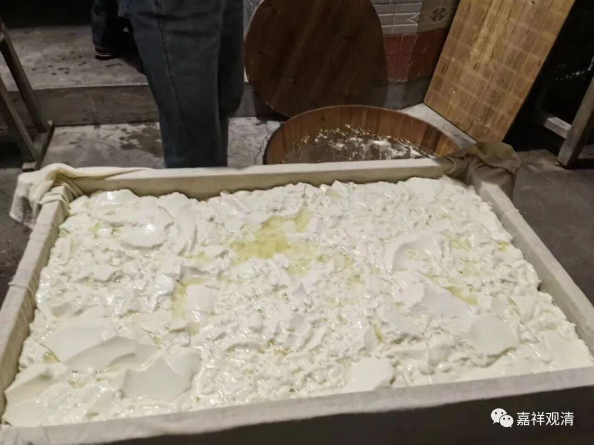
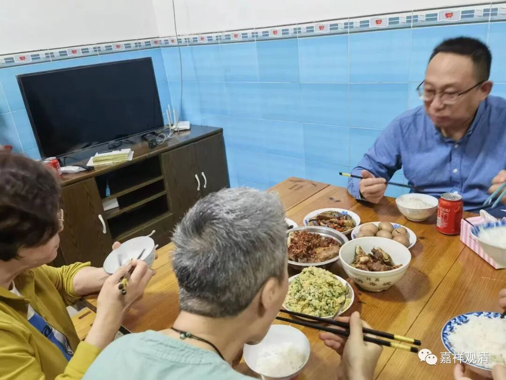

**姜主任莲花山义诊**

我两个大学同学（上海中医药大学）这两天都来寺院看看

公众号里大家一直见到的神医姜主任到咱小庙来啦……

绿上衣的是姜主任，这大长腿

姜主任昨天给庙里的义工（老胡们）摸了脉、开了方子。消息迅速传到村里，村里居士来电要求：“师父啊，请姜医生来给我们号号脉……”哈哈，义诊？咱庙里的居士，那必须满足啊！

带着姜医生下到村里，就在胡JH居士家里“摆开八仙桌，招待十六方”。

很快地，来摸脉看病的就排队啦。

这边姜医生是忙得脑门冒烟在“挣工分”，那边一起陪着来“采风”的我们可爽了——因为胡居士家正在做豆腐，大家“顺手”喝到了最新鲜的豆浆、豆腐脑。最后为了表示不能单独“苦”了我，还给我捎了一瓶腐乳，说是让我明天吃早饭的时候就着吃。

豆花阶段，准备压豆腐

村里的消息传播极快，很快胡居士家就挤满了人，都是周围“闻风而来”的——可见村里的“小广播”、村口的“情报站”工作之出色啊。

天刚刚黑下来，隔壁村子居然开来个小三轮，连司机带乘客都来“门诊”了。

留在胡居士家吃的晚饭

我跟姜医生说：“隔壁村子也来人啦！”

姜医生明显是被乡亲们的热情“吓”到了，举着撕光了的作业本皮子（撕了胡居士的记帐本做处方笺），说“明天再看吧！”

最后约定：明天下午继续原地义诊，今天到此（19：30）为止！

