**姜医生下乡义诊&村里作坊产的米粉皮**

下午继续带姜主任义诊+出诊。

我们原来的意思是在山上庙里候诊，村里居士们说他们人多，都上来不方便，也有道理，所以约了今天下午我们去村里送医上门。

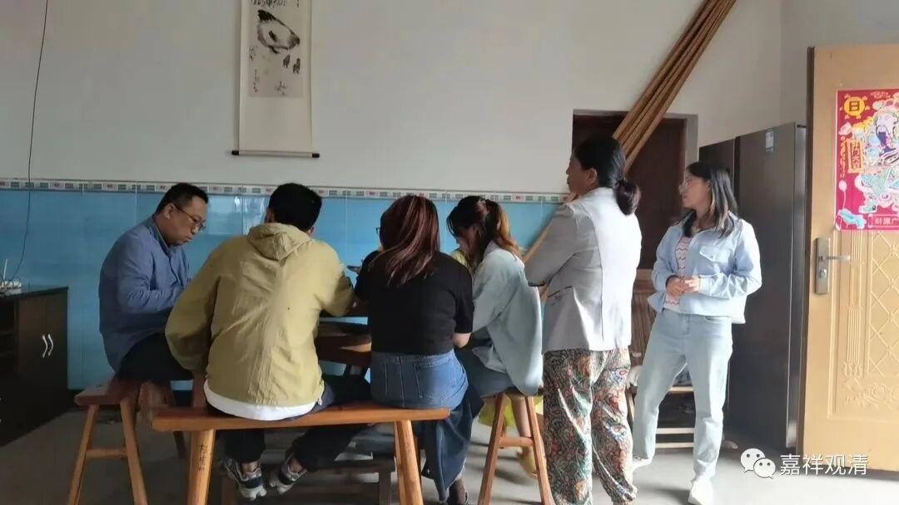

据姜主任总结，村里的老人们普遍——很少有基础疾病（高血压、糖尿病），但胃病比较多，应该是吃辣过度的原因（我觉得还有抽烟喝酒的原因），江西人吃辣实在太厉害，甚至明知吃辣会胃疼还硬吃的。以前“老团长”在庙里做饭的时候，完全按他的口味做菜，没有一道菜不辣……后来张阿姨做菜就按我们的口味很少放辣了，现在老胡，哈哈，那就是主打正宗上海口味，改浓油赤酱加白糖了。

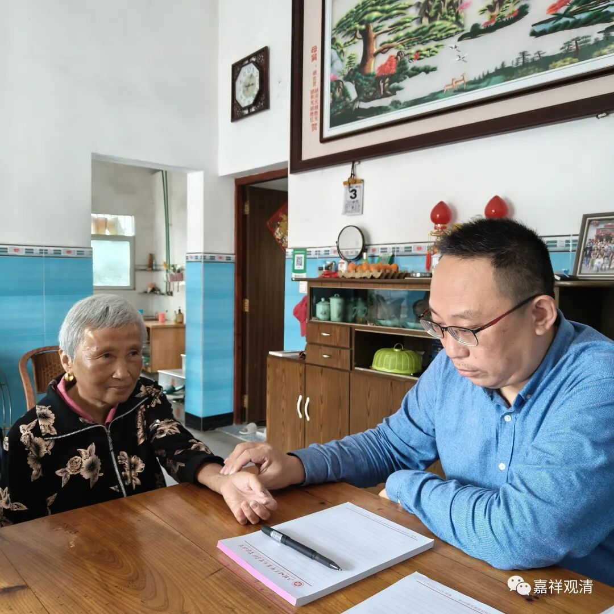

还有一个呢，就是连续几年的疫情之下，出现了一些“阳后”的虚证和免疫力下降（连我们都是标准的虚象），这个也是从年轻人开始就有的情况——可见这个疫情还是有点后遗症的。

趁病人还没来，我带着姜医生逛逛村子，介绍这里的人物、风土……

村口的工厂（作坊）在做米粉皮，我们进去看看“流程”。

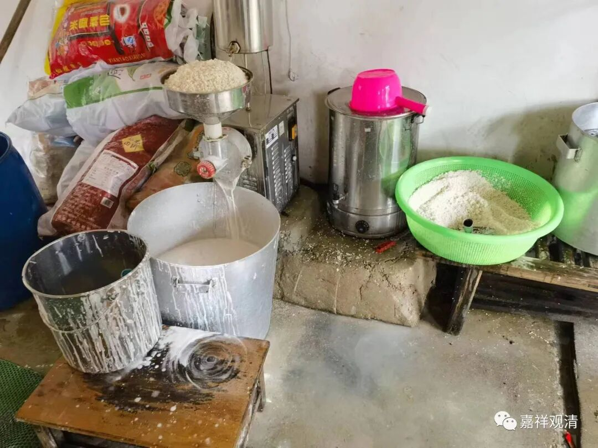

大米洗干净加水打成米浆

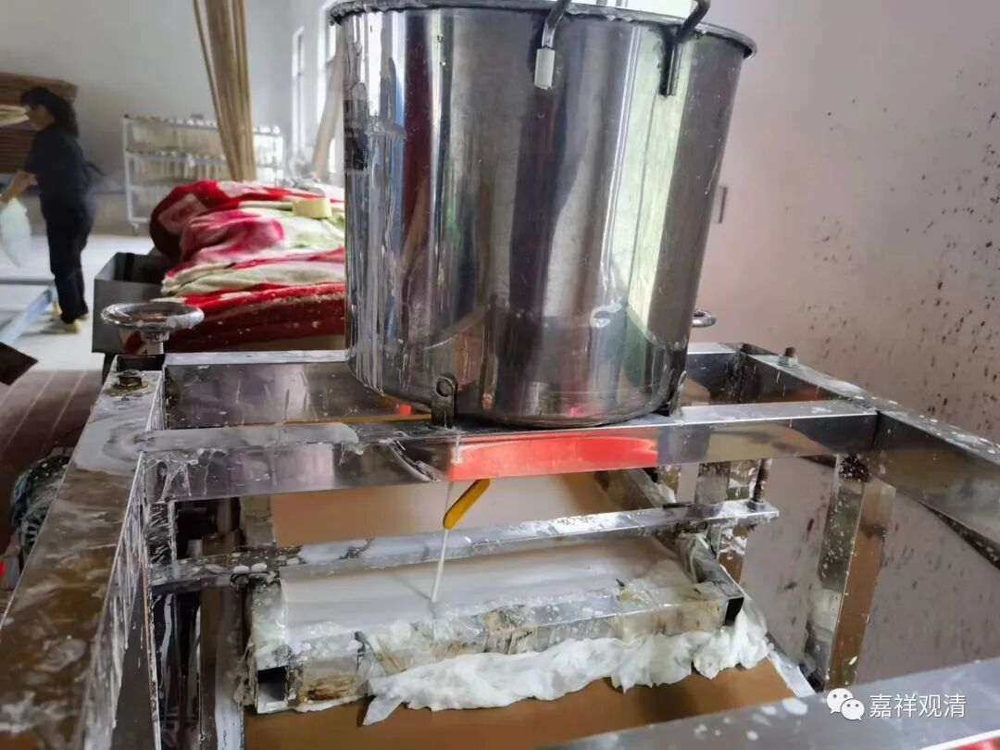

米浆倒在“生产线”的桶里，桶里的米浆流到传送带上

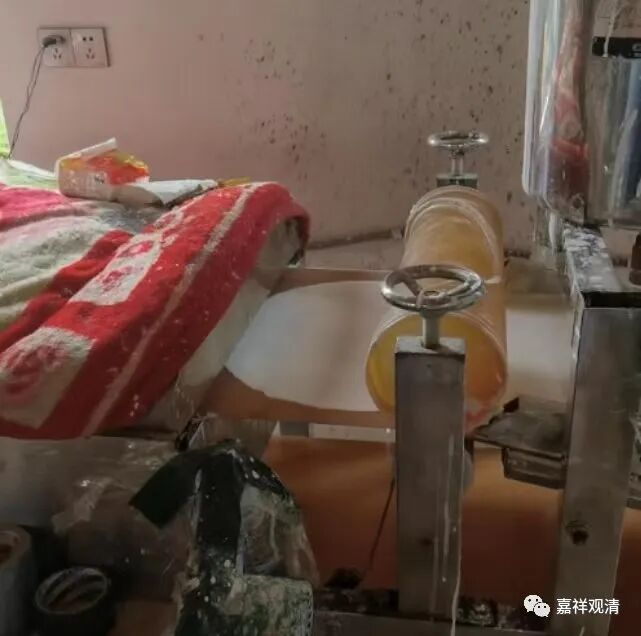

硅胶模具把米浆摊成圆形

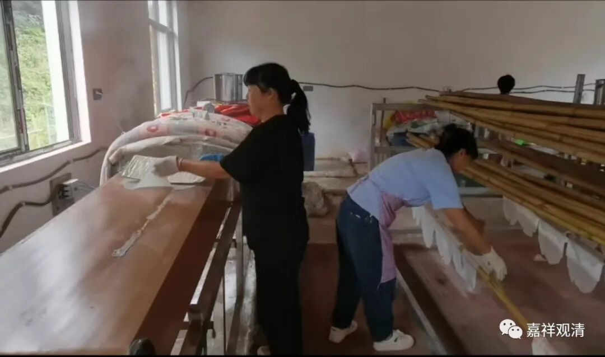

定型后快速烘烤、下线

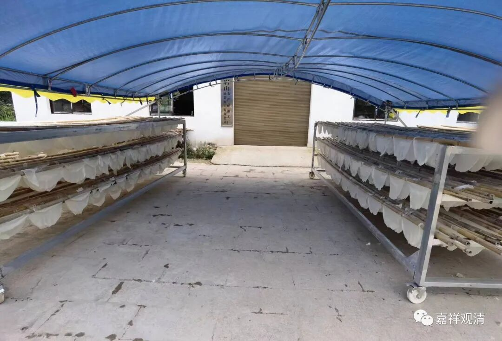

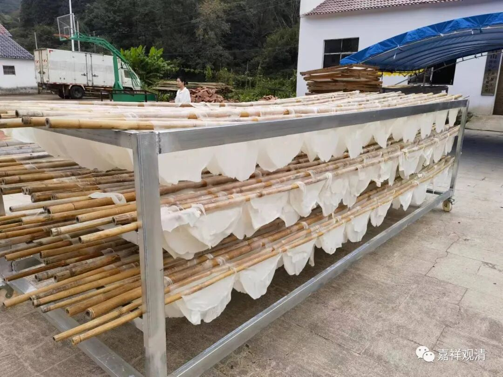

晾晒

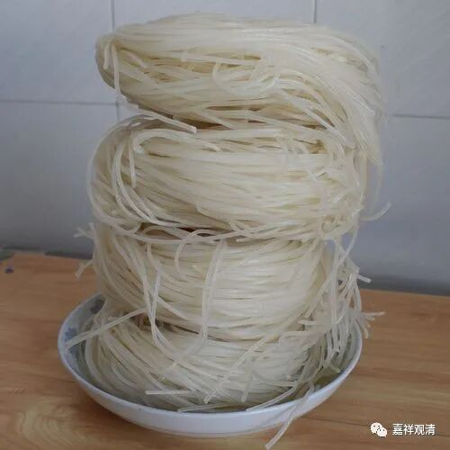

这个米粉皮子切成丝再晾晒就是米粉丝，比一般粉丝稍粗。

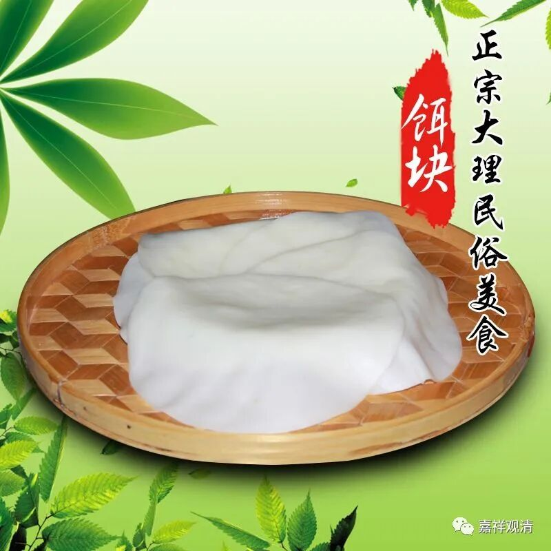

这个江西的米粉皮子，跟云南的饵块、广东的肠粉可以说是同一类型的东西（同样，米粉丝就类似云南的饵丝），只是米粉皮子比饵块薄、比肠粉大。

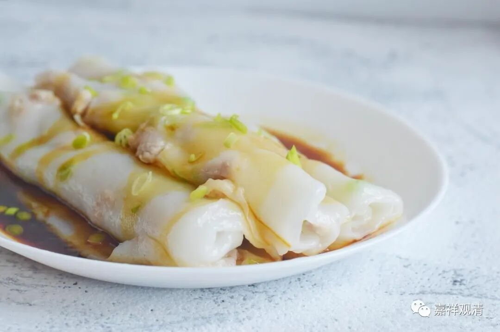

肠粉

给姜主任拿了张刚“下线”的米粉皮子，还烫得很，凉会儿趁热吃，“味道好极了”，哈哈。其实和饵块、肠粉一样，都是加点菜、酱吃起来更香！

