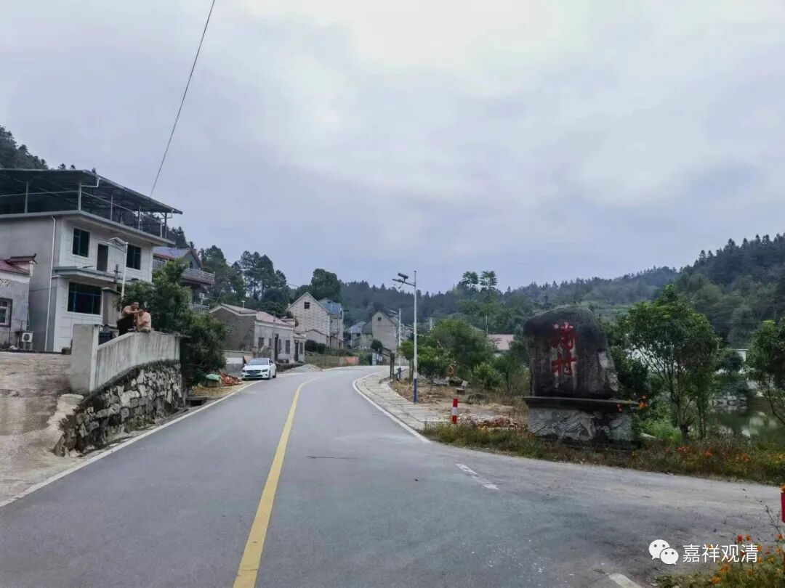
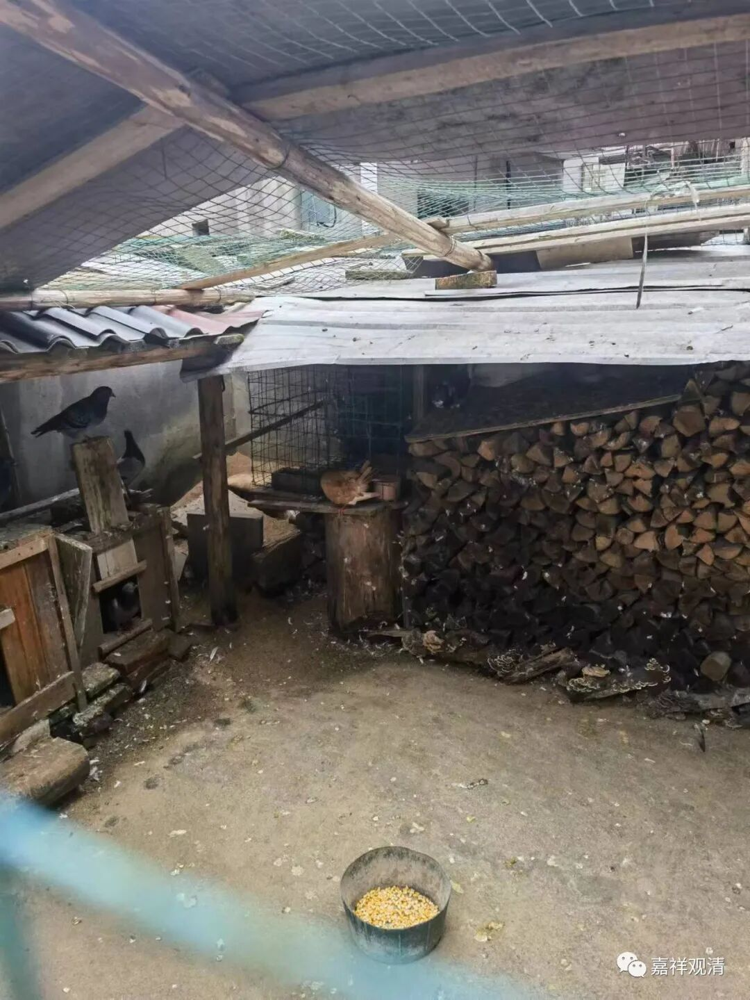
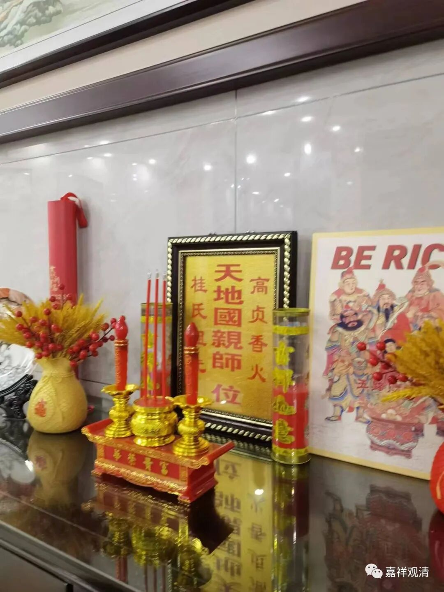
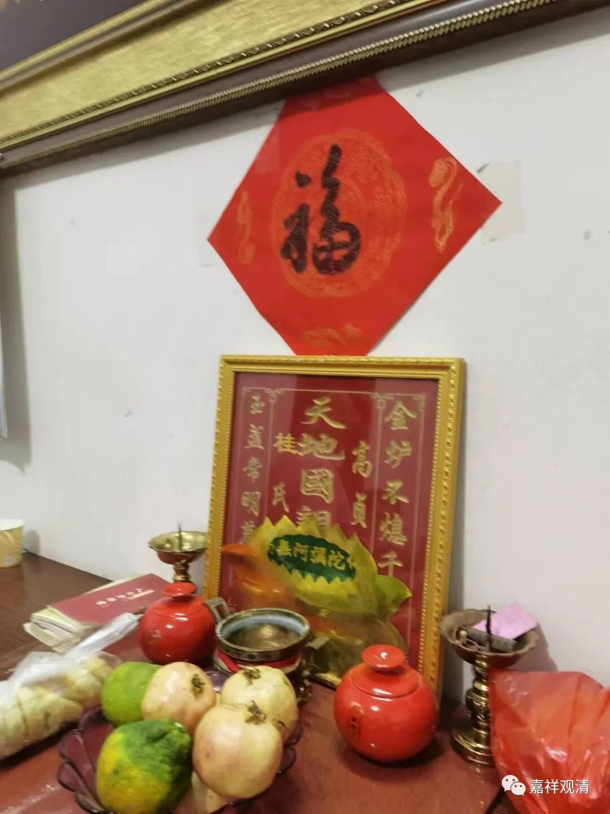
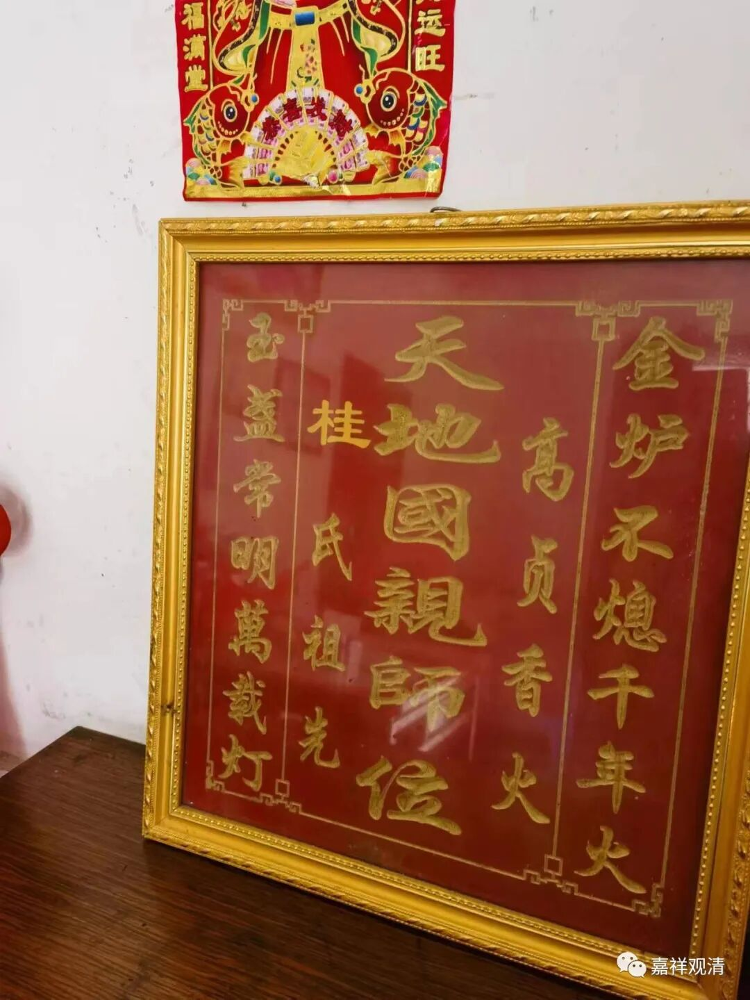
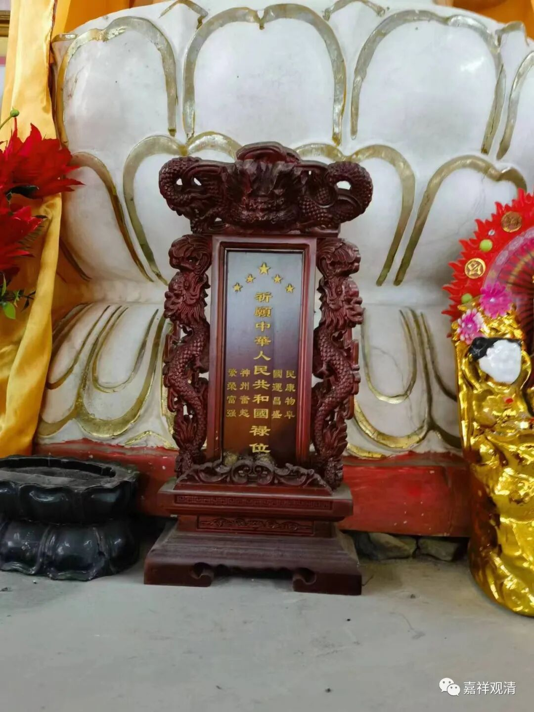
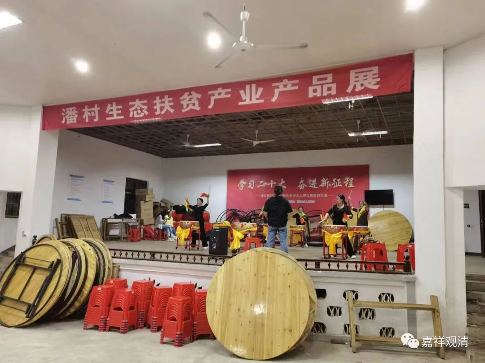

**走访新农村之“天地国亲师”**

带着大学同学（头发都白啦，我已经有俩同学退休了）去山下村里“采风”。

看着村里基本都建了楼房，大家都认为这个村子比较富裕——也对，村里人都算林场职工，而且村里有萤石矿，所以常住人口啥都不干都有每月两三千元的基本收入，而且大部分都在外面打工或者做点生意啥的，不过呢，房子建得好的并不就表示这户人家有钱……

村里还有养鸽子的

我们走到一户人家，正是庙里的居士，同学就认为这家崭新的房子“造得很好，一定很有钱”，我说其实未必。有钱的早十几年就造房子了，这些去年刚造房子的，可能反而是“穷的”。

说着话我就带着同学走进这户居士家里，可以看到“别墅”房子不小，装修也很到位，而且这装修风格放在上海都要算中上的，还有整套的茶桌、茶具……老居士两个回答我的提问，说，建房子加装修花了九十几万，还欠着小几十万……我对同学说“你看，新建的好房子，家里未必是有钱的”。我又指着村里首富、二富的房子说：“你看，那房子都十几年了，他们才是有钱的。”

屋子大厅的正中间有这个——

村里好几个居士家都有这个——

这个“福”是我写的。（村里的大姓是“桂”姓，应该是从婺源、浮梁一路迁徙过来的。）

“天地国亲师”。

所以，传统还以某种我们没有想到的方式在延续，只是，“君”没有了，“君”现代化为“国”。我们庙里也有——

另一家居士家里来了客人，桌上还有大闸蟹。

村里有礼堂，广场舞的升级版——鼓乐队正热火朝天地操练。村里土地足够多，有足够的地方消化广场舞（在礼堂）和篮球队（有篮球场），不像城里要抢地盘、会扰民。

