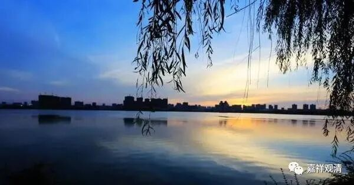

**微课堂佛教史 410·1

好，我们继续禅宗史，现在讲到浮山法远禅师。

我们前面讲到，浮山法远禅师其实已经从其他的禅师那里得到了肯定，首先是在三交智嵩禅师那里，也就是承认他开悟，或者说承认他可以出世了，还包括其他一些禅师——大阳警玄禅师、汾阳善昭禅师、琅琊慧觉禅师等等，这些都是大师了。大阳警玄禅师我们还没专门谈过，但是接下去会提到他，跟他有点关系，到时候我们还是聊一下吧。

后来呢，浮山法远禅师就和其他的兄弟们在江湖上云游，哈哈哈，相当于带了七十多人的旅游团，然后就来到了叶县归省禅师那里，足足七十多人。

叶县归省禅师一上来就把他们骂了一顿，** “一见即喝”**，来了就骂，不过也确实该骂。他骂道：** “汝辈踏州县僧，”**你们这帮人啊，“踏州县”就是到处跑的意思。** “来此何为？”**到这儿来干嘛呢？** “我哪有闲饭养你闲汉耶？”**你们到处跑来跑去，把这儿当民宿旅游了吗？赶走，全部赶走！

然后大家都不动，确实也动不了，基本上到了一个地方马上要走，也没地方去，是吧？大家都站着不走，于是归省禅师就用水泼他们。水泼了，他们也不走。再怎么呢？反正庙里面多的是香灰，用香灰再泼。其实在戒律里面是真的不可以，但是归省禅师照样泼。

这样大家就很恨，你们想想看——前面用水泼，后面用灰泼，那就都粘在身上了。大家都不高兴，就走了。这个也说明，他们也不是专门为了求法而来的，是吧？当然，也可能有些人是有点脾气的。

不过，最后有两个人没走，就是浮山法远禅师和天衣义怀禅师，就他们两个没走。叶县归省禅师就问了，那估计是派人问的：“别人都走了，你们俩干嘛留下呢？”

他们俩回答说：** “久慕和尚道德，”**就是听说您是有道高僧，** “不远千里而来，”**从很远的地方过来，怎么可以就因为泼了一点水，泼了一点香灰，就走呢？至少也要看看你讲些什么，也不枉费我们走了这么老远的路。也说明，“我们和他们（跨州涉县旅游的和尚）不一样”。

