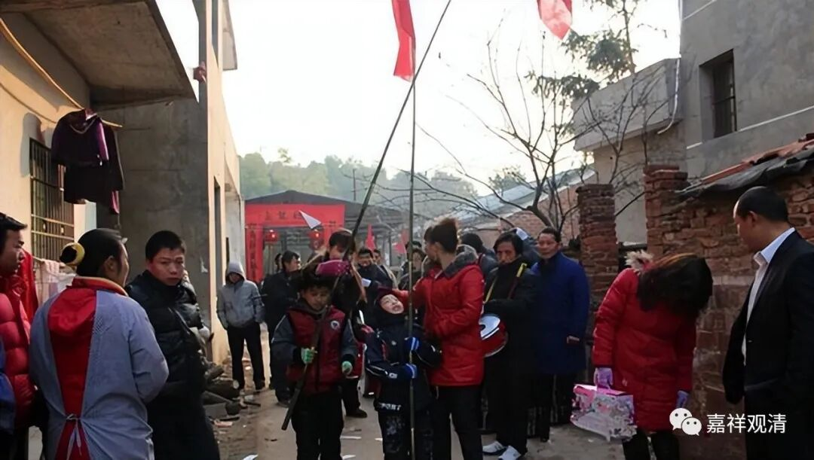
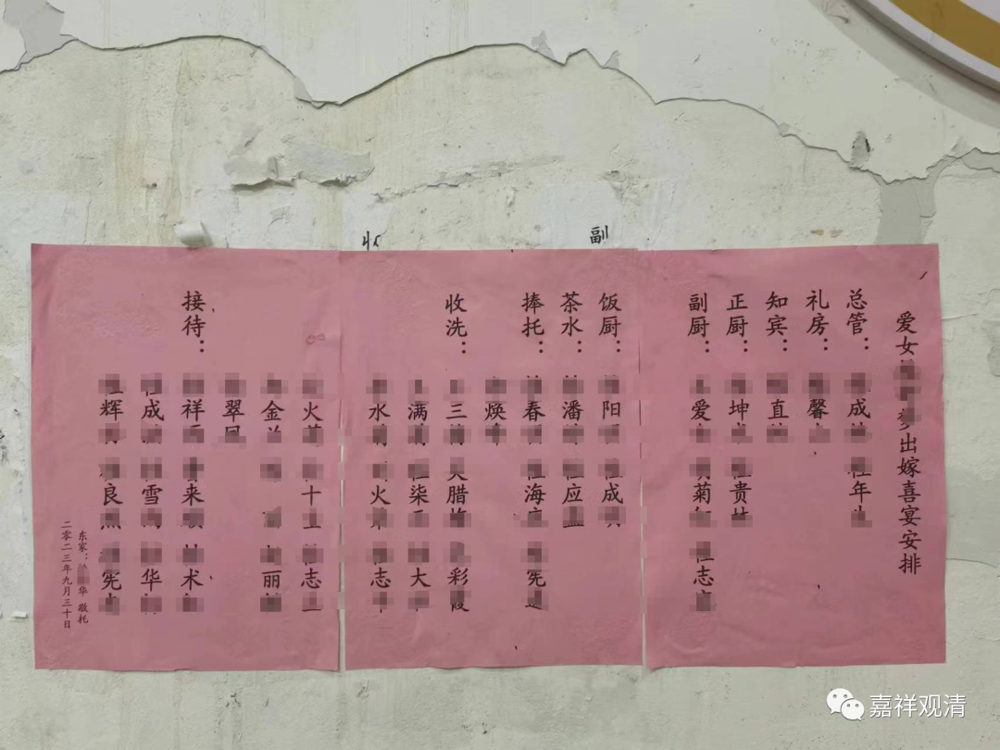
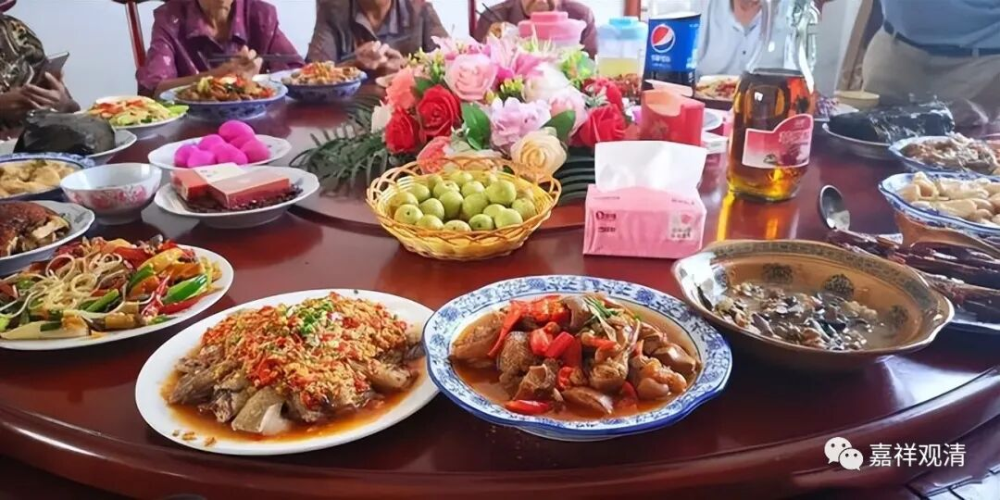

**江西的彩礼和外来的新娘

连着两天，庙里做事的小工有一大半“没来上班”，原来是下面村里有人家“办酒”，嫁女儿，村里都去喝酒（或者帮忙）去了……

上面这张单子，其他比较容易理解，解释几个：“礼房”，就是收红包的；“知宾”，类似佛教的“知客”，管接待的；“捧托”，就是端盘子的；“收洗”，就是收空盘子、洗盘子的。

江西的“彩礼”现在已经是全国闻名了，既然我们去村里“采风”，自然免不了要八一八“彩礼”的。

给我们庙里做工的木匠年前急着找我们结帐，说是儿子要娶媳妇。一问，说因为儿子年龄大了，对方彩礼要得高，好像要三十多万。我不知道是不是真的还是来要钱结账的托辞，因为后来听说那个婚事也还是没成。

这里一般适龄婚姻，说彩礼二十万上下，也跟双方“条件”（综合分数，比如女方学历、年龄、长相、能干程度，男方学历、年龄……）有关，这些个因素大概各地都差不多。有dls支教项目的负责人也跟我说，那边当地人最初也不很支持子女上学，后来“群众们”看到读书有明显的“效益”，就主动送孩子上学去了——小学、初中毕业的孩子比起没念过书的，家里的彩礼也能要得多些。所以负责人告诉我，他们也不能过多“侵入”到当地人的“生活中”，但支教最后至少能现实地帮助这些人群逐步提高认知能力，相信经过若干年的积累，会对当地有更大的帮助——题外话说多了。

江西的彩礼太高，就一定会有人想其他办法，而环江西富裕带，造成了江西人娶妻只能往更远的地方“着眼”——隔壁村子就有“外国人”。

木生说，zw村就有两个“外国人”——越南新娘，“八万八一个”。我说越南当地没那么贵，一万多就很好了，木生说中间人拿了很多，中间人是tfj镇的。木生说，有个“外国人”生了两个孩子以后跑了，因为那家男的有点残疾，耳聋；另一家“外国人还在”，我问能说中国话不，说好像还不太利索。木生说还有一个“外国人”来过，那个“十二万八”（我估计比较漂亮），没成，走了。

咱包工头听到（越南新娘）激动地凑过来……我斜着眼瞪他说，“你想干啥？！”他说：“我外甥……”hoho，这是“中国好阿舅”啊！

