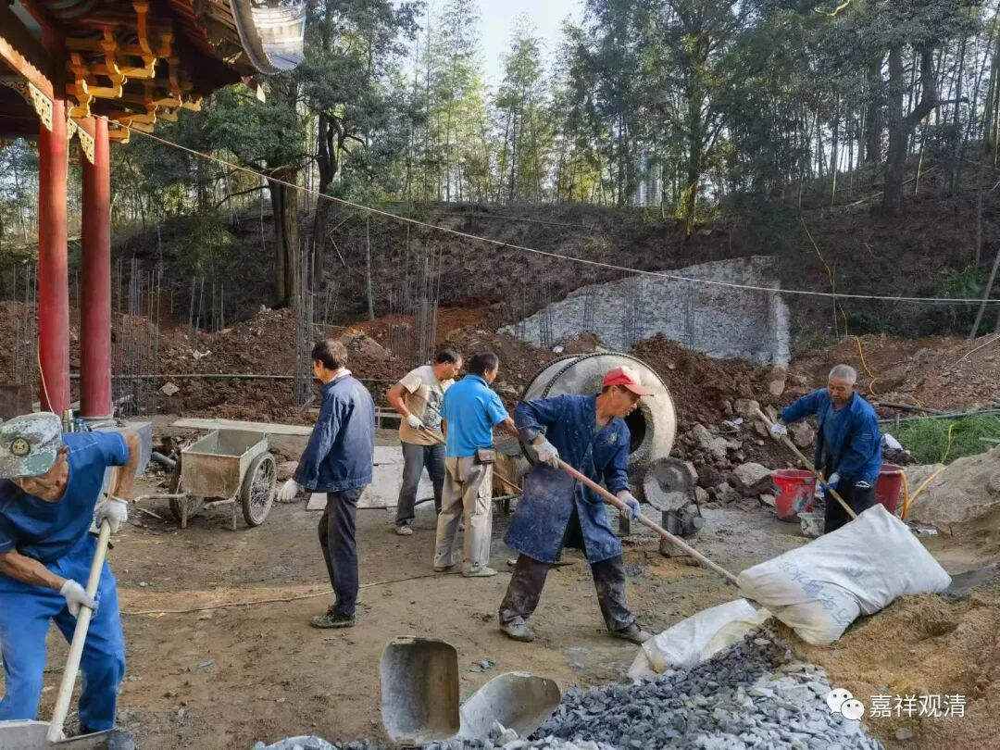
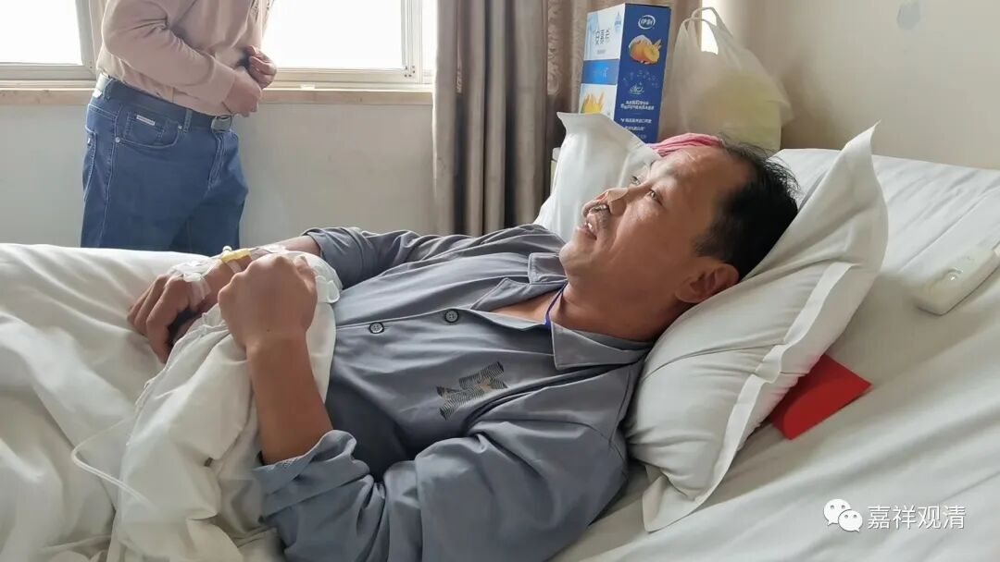
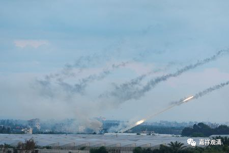

**半个八戒——老周**

一早下山，慰问“老周”。

老周是给我们建庙的“负责人”，或者理解为古建工程队的“包工头”，前两天凌晨胃穿孔送景德镇急救去了。

工程队的人，胃病几乎是标配，一般都好烟酒，湖北人又嗜辣，所以原先已经有胃溃疡，那天晚上一点钟突发胃疼，一转身，体位一变，疼痛加剧了，到三点钟实在疼得要命了，把妹夫叫起来开车送去景德镇第一人民医院……医生一摸肚子，硬的……最后诊断是胃穿孔了，马上手术！

所以那天早上我一去工地，就发现情况不对——节奏明显慢了，还到处都有点小问题，一问，一下少了仨“中高层”，送“老周”去医院了。

今天我说装个领导去慰问一下送个红包吧。

病房里老周半躺着，精神还好，因为只是一个内窥镜手术，“打了三个洞”。我跟他开玩笑：“你这病要是放在几十年前，我现在看到的就是你的相片了！”

老周说，一点疼到三点，那会儿把一辈子都“回忆”了，觉得这一辈子下来也没啥意思……我说那你跟我剃了吧，以后咱庙里造庙就轻松了。

他们那天三点多下山，五点多到医院慌慌张张到处乱窜，最后挂了急诊，检查完继续到处乱窜（所以熟悉医院还是很重要的，“导医”是现实所需），最后被推到手术室。手术室没空……最后被优先推进了妇产科手术室“先救个急”……等到醒过来，肚子上已经多了仨洞，鼻子插了管。

我告诉他：你弟弟昨天替你在庙里所有菩萨（包括红豆娘娘、土地公公）面前都烧了香了……你好好养病，以后烟酒和辣子就戒了吧！那啥也得戒！过几天回庙里，我给你搞个太师椅，你就坐在太师椅上监工吧！头发就先留着，等你全都“戒”了再说……

中东那边又掐起来了……对老百姓来说，活着就好！

