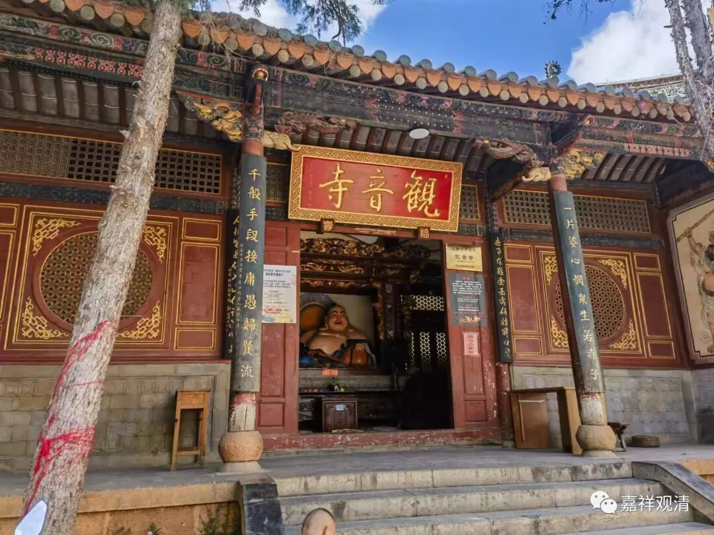
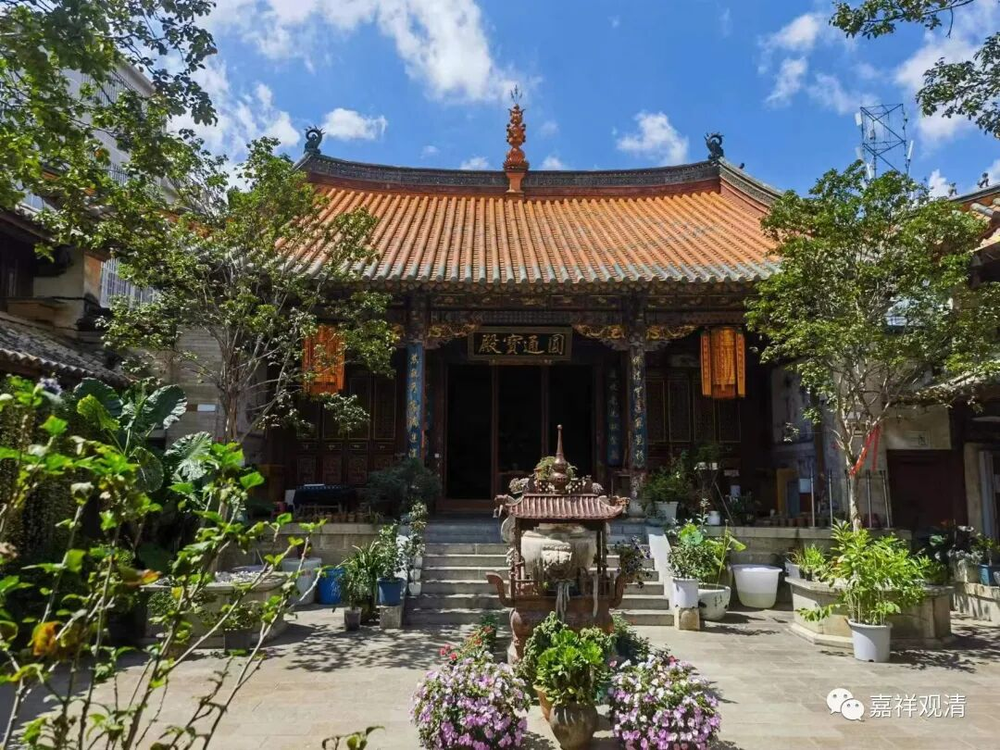
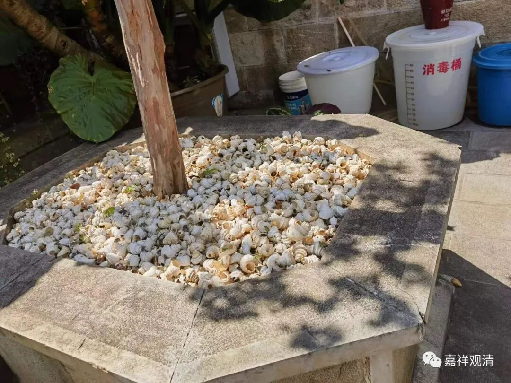

**昆明官渡古镇观音寺**

昆明飞景德镇的班机不是一周三班，所以回景德镇得在昆明“逗留”两天。以前曾数次路过昆明却都没有出来走动过，这次得空，出来溜溜。

云南博物馆的边上就是官渡古镇，网上有一个官渡古镇佛教寺院游的帖子，我按着那个攻略，倒着走了一遍。

所以我最先找到了观音寺。

观音寺不大，据说始建于唐代。我进门礼拜时遇到一位尼师，后来知道她是普道法师。

云南的寺院经常看到庭院里满满的绿化，据说这是当地人的习惯，并不限于寺院。很多寺院、庭院和沿街都种满了“多肉”，我本来想引进到咱白云寺，后来被怼了——“我们寺院就在森林公园核心区域，再到处绿化纯粹多此一举！”有道理啊。不过疫情第一年我们还是种了很多果树……最后除了枇杷树基本都活了，其他什么苹果树、桃树啥的全部涅槃！我跟老李、木生说了——明年咱种点柿子树！

寺院里面看到绿化带里都是满满的螺蛳壳，令我稍觉意外，因为一般汉地寺院不会明目张胆地用“荤腥”作装饰……便问普道法师，她说可能是因为昆明的地层下有很厚的螺蛳壳，所以当地拿来“用”作日常堆积……我不确定她说的就是答案，但刚才博物馆里确实看到有谈到昆明有些地方的地层有非常厚的螺蛳壳堆积，说那是古人进食后遗弃的结果，因为每个螺蛳壳后面都被开了口，明显是为了进食方便……

被普道法师邀请喝茶，我还正是口渴了呢（顺便又消化了一颗石榴）。普道法师是去年从云南佛学院刚毕业的，所以和她聊起佛学院来还有来有回的。她回房间专门拿出了pad，说，学会用pad是她读佛学院唯二的收获。

喝茶的时候，观音寺的居士惊诧于我居然“这么大能耐还出家”，我笑着批评到：你都老居士了，居然还认为有文化有能耐的应该留在社会上……这不应该啊！我说：“看来你并不是真的信佛！”

