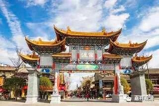
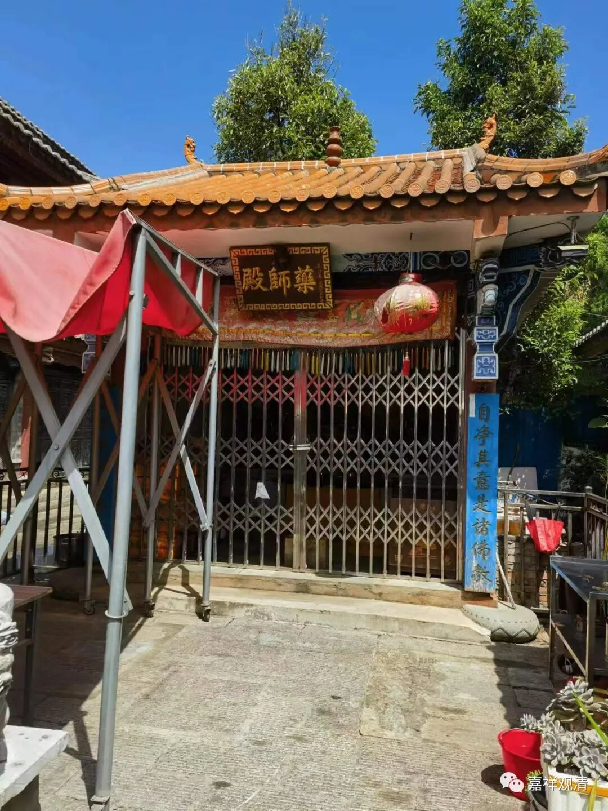
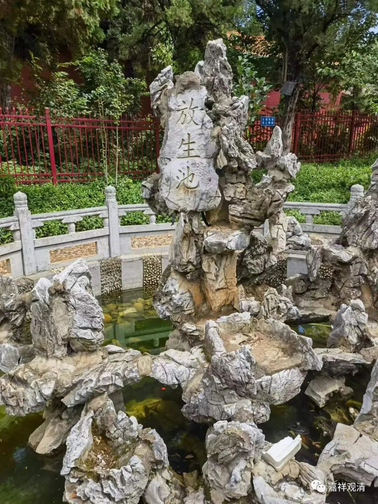
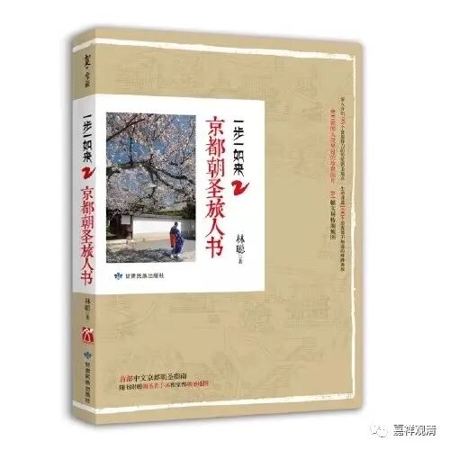
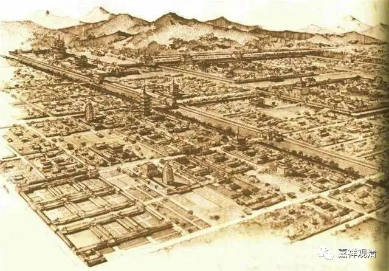
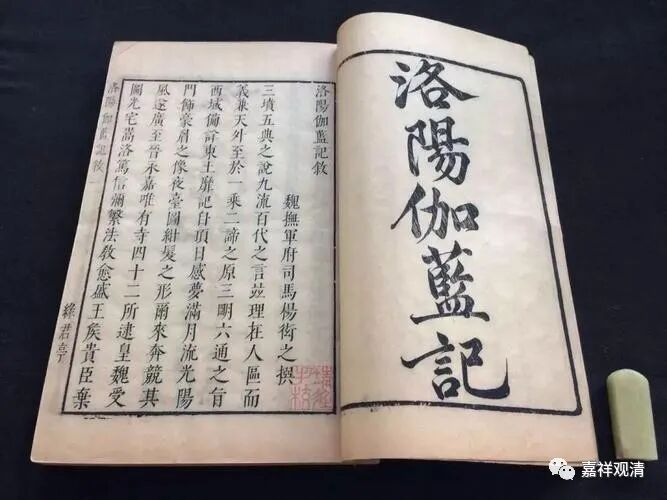

**南朝四百八十寺**

顺着地图，我在昆明官渡镇的巷子里瞎转，倒是很偶然地撞到了“药师殿”（门口就是烧烤）——

和“放生池”——

按今天看来，一个不大的昆明官渡镇就有“观音寺”“药师殿”“土主庙”“法定寺”“妙湛寺”“三圣宫”（道教）和清真寺，宗教场所就要算非常密集了，但如果读过几本地方志或者对中国的传统有点了解的话就会知道，今天这样的寺、庙密集程度，即使放在晚清也要算低配的低配了，一般这种规模的镇子上“宗教院落”至少也得在目前的三倍以上，其中像“火神庙”、“东岳庙”、“文庙”这些都是标配了——不过待会儿我们会讲，官渡古镇上这些（“火神庙”、“东岳庙”、“文庙”）的功能建筑还是具备了的，只是被整合进了今天（产权明晰）的“寺”“庙”里了。

老林今年十一月份要带个“西国三十三观音”的朝圣团，大家有兴趣的话可以去跟着去走走，或者按今天的说法叫“游学”。之所以聊起老林，是因为如果你去过日本的京都或者朝礼过“西国三十三观音”，你就可以看到，在今天的京都，大概每隔三五十米就有一个寺院，这些寺院一般并不很大，大部分也就一两个主建筑……基本上我们可以认为，当年中国城市里寺院的密集程度这就是一个很好的参考了。

如果有兴趣的更可以看看《洛阳伽蓝记》，那样大概可以知道，南北朝时期一个洛阳有多少寺院了……整个洛阳境内（大的范围），当时有1367所寺、庙，《洛阳伽蓝记》记载了其中的91所。所以，所谓的“南朝四百八十寺，多少楼台烟雨中”的“四百八十寺”并不是一个虚指，也不是说整个南朝范围有“四百八十寺”，而是指建康（南京）一地（包括辖地，并不需要算到镇江、扬州）就大致有“四百八十寺”了……

