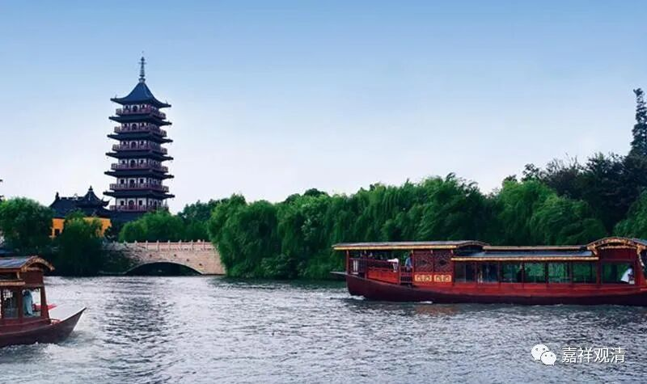

**微课佛教史412·2**

那么，浮山法远禅师是怎么出世的呢？出世，就是他开始在其他寺院出山了。但是这个出山，又和我们现在讲的某某人出山不一样。出山的主要意思是指他在丛林当中，在各个寺院正式地开法、做住持、收徒弟……应该这么算。所以，之前在叶县归省禅师那里，即使在法堂上给他传法了，但这个时候他还不能叫出世，出世必须要单独的有程序的去住持第一个寺院。

我们讲过，出世在宋代这个时候，首先就是丛林当中的推举，其实说起来更加重要的是官员的推荐。所谓的丛林的推举，实际上是丛林推举让官员知道，然后官员再推荐，所以官员推荐（打个报告）实际上是一个正式的程序，丛林推举也是程序之一。就比如现在，我去什么地方做住持，统战部要下文件也是一样的，至少文件上是这样说的：经地方或者居士们或佛教协会推举，某某法师到什么地方担任住持……再盖一个章。看起来，在宋代也是这样的情况。

那么，法远禅师的出世是在什么时候呢？是在宋仁宗的时候。这个时候有一位官员叫许式，许式的官阶也不小，最后做到尚书。他也喜欢禅宗，对禅宗是比较感兴趣的，在曹洞和云门的门下都得到过一点锤炼。不过当官当大了以后，就觉得自己了不起了，后来被其他禅师“收拾”过……不管怎么样，他算是对佛教有所了解，特别是对禅宗是有所了解的。

在他的推荐之下，就请法远禅师出山到舒州（舒服的舒，安徽）——舒州庐江县太平兴国寺，这个出山的寺院也不算小了。浮山法远禅师就去太平兴国寺开禅堂，做住持了——应该说做方丈比较好。（太平兴国，一看就是地方性的大寺院了，“太平兴国”是赵光义的一个年号。）

这个时候书上写得很明确的，哦，这本书上的次序写错了，“乃归嗣省”，应该是“乃嗣归省”，（“乃归嗣省”也说得通）他继承的是叶县归省禅师的法脉，这是非常清楚的。

后来，浮山法远禅师又去了天柱山的月华庵，距离也不远，天柱山也是安徽的。再后来就去了浮山（沉浮的浮），“浮山法远”禅师的名号就是这么来的。

说起来，浮山是他去的第三个地方，此后他又住持了几个寺院……最后他年纪大了以后，又回到浮山，因为他年纪大的时候在浮山待的时间可能比较多一点，大家就管他叫“浮山法远”禅师，理论上你要是叫他“天柱法远”禅师也未尝不可。

