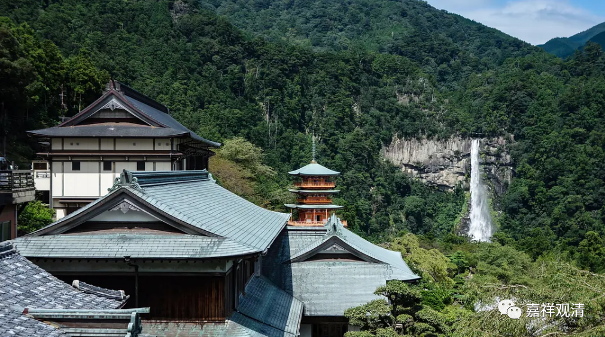
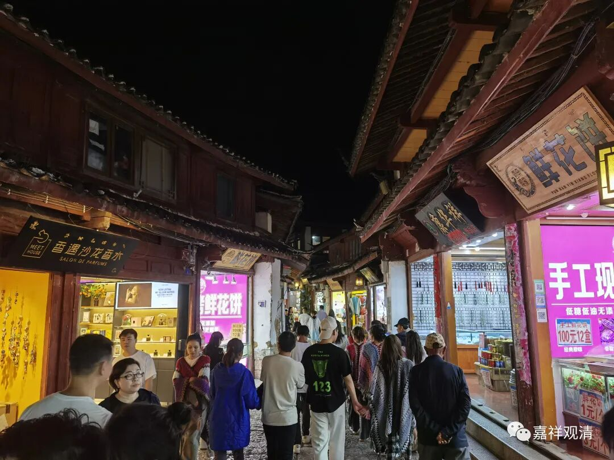
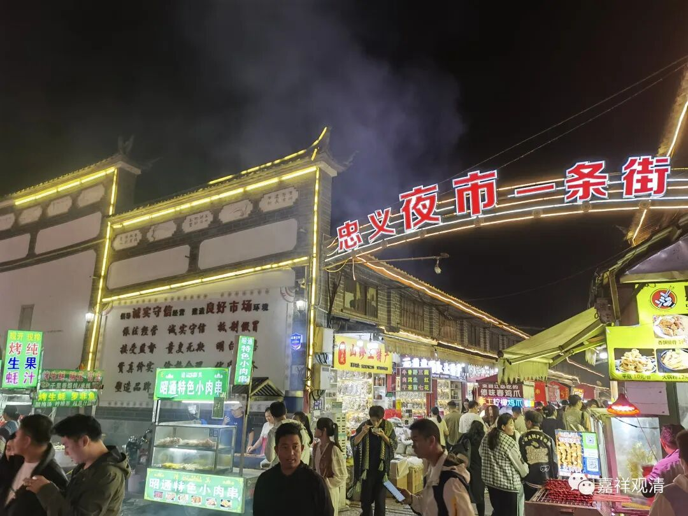
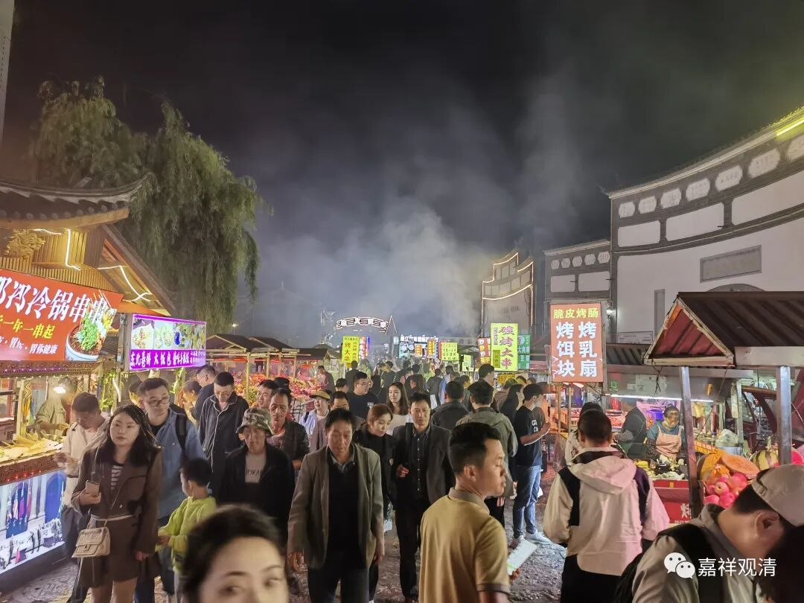
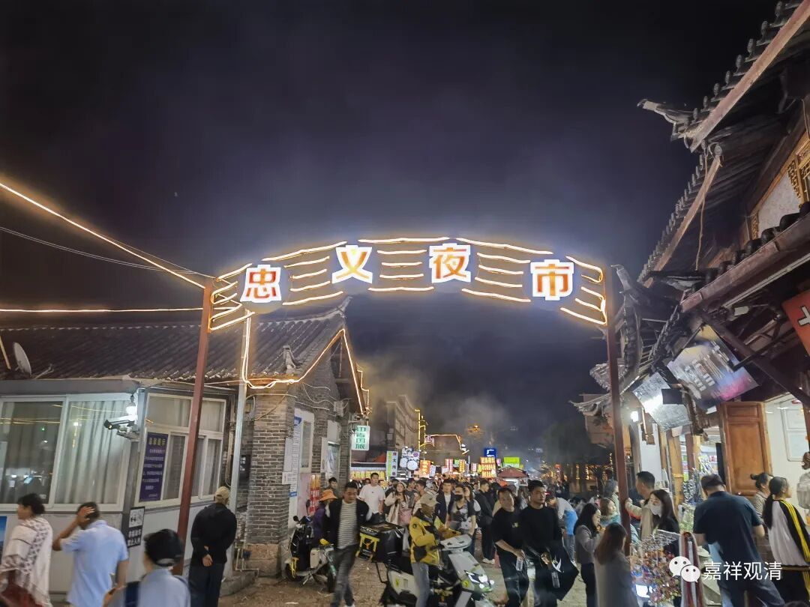
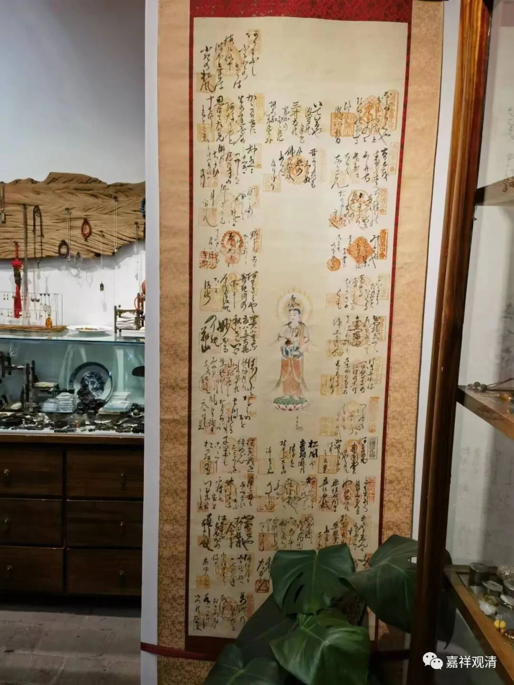
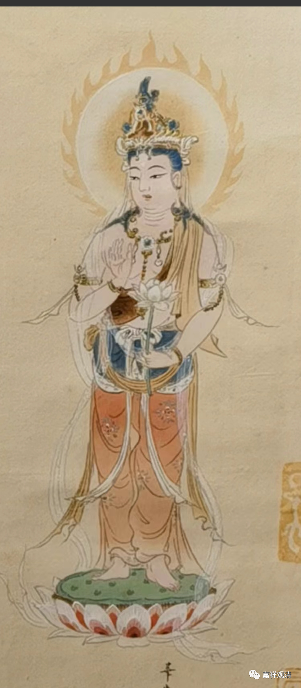
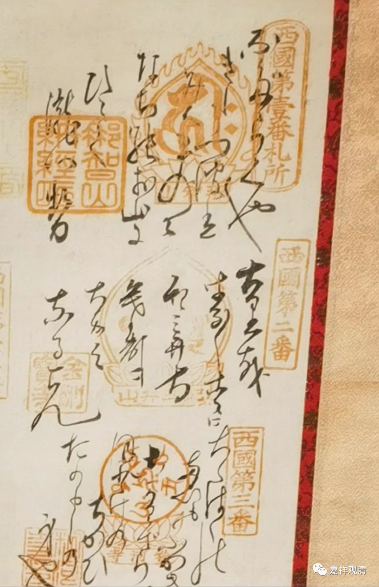
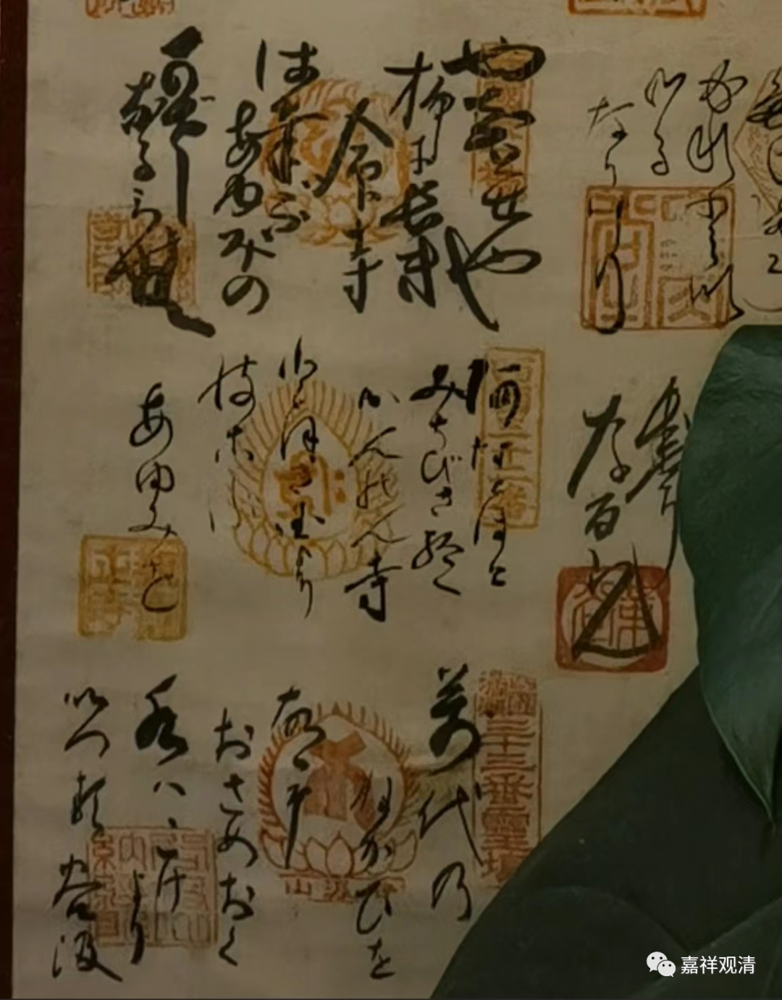
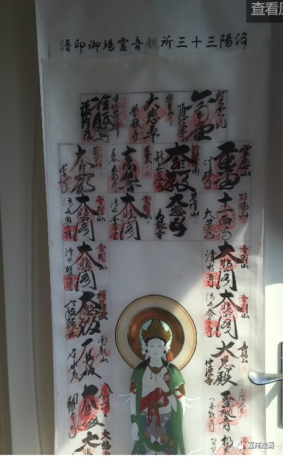

**丽江撞到“西国三十三观音”

昨天谈到林聪下个月带团去京都朝礼“京都三十三观音”，其实前几天去丽江我也“撞”到过“西国三十三观音”……

白天，丽江古城的街上人流还比较“克制”，晚上人就比较多了。那天我对着旅游地图看到丽江有夜市，就找了过去。

夜市确实很热闹，但我也就只能看看。我问白天有没有出摊儿的，说白天没有，得！

回住处的路上，偶然看到一幅——

引起了我的好奇。

我问老板这是啥？美女老板说这是日本的文物，不卖。

我说这应该不是文物，应该是三十三观音朝圣（就是“西国三十三观音”）的类似集邮的册子（“纳经账”）。

老板并不认同，坚持说这是日本文物，不许我上手，但并不阻止我靠近仔细看（不许我挪动盆栽）。我仔细看了一下，最终明确这确实就是“西国三十三观音”朝圣打卡收集图章（“纳经账”）的挂画。

挑几个细节看一下——

最中间观音像。

依次，第一行，三枚印章是“西国第一番扎所”“那智山”“那智山纳经所”，这是那智山青案度寺，在和歌山。

第二行：“西国第二番”“纪三井寺”“金刚宝寺”，即纪三井寺金刚宝院护国院。

第三行：“西国第三番”“粉河寺”“粉河寺印”；粉河寺和纪三井寺这两个寺院也在和歌山。

……

最后一行：“西国@@三十三番灵场”“谷汲山”“谷汲山纳经处”，谷汲山华严寺，在美浓。

“纳经处”就类似于我们的流通处，你朝礼寺院，就可以自己去“纳经处”敲图章。

这张图，从头到底一个没落下，西国三十三观音纳经账。

这张是网上找到的洛阳（就是京都）三十三观音灵场的印谱

后来我给老板和其他法师聊了几分钟京都“西国三十三观音灵场”，老板虽然仔细听，但死活不认可我说的，哈哈。

大家有兴趣的话，可以上网买本《一步一如来2》来看，比我这讲得要详细、专业，或者直接报名跟林聪去朝圣吧（他带去的是不知道是“京都三十三所”还是“西国三十三所”，没注意）。

