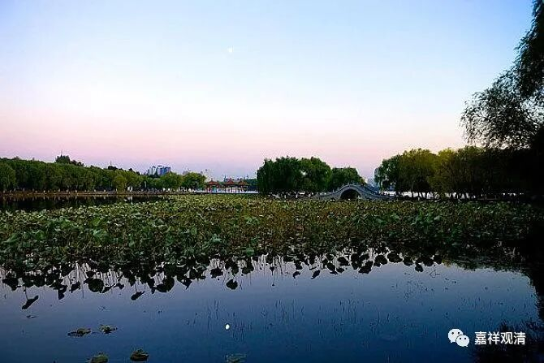

**微课佛教史412·3**

再以后呢，又出现了一位比较有名的人物——范仲淹，他也是一个出将入相的人物。范仲淹就请浮山法远禅师到姑苏天平山，这里写的是姑苏平江府，就是苏州。天平山，我还没去过。以前我们小时候一直听说天平山的秋天的枫叶，是吧？天平山我好像真没去过，啥时候去一下。

最后他又回到了浮山，先后两次在浮山做住持。哦，第二次不应该叫住持，他应该是回浮山归隐，就是晚年又回到了浮山。

另外，浮山法远禅师和欧阳修也有交集，虽然欧阳修对佛教是不感兴趣的。我们之前讲了，一开始欧阳修就是反佛的，后来经历过好几次事件，使得他对佛教有所改观，包括他碰到了浮山法远禅师。欧阳修下完棋，就问浮山法远禅师能不能就棋来讲法，法远禅师马上很正式地进行了讲法。于是，欧阳修立即对佛教、对和尚都有所赞叹和改观。

说实话，我觉得上面这个故事很可能不那么真实，实际情况可能并不是这样的。你要让欧阳修这样的人去改变他这么根深蒂固的想法，不太会的，可能也就是给一个面子，说了几句话，大家就给记录下来了。

我认为总的来说欧阳修对佛教的态度是很不好的，我们前面讲过，是吧？《新唐书》里面凡是讲到和尚的地方（两处），没有一个地方是好的，反正与佛教有关的内容几乎全都给删掉了。《新唐书》里面与佛教有关的内容极少，而《旧唐书》里面与佛教有关的内容很多。他是刻意地把佛教相关的内容全部删掉的，他的门派之见极重啊极重。

所以，有时候我们读到佛教史传当中一些说士大夫和佛教关系非常好的地方，要仔细辨别。有些地方未见得是，比较容易被夸张了。我觉得欧阳修对和尚、对佛教，最多也就能够做到江湖上一般的“给个面子”，也就这样了，差不多了。

前面讲，有人说浮山法远禅师是继承了曹洞宗的，主要是说他继承了大阳警玄禅师的法脉。应该说，浮山法远禅师在大阳警玄禅师、汾阳善昭禅师和叶县归省禅师那里，都得到过印可，前面不是都讲过吗，都得到过印可。但是，得到印可，并不就是继承了法脉，这是不一样的，性质是不同的。所以，有些人或者百度上这么说，我估计还有其他人也会这么说，但这个说法是有问题的。

接下去我们梳理大阳警玄禅师、浮山法远禅师和投子义青禅师之间的关系时，我们会继续讲。

今天就讲到这里，谢谢大家！

