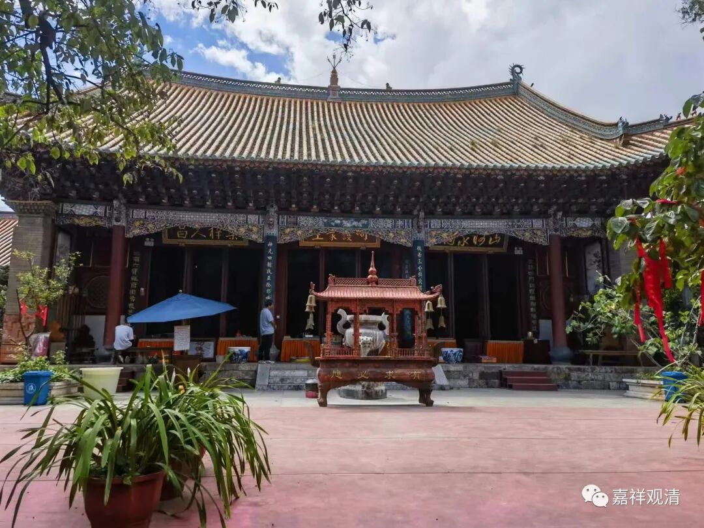
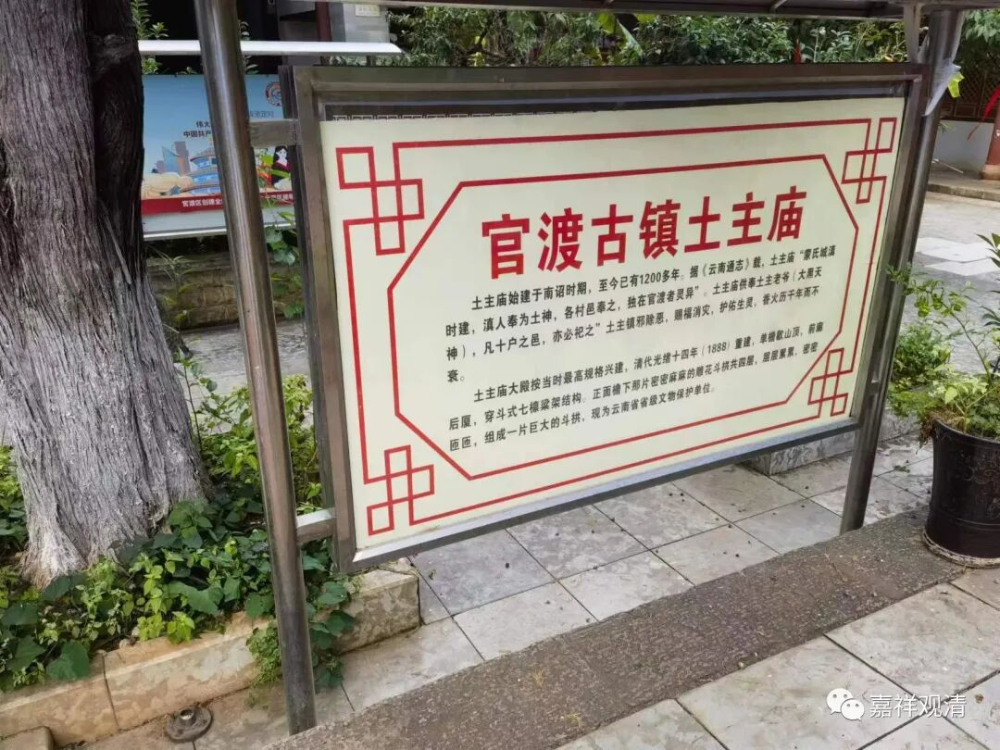
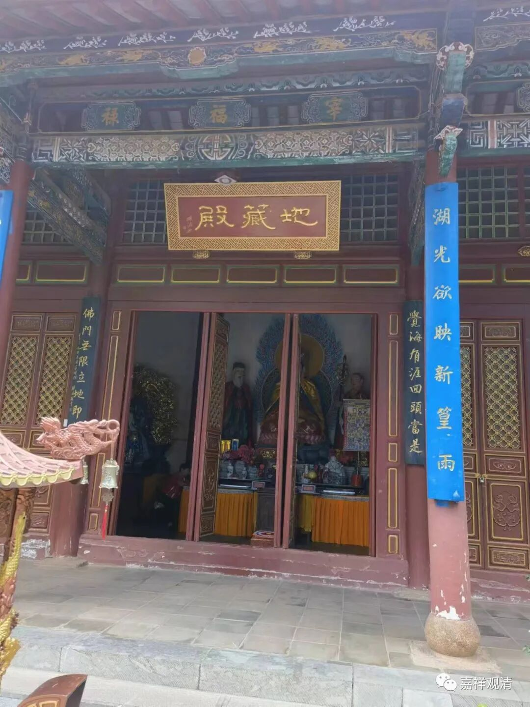
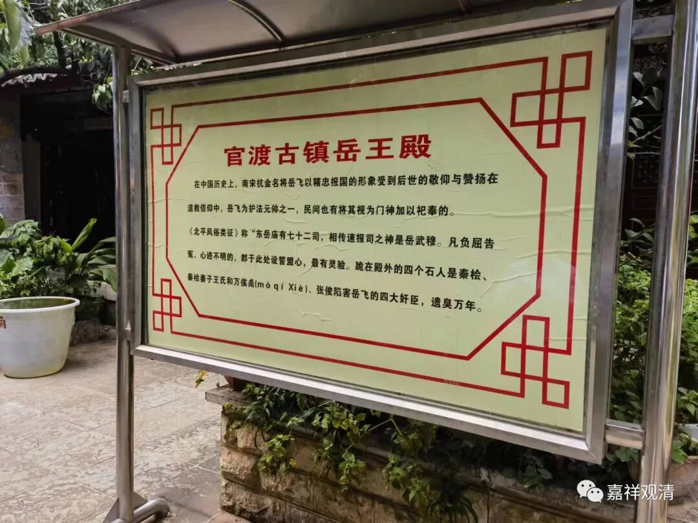
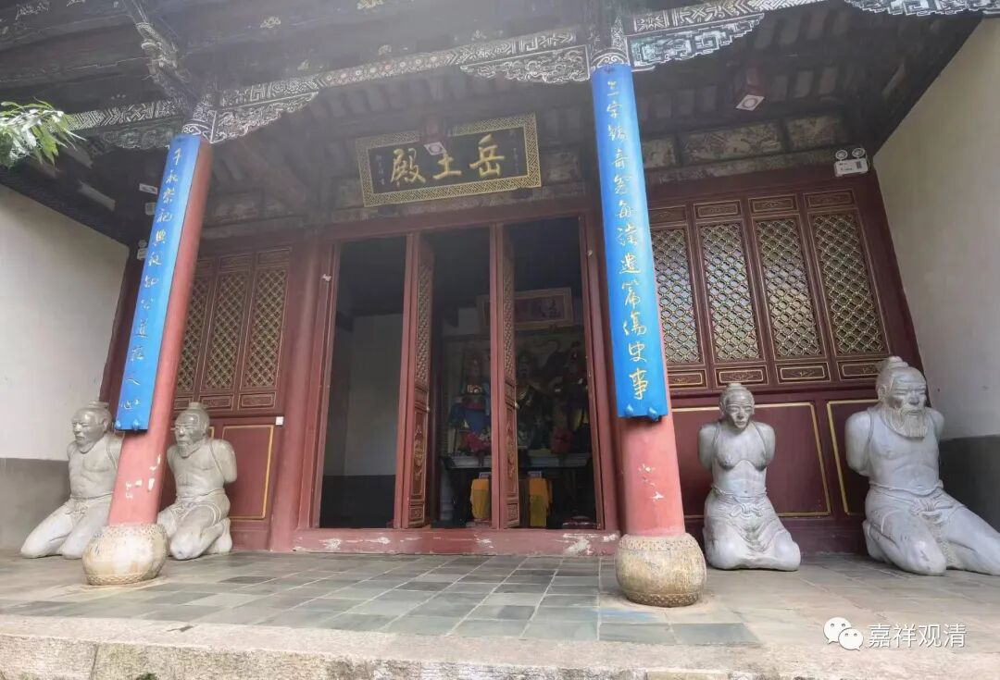
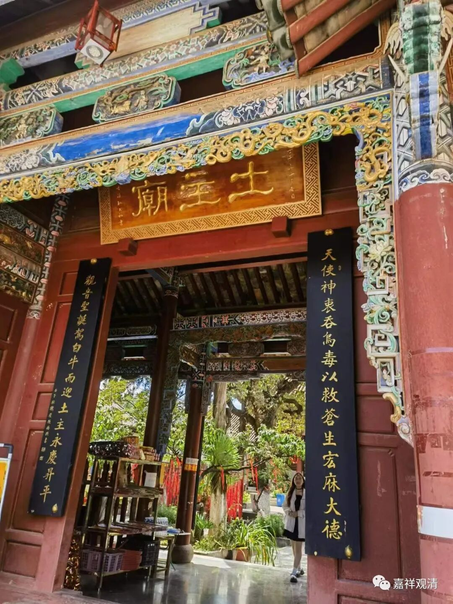
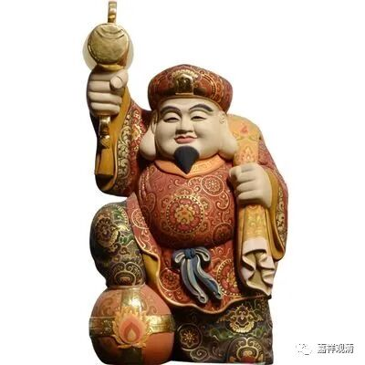
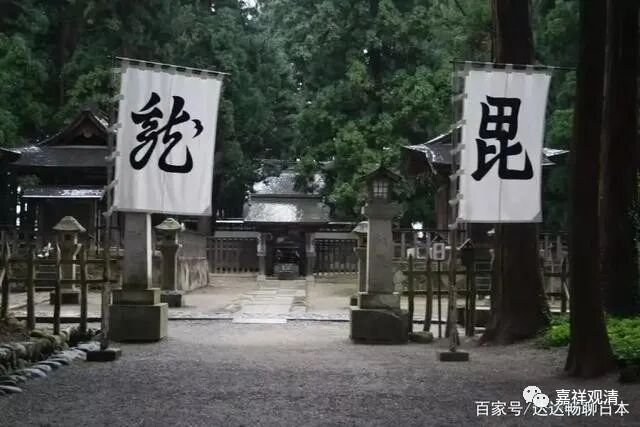

**官渡土主庙**

继续聊昆明官渡古镇的寺院群……

照着地图找到了“土主庙”。算是歪打正着，本来的“官渡理（礼）佛游”的地图上没它。

官渡土主庙建于南诏时期，按常规要算是个佛教寺院，里面供奉了观音菩萨、大黑天、地藏菩萨都是很明显的佛教背景，即便是偏殿的财神、岳王也要算得上是在佛教寺院常见有供奉的，但今天土主庙似乎已经变成道士在管理了（我记得至少有三个道士在管理，没有和尚）……倒也不是不能理解，最基层的这种寺院、道观经常是“产权”不清的。

我记得tc有个尼师在抱怨她的寺院被“抢走了”，原来是文革以后她在此地某道观的旧址恢复了一个寺院，当地道协成立以后就和佛协商量要求归还……佛协最终和尼师商量给予赔偿，“寺院”搬迁、异地改建……

其实这里土主庙“岳王殿”的来历也很值得研究的，按理在今天岳王殿这个位置上安排“岳王殿”不是很适合，但看寺院（本主庙）的介绍说这个“岳王殿”和“东岳庙”有关（不知道他们引用的文献是否合适），那就可以理解了。很多地方原属于官方正祀系统的“东岳庙”会被民间理解为“东”“岳庙”、或被简称为“岳庙”，渐渐地就正式讹为“岳（飞）庙”了，于是出现了信仰主尊的讹变。

其实还有一种可能，就是“药王庙”而“岳王庙”（或者“岳王殿”而“药王殿”）——之前谈到的“药王殿”地理位置上和“岳王殿”就是背对背的。

假如我们要顺着这个线索继续聊下去，那么，“药王殿”还是“药师殿”还得考量一下“产权”归属问题——是孙思邈这个“药王”讹变为药师佛，还是“药师佛”讹变为孙思邈？我在泰兴某村就见过孙思邈升格为药师佛的村庙。

土主庙的对联说明，原先这里是主供观音和大黑天的。云南有很深度的大黑天信仰，我以前也聊过，很多地方的“本主庙”都以大黑天为“本主”，是因为传说中大黑天为了给当地众生挡灾疫一口吃了毒药（这个故事也似湿婆故事的另一个版本），所以云南地方普遍信奉大黑天。云南地方还有两个信仰是观音和毗沙门。

日本财神形象的大黑天，招财猫的原型

某种角度上看，大黑天和毗沙门都曾是汉传佛教的重要信仰对象，但明以后官方背景在中原一带削弱密教信仰，导致大黑天和毗沙门的信仰在汉地“退化”了。而我们看到，作为汉文化周边地区的云南和日本，大黑天和毗沙门的信仰就被很好地保留下来了。我们去日本的话，满目都可以看到“大黑天”“毗沙门”，甚至日本战国时代的大名都以他们作为自己的护法神。

“龙”、“毗”——“越后之龙”上杉谦信的毗沙门旗帜。

