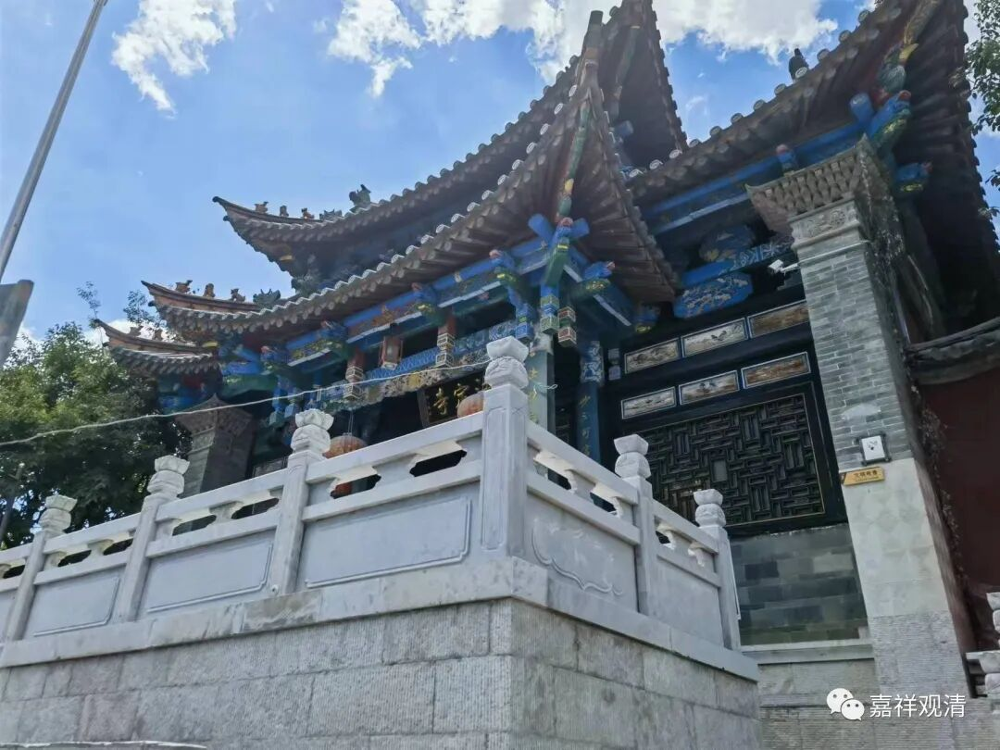
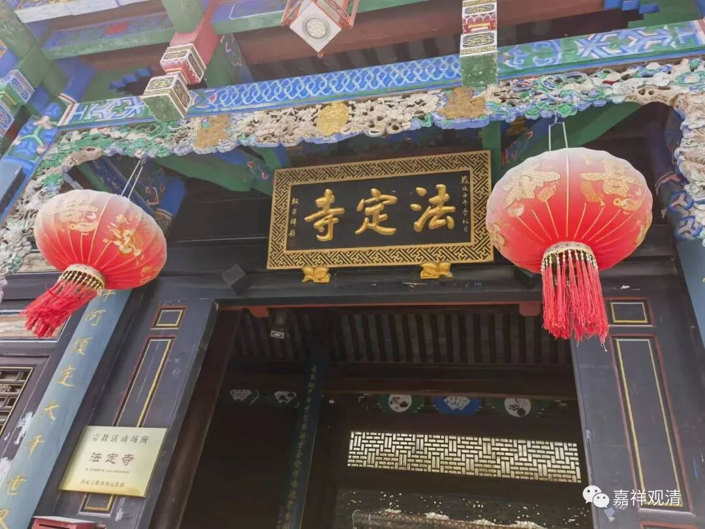
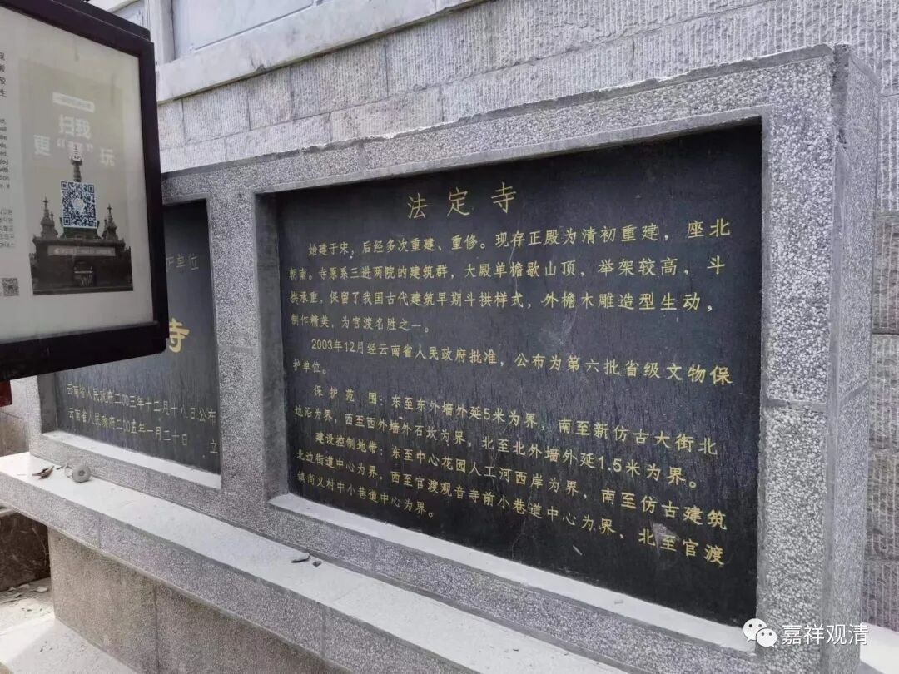
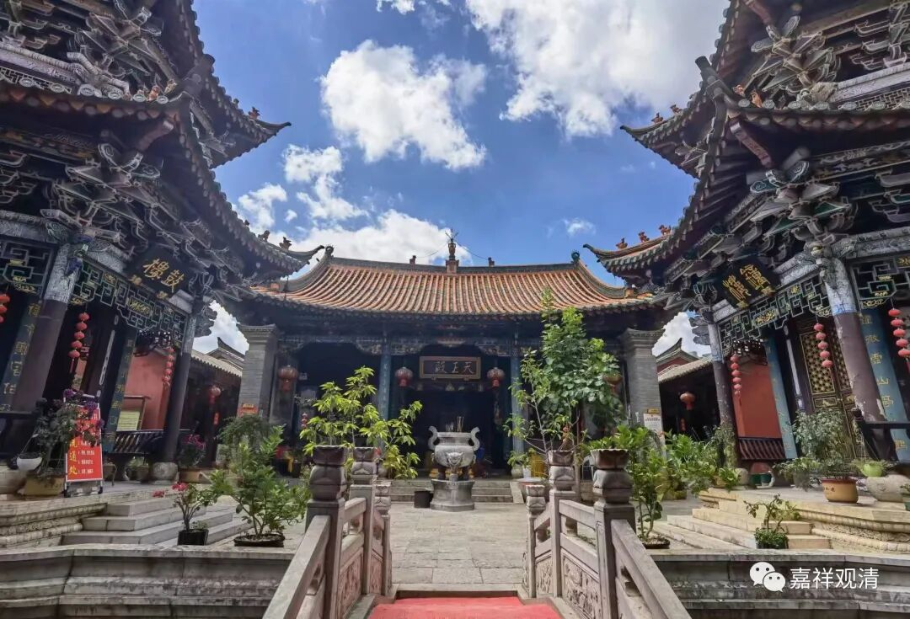
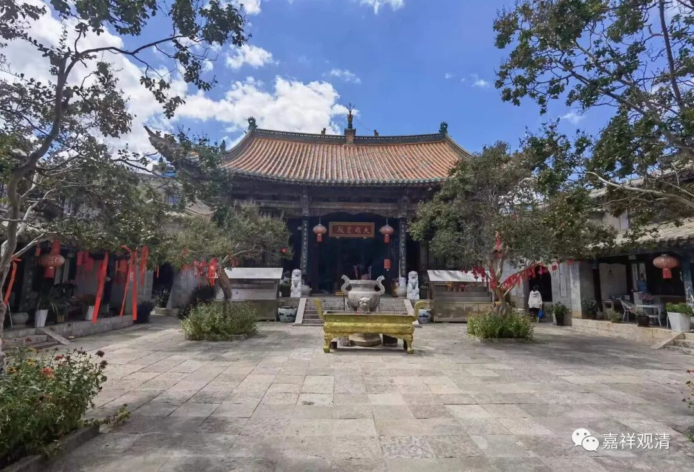
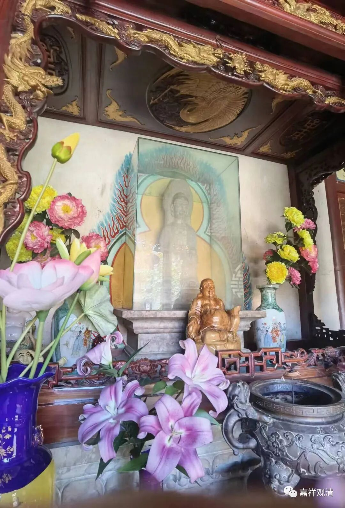
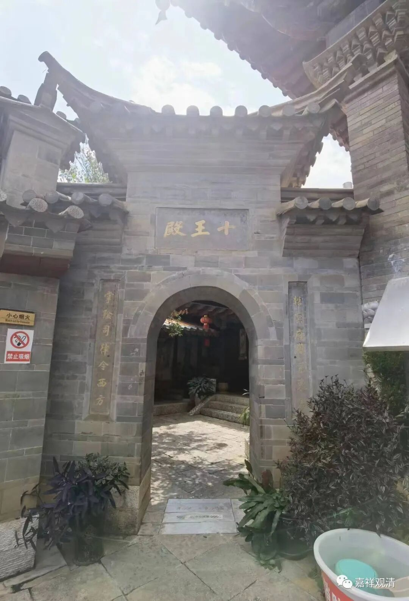

**昆明官渡法定寺**

找到法定寺，它在两条路交汇的拐角处，法定寺门口和螺屿楼正在维修。

看介绍说法定寺始建于宋代，经多次修建，目前保存的主殿主要是清代的遗存。

法定寺的方位不正，坐西北而向东南，明显可以看出当初是依街道走向而建。其实以前建寺院很多都是这样，并不强调以南北向为正，大量的小型寺院本来也就是据民宅改建的，所以在“方向”上并不拘束。倒是文革以后很多寺院基本是凭空而建，于是纷纷坐北朝南地学起了紫禁城，又学西方搞起了大广场，其实以前寺院都是宗教功能性的，不可能搞这些华而不实的大广场，有地还不赶快建僧寮？！YW法师说他数主东西向的寺院，其实东西向的寺院本来就不少见——我们白云寺现在也是东西向的（明代应该是南北向的）。

有一次在山西被带着参观了个大寺院，我就问了一个问题：“和尚住哪儿？”那个超级大的寺院，整个寺院却连一处寮房都没有看到！原来和尚被安排住在寺院外面的素斋馆楼上——这样的“寺院”是旅游公司建的，只是单纯的收费景点，没有寺院的灵魂。

说起来，像法定寺这样的寺院，在古时候大部分时候是自然带着点免费开放的“公园”性质的宗教场所——一些宗教实践性很强的寺院比如“讲寺”、“禅寺”、“律寺”可能很少对外开放（节假日开放）甚至全年不对外开放（这样的极少），但在都市、乡镇里此类“接地气”的寺庙观堂则全部具有“人民公园”的功能，一般是全天候开放的。这类寺庙同时也还带有部分义学的功能，这又可以看作是民间的公益轴心……

法定寺的偏殿有十王殿，十殿阎罗，这是比较晚期的民间信仰了。

