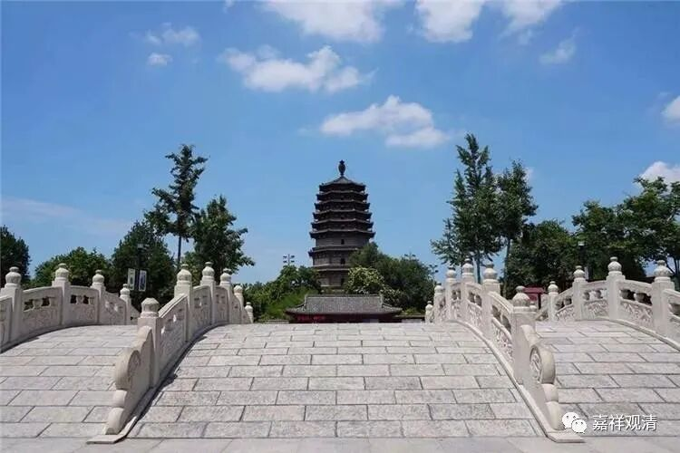

**微课佛教史413·2**

还有一个问题，就是关于大阳警玄禅师的弟子的问题。

首先，大阳警玄禅师继承的是梁山观禅师，而梁山观禅师的上面好像是同安志禅师。你们看，这几位禅师在禅宗史上也比较没有存在感，因此我们也就没讲。到了大阳警玄禅师的时候呢，他的弟子也出现了类似的问题。就是大阳警玄禅师即使曾经有两个弟子——就连我们不准备讲的那位慧洪觉范禅师也提到过他有两个弟子，但是很有可能这两个弟子的寿命不长，所以对曹洞宗的发展没有产生什么影响。

那么，我们再来看投子义青禅师的这个故事，很有可能这个时候曹洞宗已经没人了，从传记上看很明显，就是曹洞宗没人了。但是在其他的一些《灯录》当中，提到大阳警玄禅师有一些其他的弟子，甚至可以找出近十个左右。不过，从后来的历史发展看起来，这几个人虽然在禅宗史上留下过名字，但是名气不响，作用不大。还有一个原因呢，很有可能这些人的实力并不强。因此，诸山大佬们就觉得这不足以去继承和发扬曹洞宗的门庭。所以这个时候，就由浮山法远禅师跳出来，帮曹洞宗来发掘一个人才，这个“人才”就是投子义青禅师。

可以说，投子义青禅师在他本人身上聚集了他必然会爆发的几个原因，所以他出世以后，迅速地帮曹洞宗稳住了局势，打开了局面。如果他不出来的话，曹洞宗按照当时的历史情况来看，很有可能就这样绝了。

那么，我们来看看这位投子义青禅师。

投子义青禅师，俗姓李，青社（今河南偃师）人，七岁的时候在妙相寺出家的，十五岁试《法华经》得度。这个又是一个背《法华经》的例子。这个“试”就是通过《法华经》的考试。“得度”，就是这个时候成为正式的僧人，就是拿到了国家的度碟，我已经讲过很多次了。

试《法华经》呢，没有大家想象中那么简单的。你们如果看华严宗、法华宗的有些传记等等，很明显地，如果不是特殊情况的话，应该是要背诵《法华经》全文的。如果我们看《华严经》感应录的话，甚至有人能背大几十卷的《华严经》。（大学的时候我遇到过一个文盲老太太，能背整部《法华经》。我还有个弟子是京剧院的国家一级演员，文盲，解放前是有名的班主，会的戏很多。）

