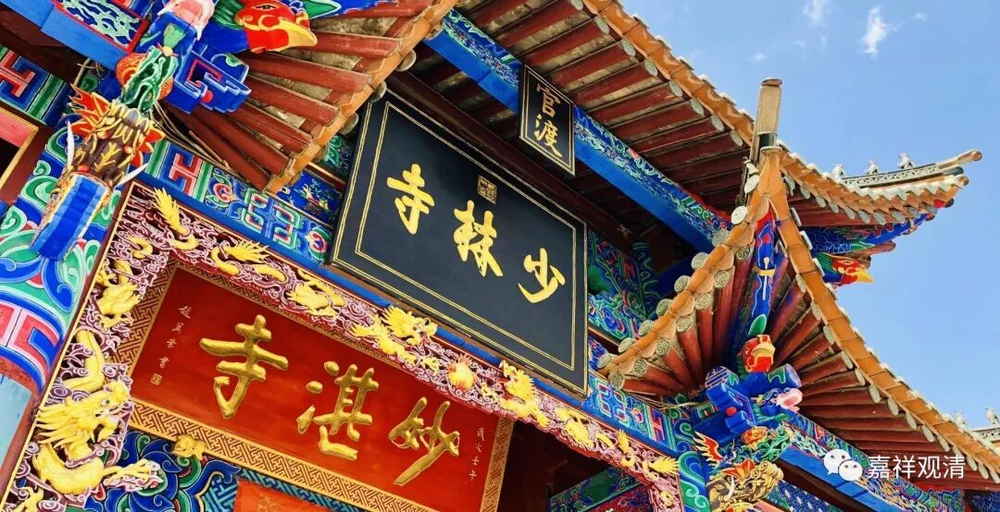

**少林寺？妙湛寺？**

应该说，最初看官渡古镇的地图我是晕乎的——怎么出来个少林寺了？那么到底是少林寺还是妙湛寺……？不过转念一想也能理解，毕竟少林寺满世界扩张、收购，“收几个”寺院也算正常。

巧的是，我到的时候正是“独立”的日子——原本少林寺是从08年开始“代管妙湛寺、土主庙、法定寺、观音寺二十年”，应该到28年结束的，但由于种种原因（我估计是少林寺的财务状况），今年少林寺撤了，我到的这天正是妙湛寺自主的第一天。也就是我在观音寺喝茶的时候，一帮居士刚从妙湛寺参加了法会回来，而我到观音寺的时候，普道法师也以为我是刚参加完妙湛寺的法事出来。

看我拍的现场照片，和前面那张照片比，“少林寺”的匾取下来了。

少林寺在国内外有大量的“下院”，他在海外发展的套路是——一般最早期是派一个人去某地教拳，先租一个地方，慢慢租一个大的，最后买一块地建寺院……这样若干年后某个“少林寺”就被建起来了。

要说到全世界最有名的寺院，那一定是少林寺，要说全世界影响力最大的寺院，也一定是少林寺，“没有之一”。郑教授（武术八段）告诉我，全世界大概有一千大几百个武术协会，其中绝大部分的武协会长都（至少）在少林寺进修过。我穿着汉地的僧装大褂在路上走，不论在国内国外，大家第一反应都是问：“你是少林寺的吗？你会功夫吗？”我脾气好的时候会说：“我不是少林寺的，但也算会一点武术。”有时候实在被问烦了，我会回答：“除了少林寺就没有寺院了吗？”

少林寺我倒是去过，那时候我还没有出家。在二祖殿有个出家人和我聊，力劝我在少林寺出家：“你佛教水平这么好，又想在佛教里做事，那还有比少林寺更好的平台吗？全世界没有比少林寺更有名的寺院了！我是方丈的徒弟，我们正缺人，我给你介绍……”

我没在少林寺出家，少林寺不是我的选项。

（“少林寺”在官渡古镇已经撤了，但地图上还没改过来。）

        修改于