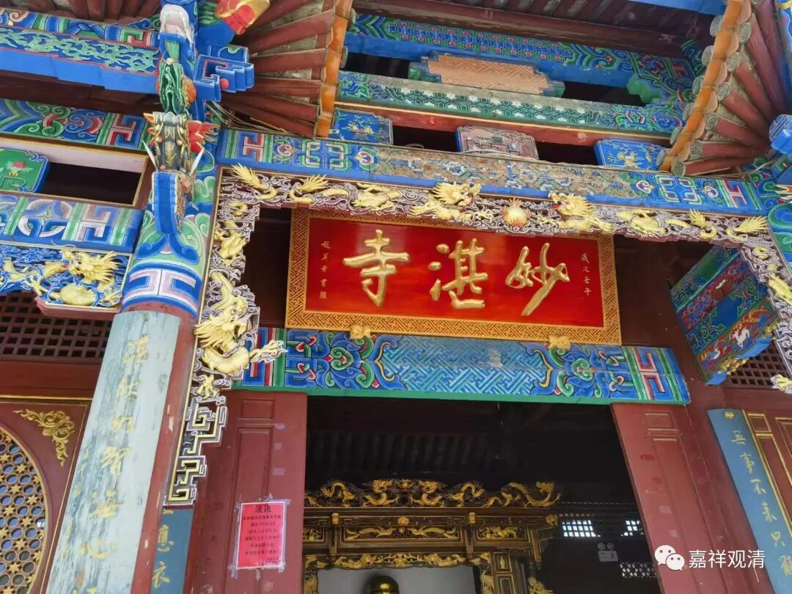

**官渡妙湛寺**

继续聊妙湛寺（有的地图上还是叫“少林寺”）……

介绍上没谈“妙湛寺”寺院取名的来历，但一望而知寺名来源应该是取的“妙湛总持……”的初二字。

寺院的取名有几种，有的用地名，比如“径山寺”、“普陀寺”；有的用佛教名词，比如“真如寺”“龙华寺”；有的用菩萨名，如“观音寺”“地藏寺”；有的用经典名，如“法华寺”“楞严寺”；有的用年号名，如“开元寺”“景德禅寺”；有的用人名，如“鸠摩罗什寺”“玄奘寺”；有以寺院建筑命名的，如“三塔寺”“七塔寺”；有以佛像命名的，如“玉佛寺”、“铁佛寺”……

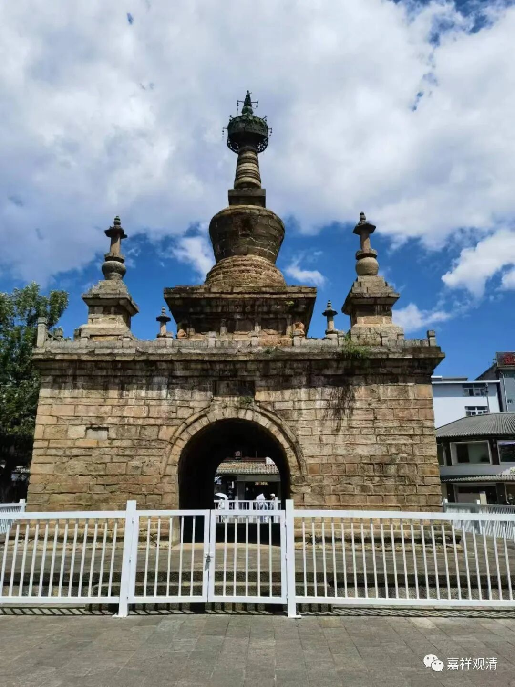

妙湛寺金刚塔

今天的妙湛寺门口有三座塔，一座是“妙湛寺金刚塔”，这个“金刚塔”的名字是现代新起的，历史上并没有这个称呼。

妙湛寺金刚塔的式样原型来自印度，明清以来这样的塔在汉地不少见，主要是模仿佛教宇宙观而形成的式样——中间高大的塔代表须弥山，周围四座小塔象征着四大洲。从印度大菩提寺这样建塔以后，周围佛教国家就出现了很多这种形制的塔，有的原样照抄，有的做了变形，主要特征就是中间一大周围四小（还有加上更小的八个塔的）。

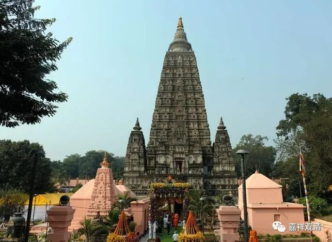

菩提迦耶大菩提寺塔，注意，这是原版

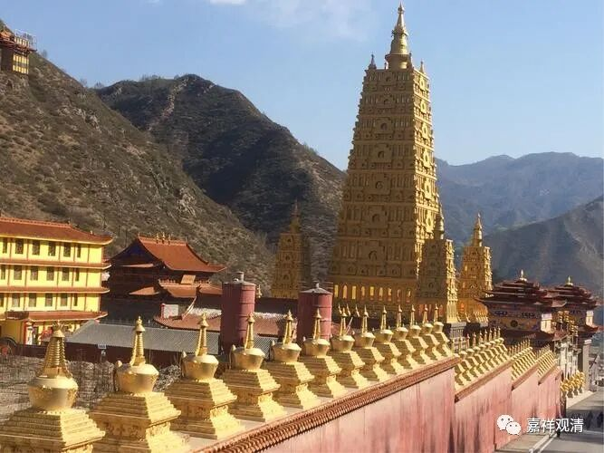

五台山大宝寺塔，基本复刻了菩提迦耶的大菩提寺塔

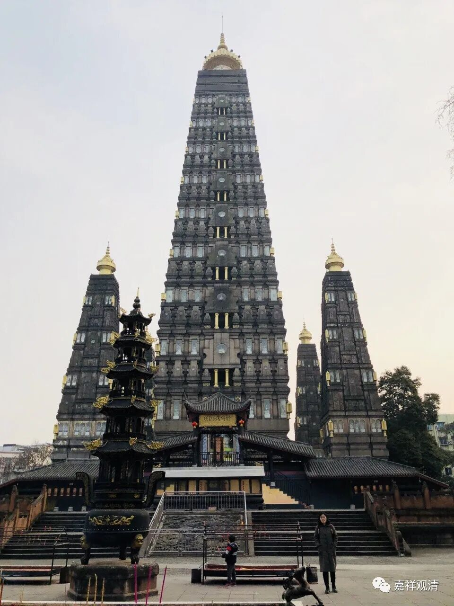

四川彭县龙兴寺塔，基本原样拷贝

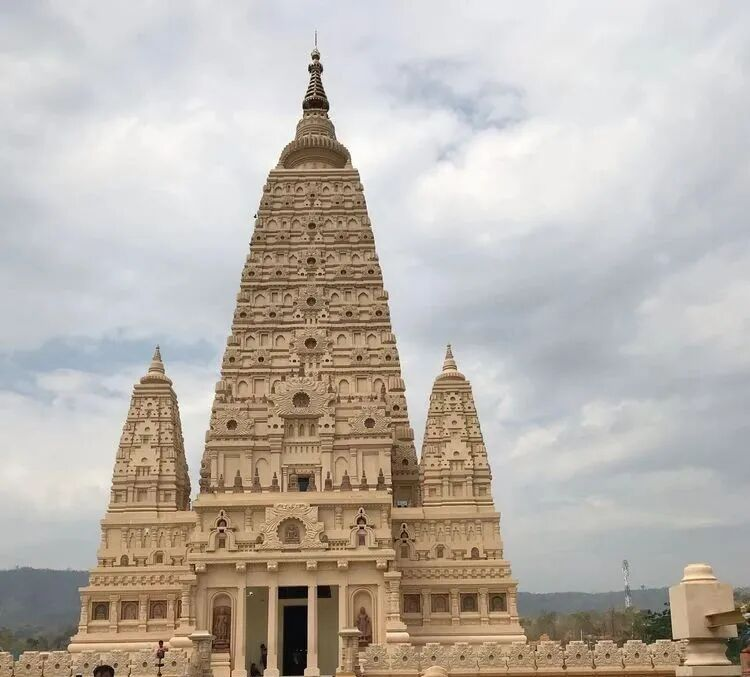

缅甸菩提哈塔，拷贝不走样

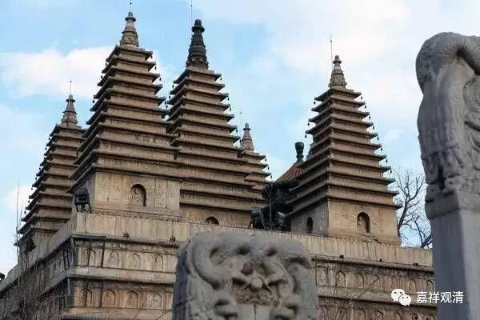

北京真觉寺塔

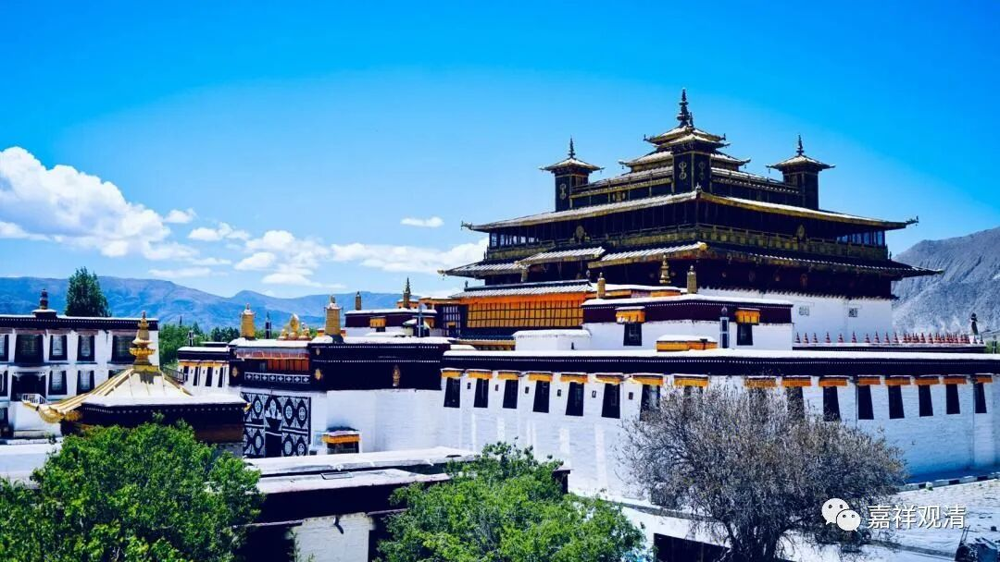

桑耶寺

妙湛寺金刚塔和妙湛寺大门中间，是妙湛寺双塔，又叫金鸡双塔。双塔始建于元代，后多次维修，清末地震，西塔倒塌，今已重建。云南的塔，这种式样的很多，如大理三塔。

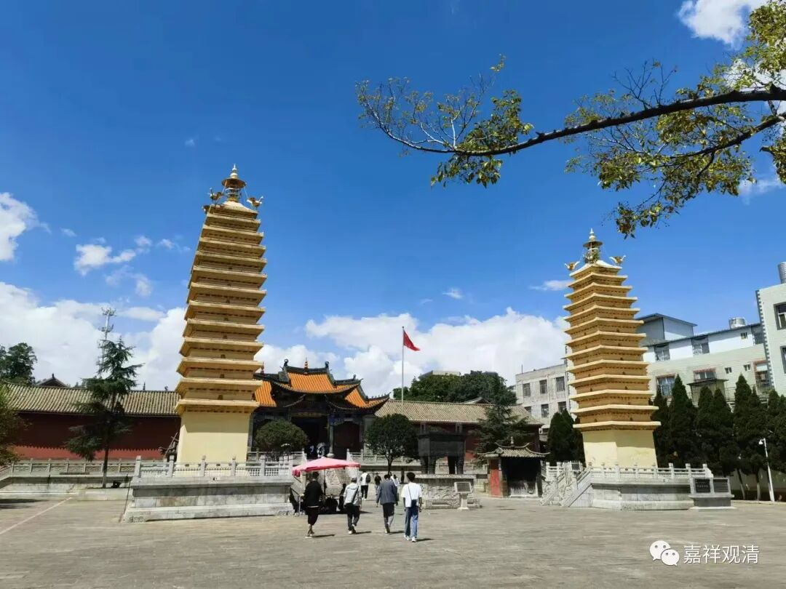

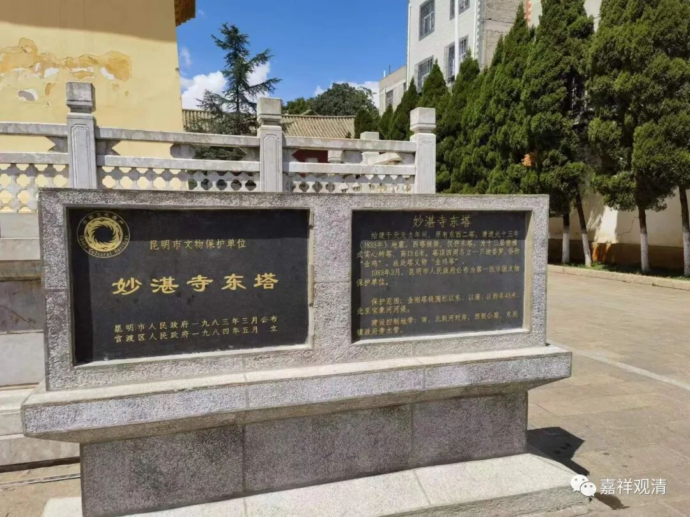

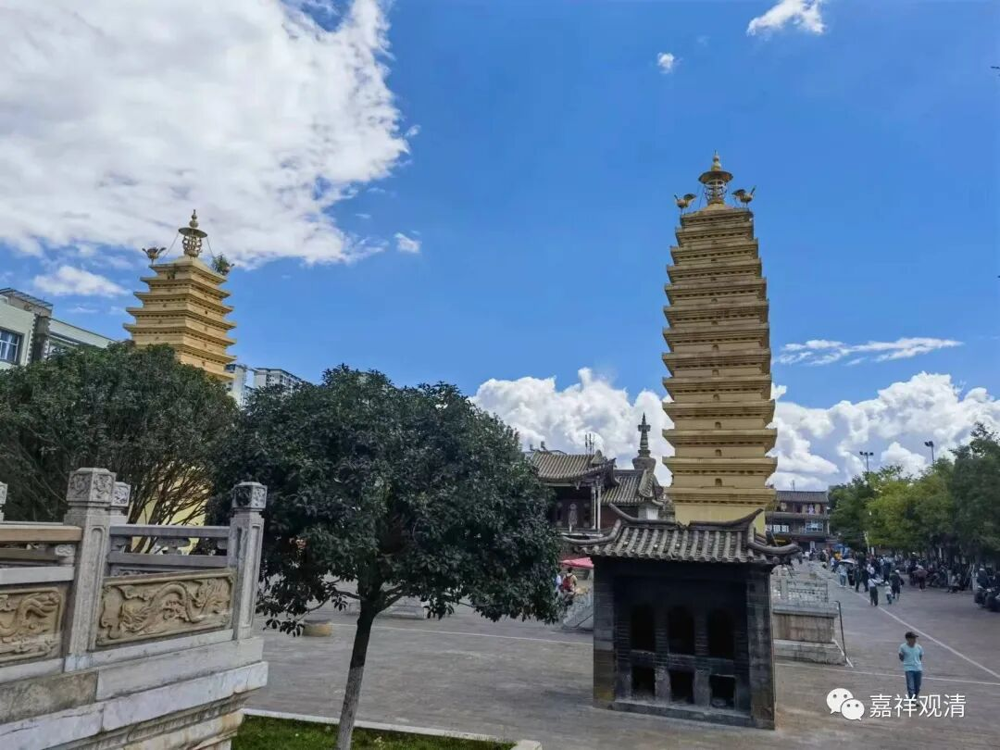

我去妙湛寺的这天正值它“恢复自由身”，不过看来很低调，完全不露痕迹。

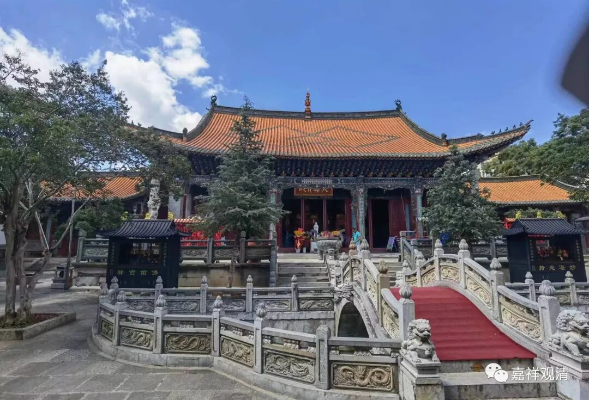

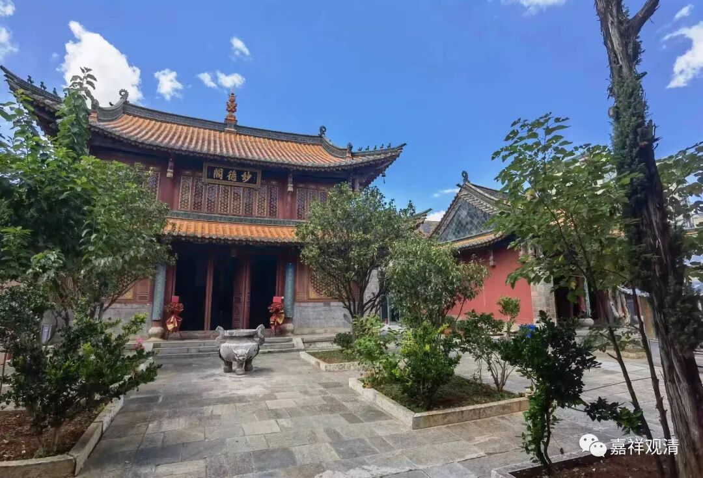

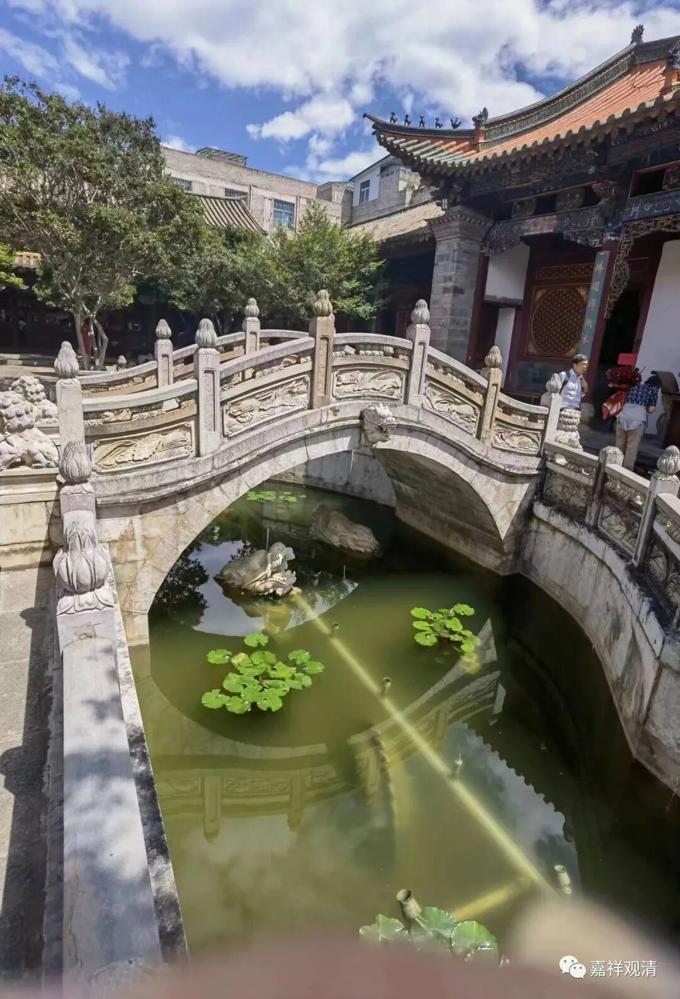

水池里雕了两条石龙。这种形式，很多人都会丢硬币。现在带现金的人少了，都用手机移动支付了，却并没有人丢手机下去

寺院建造时，主要是由云南剑川的工匠来建造的，就是之前我们提到过的剑川。云南当地人都知道，剑川的工匠很有名，他们说：造庙，找剑川人就行了！

