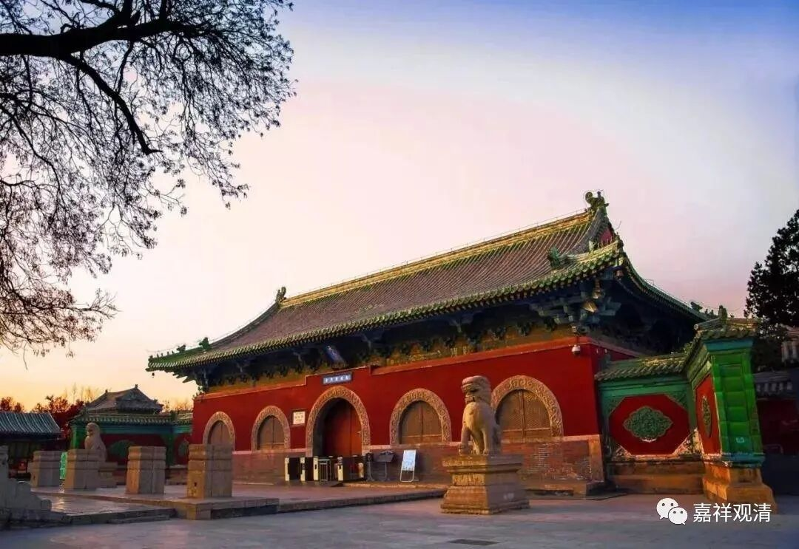

**微课佛教史414·2**

《百法明门论》当中讲到了二无我：人无我、法无我，但是对于但是的投子义青禅师来说，好像还没有完全解决类似无我的问题，于是他又去学习了“华严”。后来投子义青禅师研学“华严”是比较有名的。

这里我还是要解释一下的，这个“华严”不仅仅是指《华严经》，实际上要包括一些华严宗的内容，甚至主要是指“华严宗”而不是《华严经》。华严宗的内容和《华严经》不完全一样。华严宗是中国佛教当中的一个流派，有自身特色的教义体系。

传记里说投子义青禅师开悟以后，大家给他的称呼叫“青华严”，这个称呼说明他研学华严的水平在江湖上是非常有名的。

投子义青禅师后来就到了河南洛中，也就是河洛一带，学习“华严”——《华严经》和华严宗的内容。他在那个时候也开法讲经，而且讲经讲得很好。但是，说他讲到了法慧菩萨的** “即心自性”**的偈子的时候，突然就说** “法离文字，宁可讲乎”**。法——真正的佛法，是离开文字的，不能够局限于文字，怎么可以仅仅是讲说呢？投子义青禅师就觉得单纯的讲学是不够的，所以就开始趋向了禅门。

我们来看一看“即心自性”这一段《华严经》的原文：

“知一切法，即心自性，

成就慧身，不由他悟。”

还有另外一个问题，我们前面已经提到过，就是到了北宋这个时候，华严一系和禅宗一系已经非常紧密地联合在一起了。唐代的圭峰宗密禅师就是如此，然后《宗镜录》的作者永明延寿禅师也是华严和禅宗两肩挑，或者说和两宗都有关系。很多禅宗的宗师都表现为“教在华严、行在禅宗”，他们“依禅出教”的“教”更多地倾向华严，由此来打通禅教，而投子义青（“青华严”）也属于其中之一了。

投子义青禅师就从唯识而法华而华严而禅宗，说明他虽继承禅宗，在教下学过的东西也不少，挺有文化的。北宋整个朝代的风气就是这样，文化的氛围很浓，很小资。宋代有很多东西真的是能够非常杰出地代表了中国文化。

我们就先讲到这里吧。好，谢谢大家！

