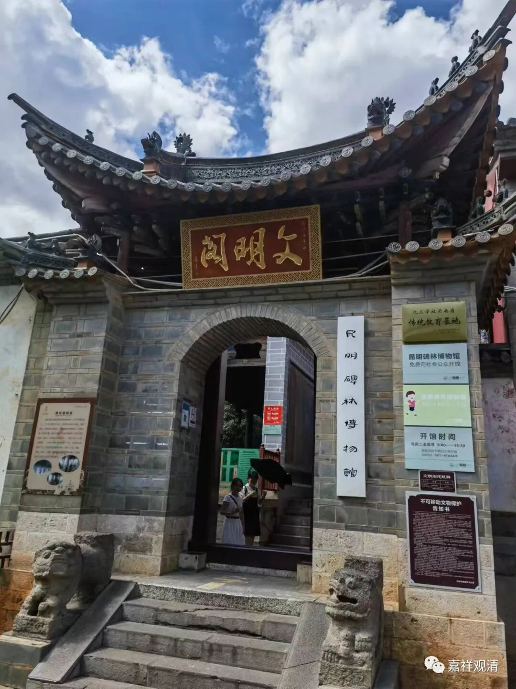

**昆明碑林博物馆**

妙湛寺边上的文明阁，现在被辟为昆明碑林博物馆，我自然要冒充内行进去看看的。

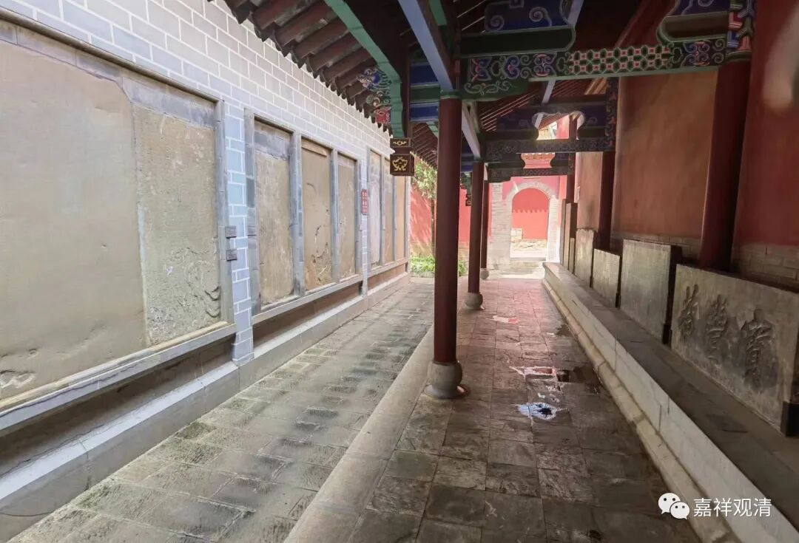

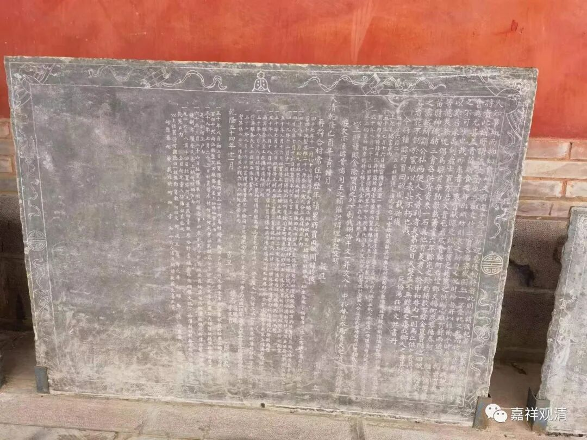

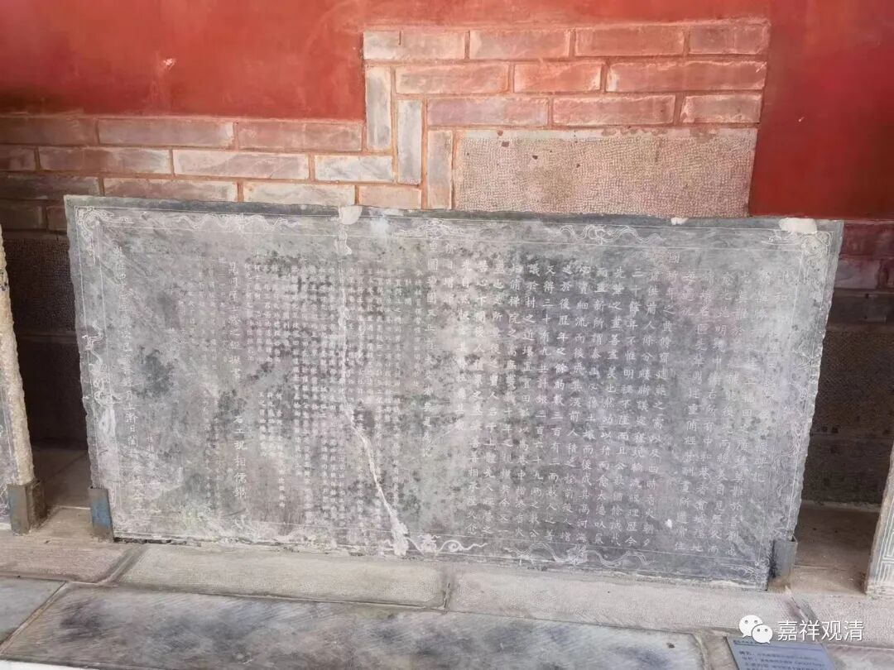

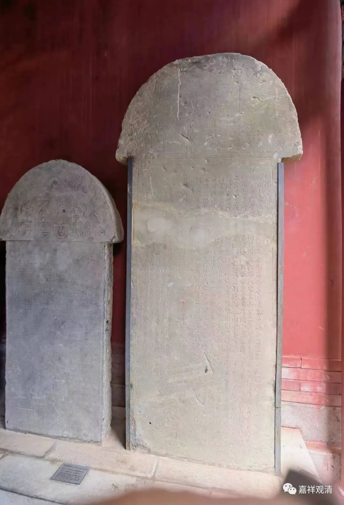

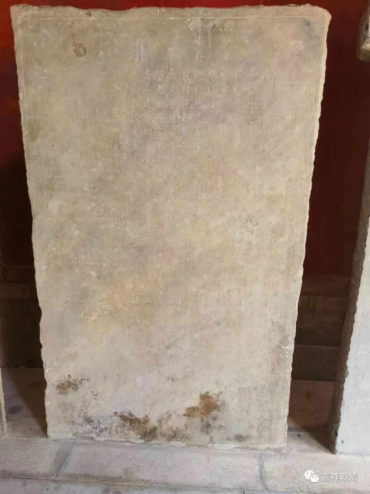

昆明的这个碑林博物馆没什么名碑，数量也不多，都是八九十年代官渡古镇周围收集来的，大部分是寺院的碑记，有功德碑，有田产捐赠，也有寺名的匾……所有的碑放一块儿也就一个不长的廊左右两边就摆完了，西安碑林就不用说了，比起苏州衢州都是远远不够的，大概放在县级规模里也不算大。

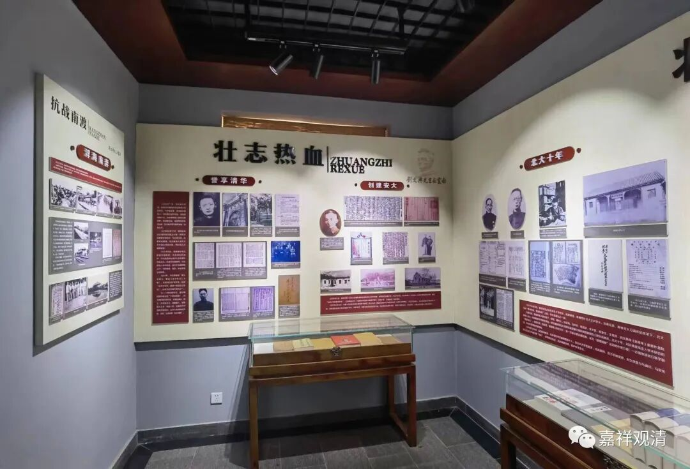

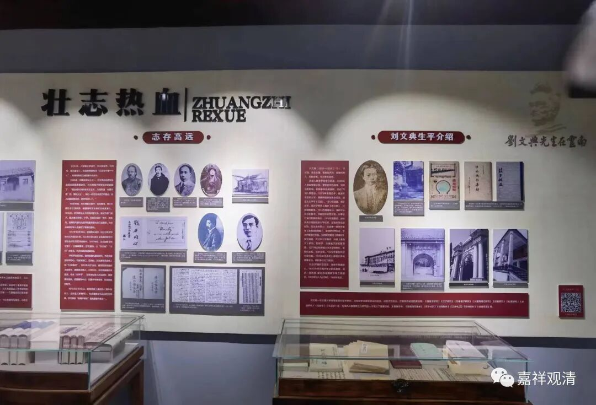

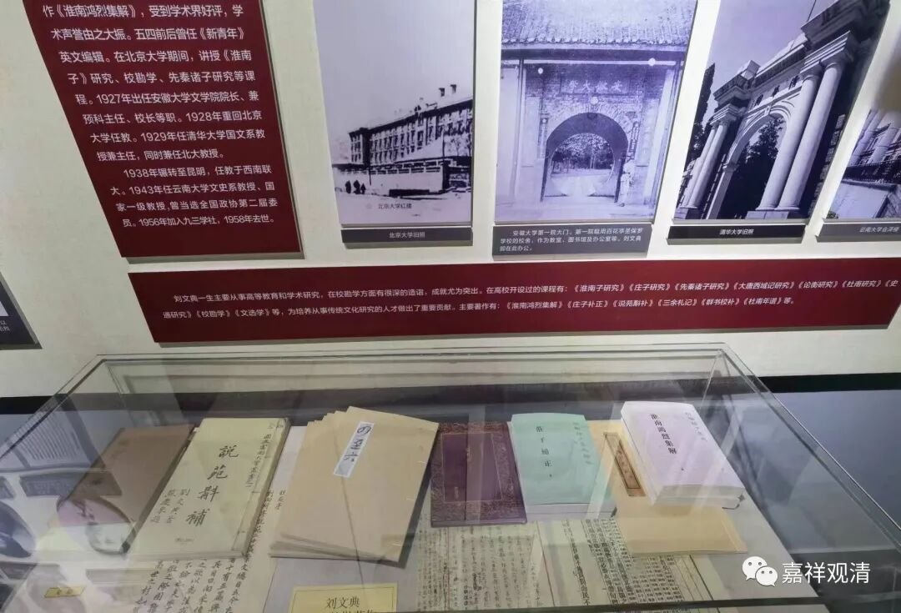

展厅里还有国学大师刘文典的事迹展。刘文典很有名，狂人学者，家学渊源，但我不知道他最后是留在昆明的。

楼上还有个展厅是云南碑刻的拓片展。

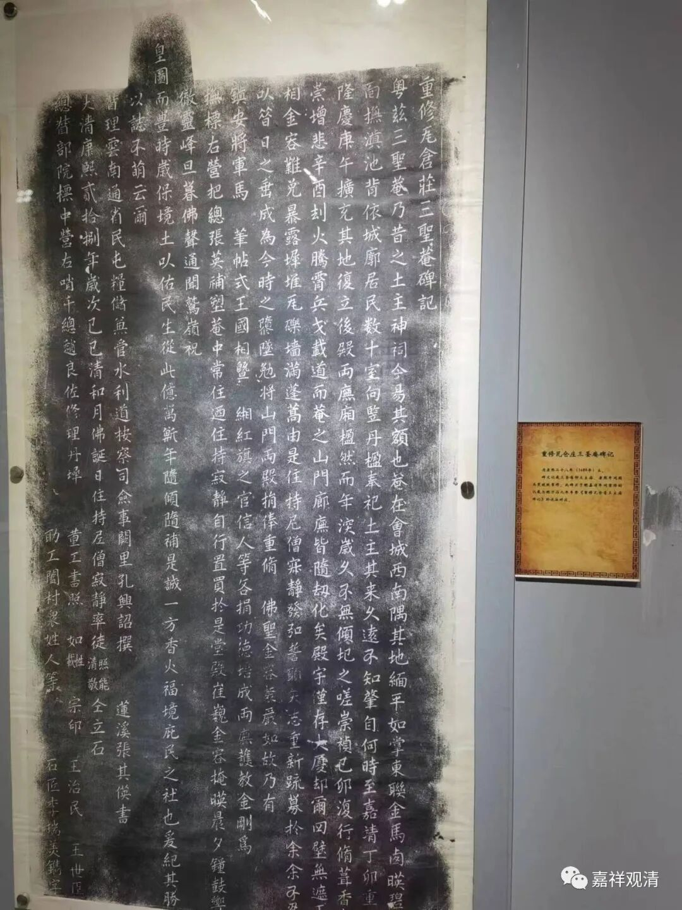

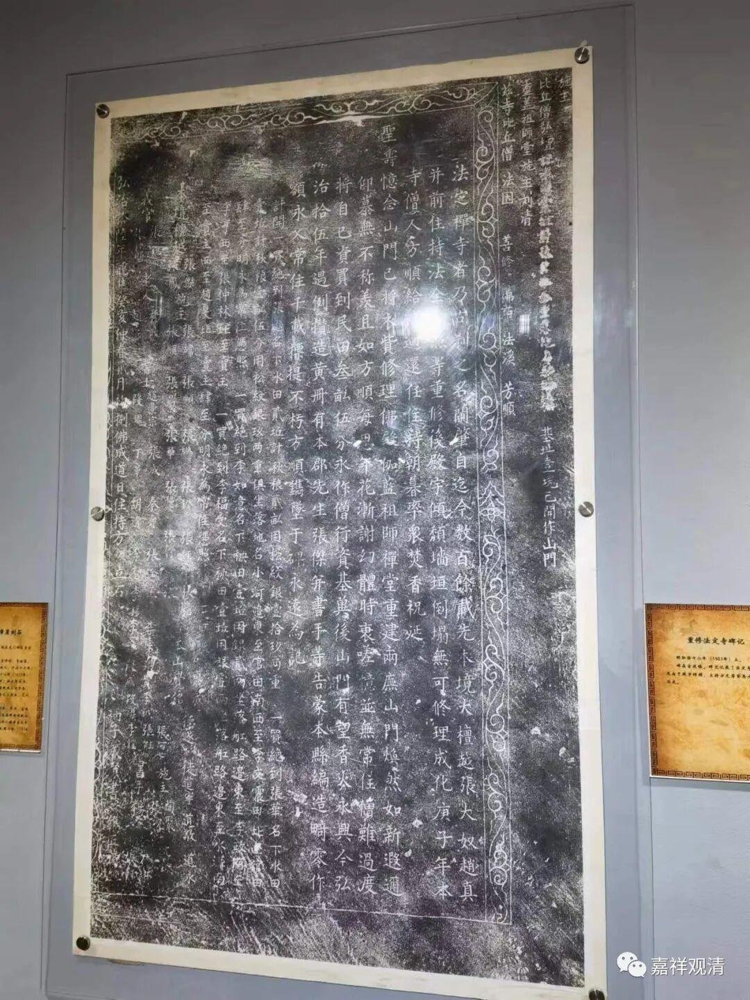

以我这个初学看起来，这个拓片展算是很敷衍了，很多拓片拓工的质量不高，也就是比我目前的手法稍好一丢丢的程度。假如我搞成这个样子，我是没脸拿出去给别人“参观”的，免费的也不行。

碑林博物馆有一块碑拓很有趣，我是第一次关注到——贪官遗臭碑。

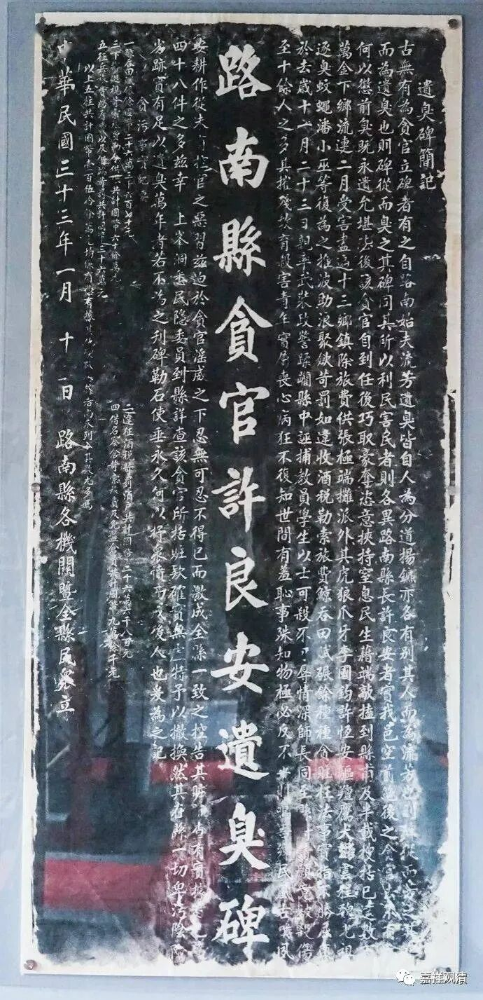

《路南县贪官许良安遗臭碑》

碑文说：

“古无有为贪官立碑者，有之，自路南始……”

那这就是历史上第一块“贪官遗臭碑”了。（路南县，今云南石林彝族自治县。阿诗玛的家乡。）

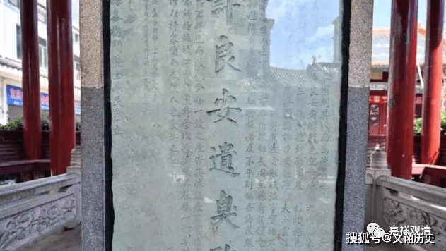

原碑

