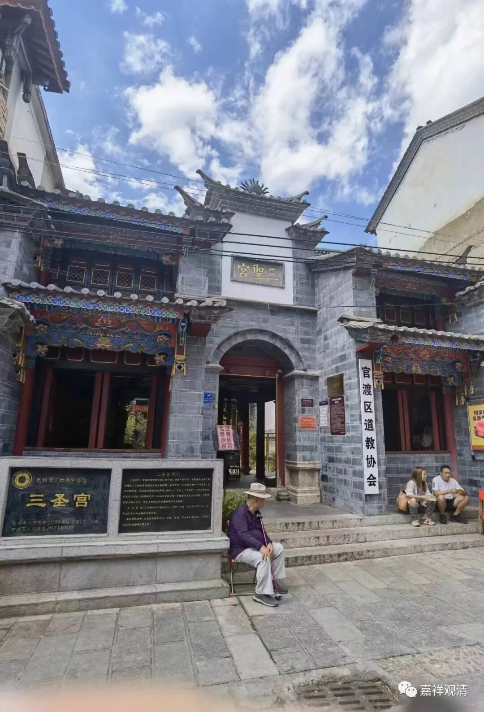
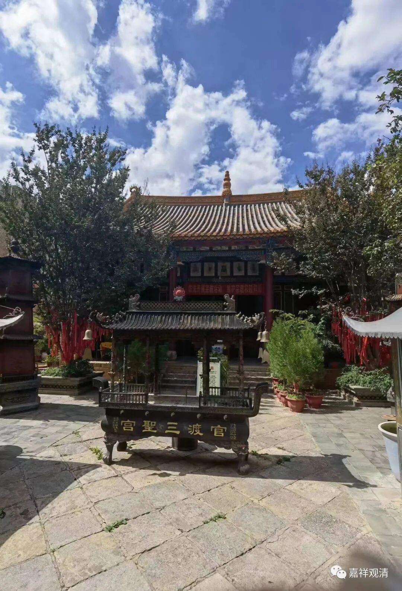
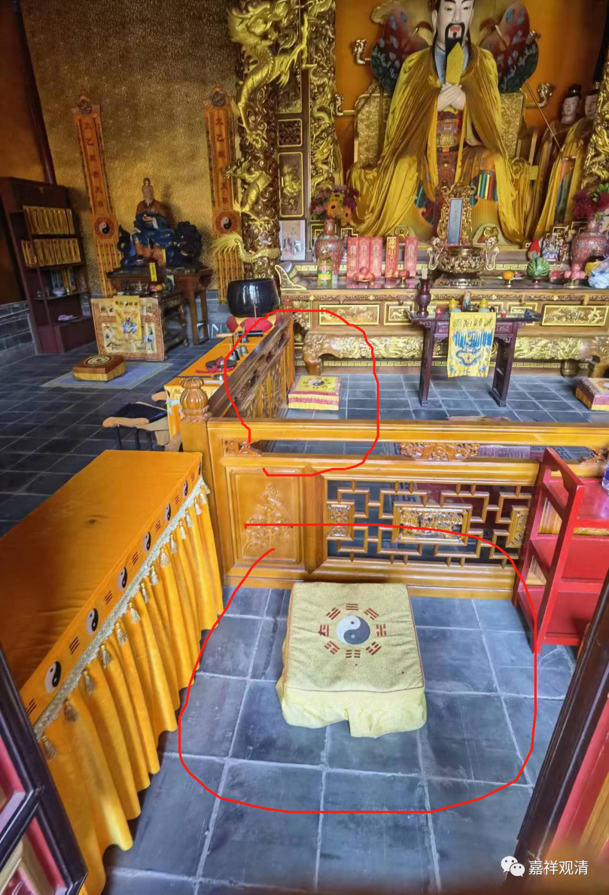
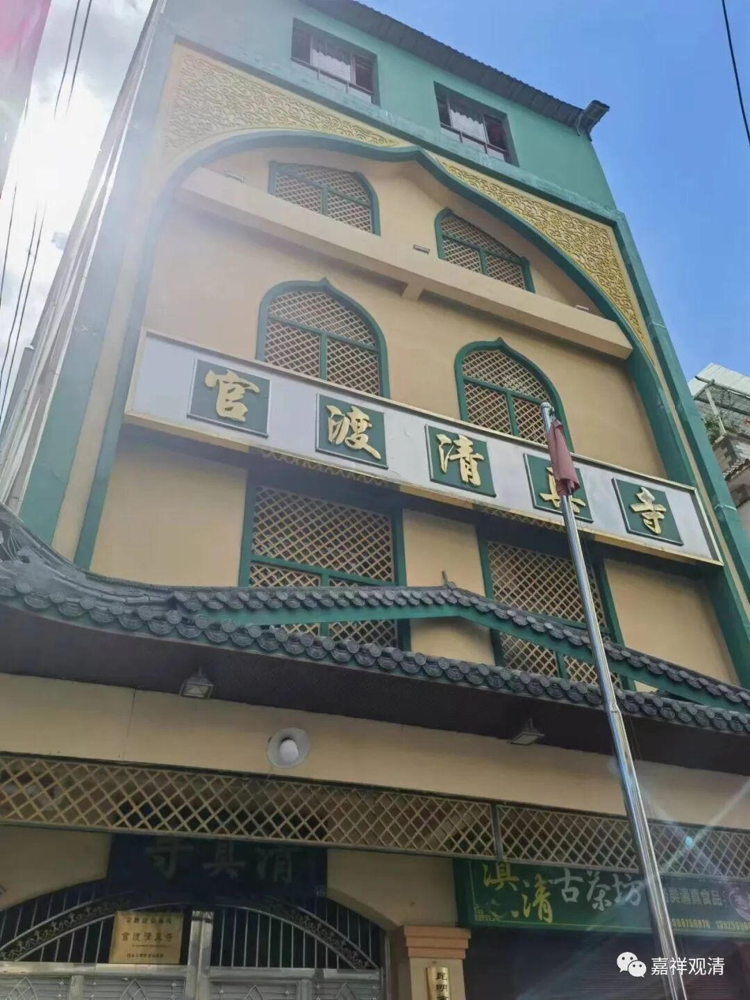

**官渡三圣宫**

出妙湛寺，金刚塔左手有一条老街，并非刻意的，发现昆明官渡区道教协会的所在地——三圣宫。

官渡“三圣宫”恢复时间不长，内部三进、两院子，据说以前是县衙，也做过公安局、教师宿舍、兽医站、养猪场……因配合官渡古镇的开发而重建。

“三圣宫”的称呼各地都有，但并不“特异”，有的“三圣宫”的“三圣”就是三清（玉清元始天尊，上清灵宝天尊和太清道德天尊），有的三圣是指三教的“圣人”（孔子、老子、释迦佛），束河古镇的三圣宫则供的是观音、孙膑和龙王，我问了一下三圣宫的道长，道长说这里供的三圣是：孔子（孔圣）、文昌帝君（文圣）、关羽（武圣）。

这种说法虽稍显牵强，但能理解。从县城级别的古镇角度来说，一般“文庙”和“关帝庙”都是县级的标配（其实还应该有“城隍庙”），而文庙里带魁星阁、供文昌帝君也是标配，后期文庙武庙合并，祭祀都在一起了，取一个大差不差的名字，就随大流叫了“三圣殿”。（一般来说，三圣殿最合理、最常见的应该是三教的“圣人”。）

我看他们拜垫上的八卦有点不一样，就“请教”常住的道长，道长似乎也是第一次被提醒，就说是采购得不一样。其实这是“由内而外”和“自外向内”的“视点”不一样造成的八卦图像不一样。（我心里有点暗暗“骄傲”，呵呵，我比道长多懂点“八卦”。）

再转过一个小巷，是官渡的清真寺，这也是后期县城的标配。

