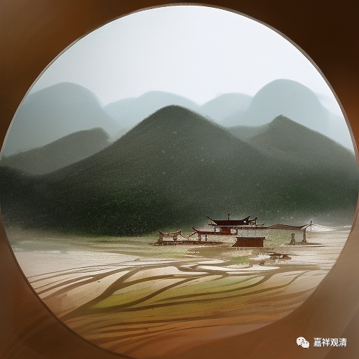

**微课佛教史415·2**

浮山法远禅师就让投子义青看外道问佛“不问有言、不问无言”的因缘，用后来的话说就是“参话头”，但实际上那个时候还没到“参话头”流行的时候，就是“参话头”的意思已经有了。浮山法远禅师就让他看这个话头，投子义青禅师在他门下三年还没搞清楚，或者说三年还在那里参究。

有一天，浮山法远禅师就问他：“你这话头还记得吗？”投子义青禅师刚要回答，浮山法远禅师马上就把他的嘴给捂住了。“咣当”一下，投子义青禅师立即就开悟了，通身汗流，全身冒汗，马上就磕头，有所境界就磕头。

这也有点奇怪，禅宗里面是有这样的情况，就是不让你说。这个究竟是什么，大家也看看，我也不是很知道。比如说，我师父也是禅宗的，一般我们说参话头就是参“念佛是谁”，是吧？但是我师父传下来不是这样的，有点特殊，不是参“念佛是谁”，这个“谁”不要了，就是参“念佛是”。可以说也类似于浮山法远锤炼投子义青这个情况，等于是你说了一半把你嘴捂住了，不让你说了——“念佛是”，所以我们参“念佛是”。

浮山法远禅师问：** “汝妙悟玄机耶？”**你悟了吗？

投子义青禅师说：** “设有妙悟，也须吐却。”**如果有什么，那我也会吐了。

老和尚边上有一位侍者，侍者有时候也会搭话，他说：** “青华严今日如病得汗。”**啊呀，大家看看哦，我们小和尚现在就像生病一样，出的这一身汗，通身是汗。

投子义青禅师说：** “合取狗口。”**把你的狗嘴给我闭上！——差不多这个意思。

这个呢，就说是投子义青禅师的得道因缘或者说得悟的因缘。

我还是不断地要强调，得悟的因缘是得悟的因缘，但是前面的三年不是白费的。所有的事情基本上都是这样的，基础的那些东西其实很重要。比如说你打太极拳，你先不学招数就想要悟，就是招数先不好好练，一开始就想要悟，那就没得谈。练武也是一样，你的速度和力量不上去，你就要讲技巧，这都没得谈，没有意义。

前两天，有一位教琴的先生，是zg琴会的会长。她也说这个话，说：“现在练古琴的人很多，动不动就谈哲学，谈到中国文化上去。你连韵律、音准、节奏都没搞清楚，你谈什么文化呢？先不急着谈文化。”

禅宗也是一样，你不经一番寒彻骨，你没有在禅堂里面盘过三年腿子，你说“我要来开悟”，“我跟你玩斗机峰”，那都是废话，那些东西都和你没关系。其实所有的事情都一样，在刚开始学习的时候基础绝对是很重要的，你下面没学好，上面的东西对你来说都是没有意义的。以前我们的QQ群里，有很多人喜欢聊禅宗的什么见地等等，我都懒得聊：“腿子都没盘过三年，你聊什么？”

