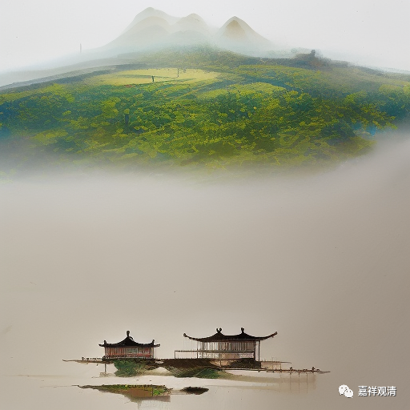

**微课堂佛教史 416·1

在这以后呢，说浮山法远禅师又专门锤炼了投子义青禅师整整三年。三年又三年以后，浮山法远禅师专门把投子义青禅师找来，跟他讲了一件事情，他说：“我在丛林里面待了很久，大师们我也都已经见了。”

我们前面也讲了，浮山法远禅师得法是在叶县归省禅师那里，在此之前他也见过汾阳善昭禅师，后来汾阳善昭禅师让他去见大阳警玄禅师。当时好像是汾阳善昭禅师说“天下的禅法和大师们我都见过了，但是曹洞这一系我不算了解，你们几个可以去大阳警玄禅师那里学学”，所以他推荐了他的很多弟子去到大阳警玄禅师那里。在大阳警玄禅师的门下，浮山法远禅师也是被认可的，也是被认为这个人很不错，而且待的时间并不短。

但是，前面我们讲过，浮山法远禅师主要是在叶县归省禅师那里待了很长的时间，后来在门外，就是在山下偷听，最后得法在他（叶县归省禅师）手里。所以，当大阳警玄禅师要把自己的法脉要传给浮山法远禅师的时候，他——不能说是直接拒绝，就说：“我已经有师父了。”他的意思可以理解为：“我已经是叶县归省禅师的弟子了，所以我不方便再继承您的法脉。” 其实，这个事情江湖上也已经知道了。

有些地方就说，大阳警玄禅师的意思就是“我没有弟子”。现在看起来，应该不是没有弟子，而是没有特别出色的弟子，没有特别超一流的弟子，这样有可能的。在传记当中说，大阳警玄禅师还是有七八个弟子的，就是在《灯录》当中是有这些人继承的。但是这些人有些可能有些早逝，去世得比较早，有些走向江湖后实力不济……造成了大阳警玄禅师的门下很快就没有人继承。

大阳警玄禅师自己可能在比较早的时候就发现了，这些弟子虽然算是出色的，或者说他也已经肯定这些人可以出去领一方僧众，但是还欠锻炼，还缺一点。这个时候呢，大阳警玄禅师就专门请来浮山法远禅师，就有点像“托孤”的那种感觉。

以前不是说“托付衣钵”嘛，但是大阳警玄禅师他不可能把自己的袈裟给他，因为他还活着，是不可以把袈裟给别人的。于是，他就交给浮山法远禅师自己的直裰（类似于大褂，比大褂的袖子更宽一点），还有自己的顶相（就是画的自己的画像）等等，说：“你啊，有机会就代我传下去。”

另外也有一个说法，就是浮山法远禅师自己说的：“我已经继承了叶县归省禅师这一脉。这样，假如老师您将来门下比较凋零，到时候我帮您找一个根器好的，再帮您锻炼一下他，让曹洞门下的宗旨不致断绝。”

然后，大阳警玄禅师就说：“同意！” 就把自己的皮履、直裰都交给了浮山法远禅师。皮履，不是今天的皮鞋，就是长筒靴子，他平时用的靴子。直裰，就是自己平时穿的类似于大褂，又有点类似于海青，比大褂的袖口要长一点。

最后还留下一首偈子作为证明，说我是托浮山法远禅师来帮我找个弟子：“杨广山头草，凭君待价沽，异苗蕃茂处，深密固灵根。”这个“杨”字有两种写法，还有一种写法是阴阳的“阳”，我但估计可能是杨广的“杨”。

