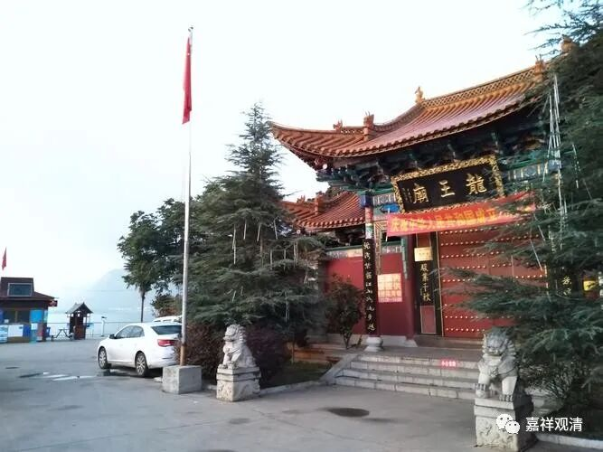
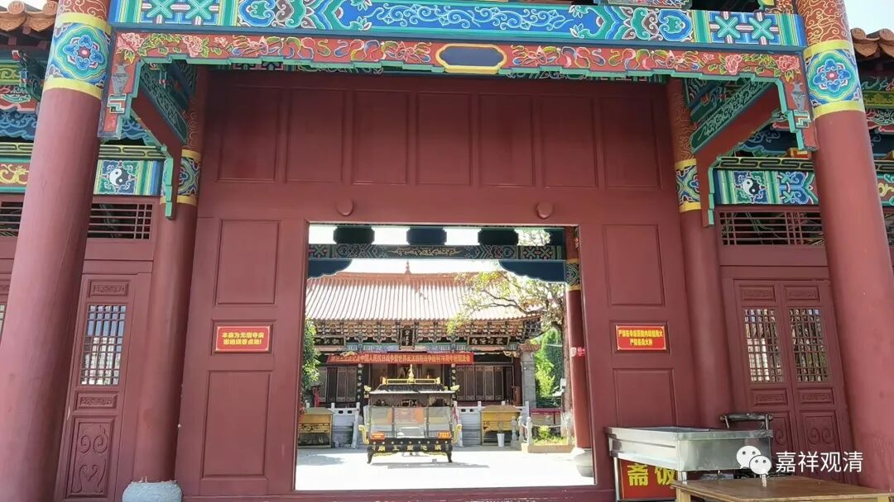
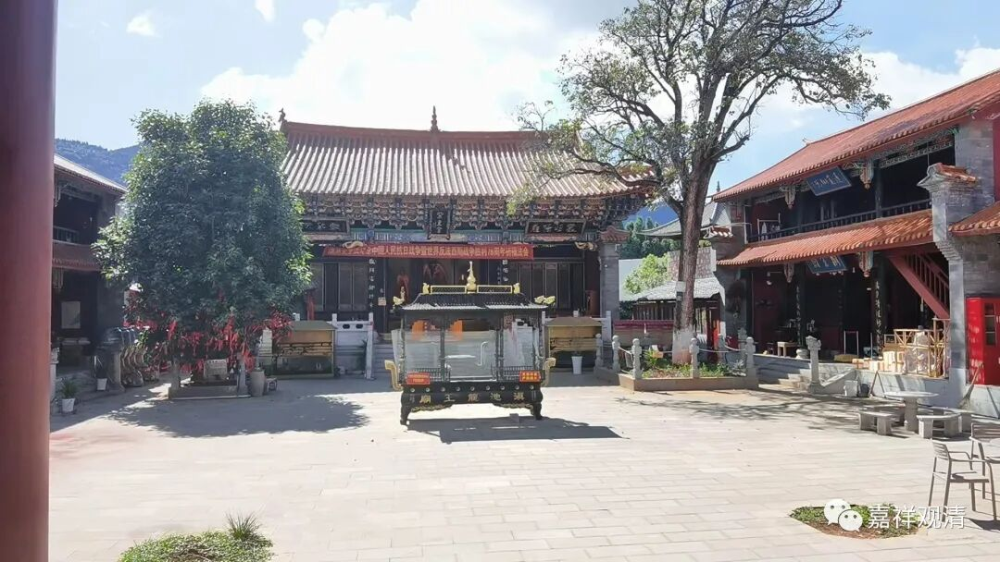
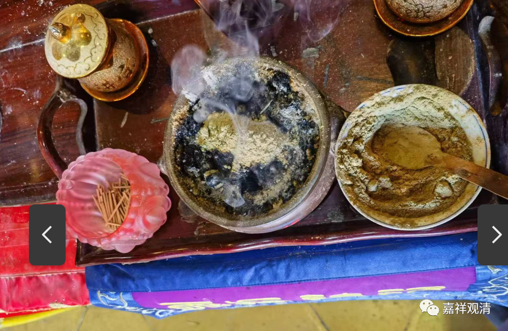
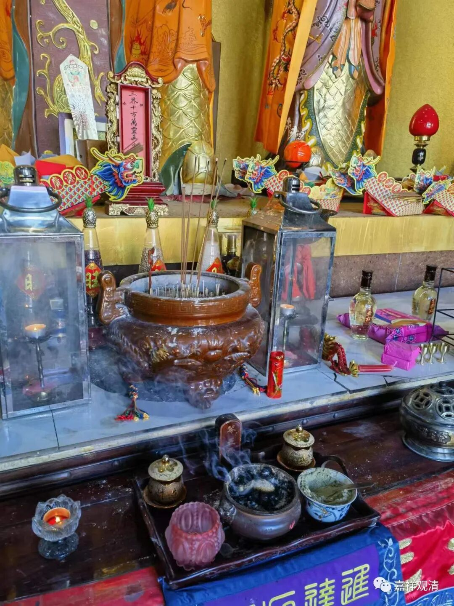
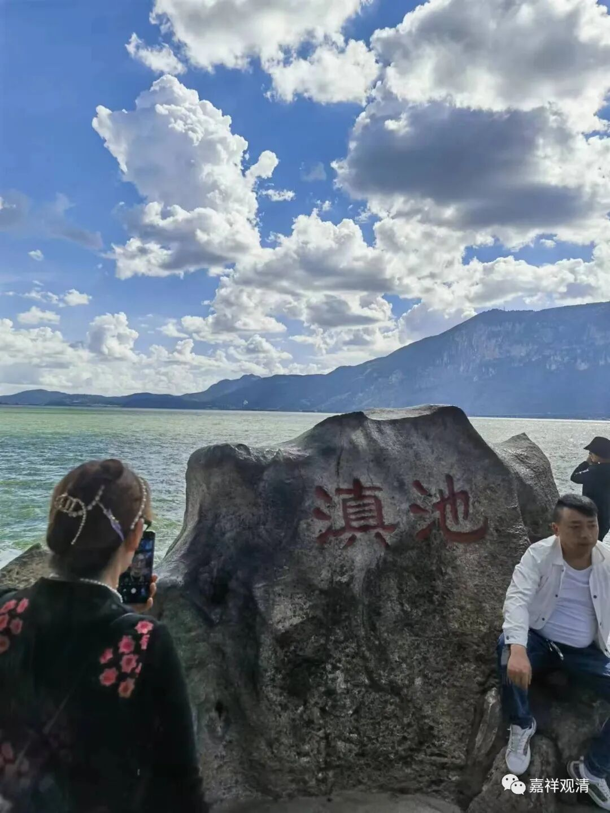
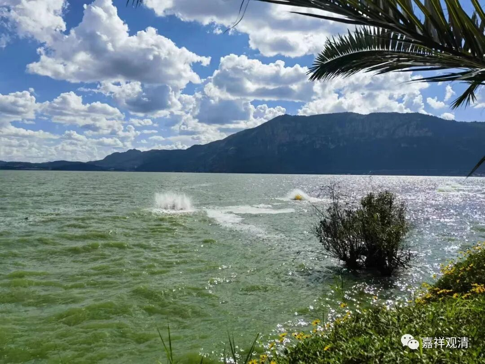
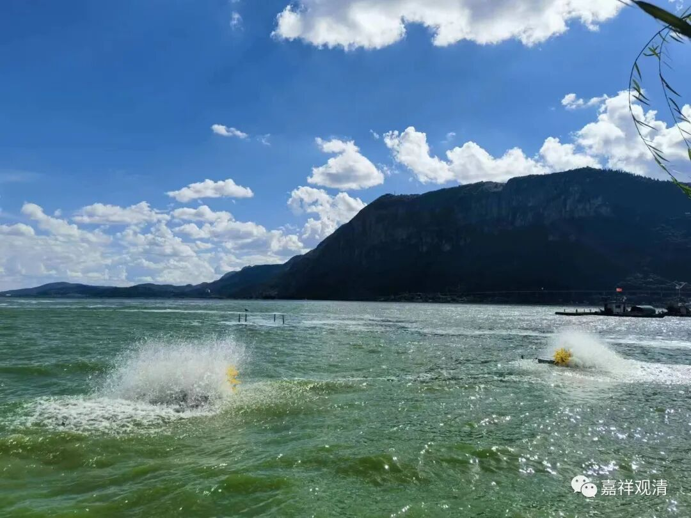
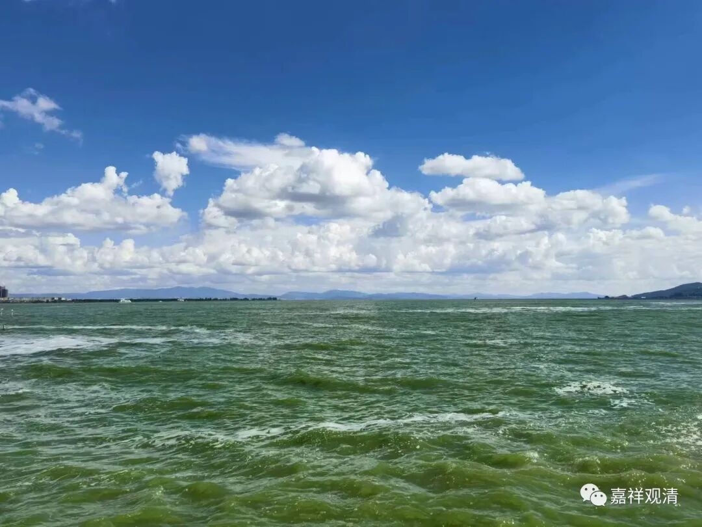
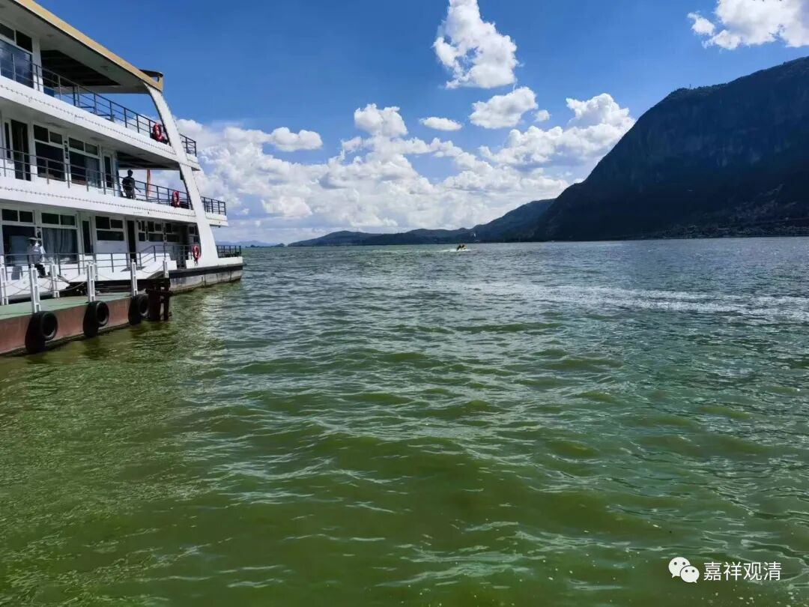

**滇池西山龙王庙

昆明，我还专程去了滇池的龙王庙。

我是打车去的海埂公园西门，司机说，很少有人从那个方向去海埂公园。他不知道，我主要的目的地是滇池西山龙王庙。

龙王庙在滇池边上，不大，就一个院子，有几个道长……

我向道长“化”了点香（不能说“借”，说借，以后我还得还他）在龙王像前面点上。又去滇池边上丢了点“丹药”——据说龙族好这口。

飞龙在天

据某专业人士说：“滇池……没有什么大龙王……云南的大龙王在洱海。”

为什么呢？（明明滇池大！）

答曰：“太浅！”（八卦得这么科学吗？）

上网一查，果然，滇池面积有330平方公里，但平均水深才5米，最深8米；洱海252平方公里，平均水深超过十米，最深22米。

问：那抚仙湖呢？——抚仙湖离昆明不远（昆明东南60多公里），平均水深96米，最深处159米，湖面积212平方公里。

回答说：抚仙湖不佳！（一查，邪门儿！）

专业人士还是有专业人士的道理……

我们这种麻瓜，只能竖起耳朵，听听就好……

