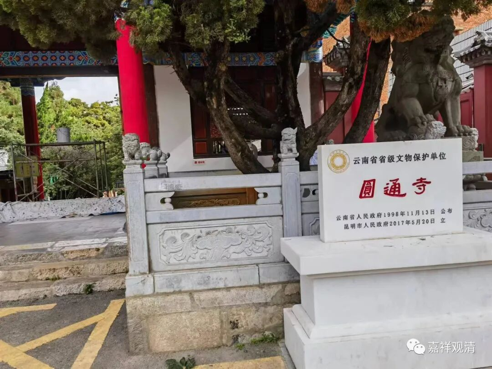

**昆明圆通禅寺（一）**

昆明圆通寺是昆明市内最大的寺院了。

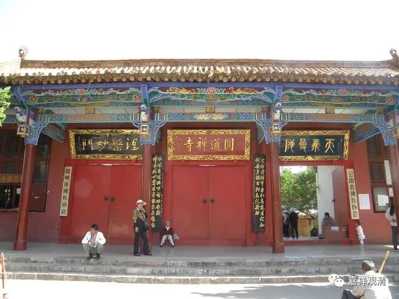

据说昆明圆通寺始建于南诏时期，当时叫“补特罗寺”。很明显，这个“补特罗”不是“补特迦罗”而是“补特珞珈”，“补特罗”也就是“普陀山”的“普陀”，也是拉萨的“布达拉”，意思就是指向观音菩萨住的地方。大概因为“补特罗”比较绕口，后来改名叫“圆通寺”，“圆通”一般也是指向观音菩萨，国内叫“圆通寺”的很多，很多寺院也有“圆通殿”，都是专门供奉观音菩萨的。

昆明的圆通寺据说佛教三大系（汉传汉语系佛教、藏传藏语系佛教、南传巴利语系佛教）的建筑都有，但是我没找到藏语系佛教的符号，只看到了寺院最后面一个明显南传式样的建筑，叫铜佛殿。居士们在里面念经，可能是佛七之类的，没能进去看。

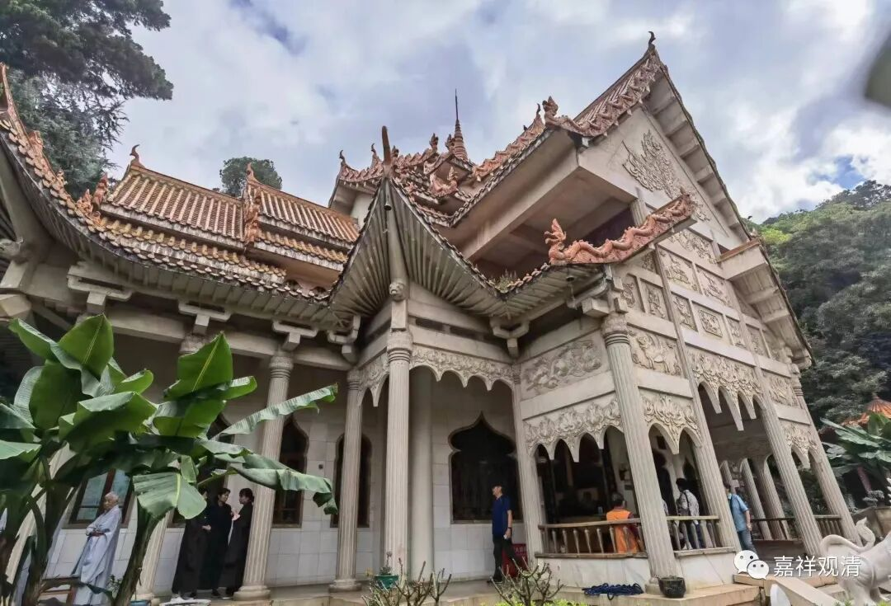

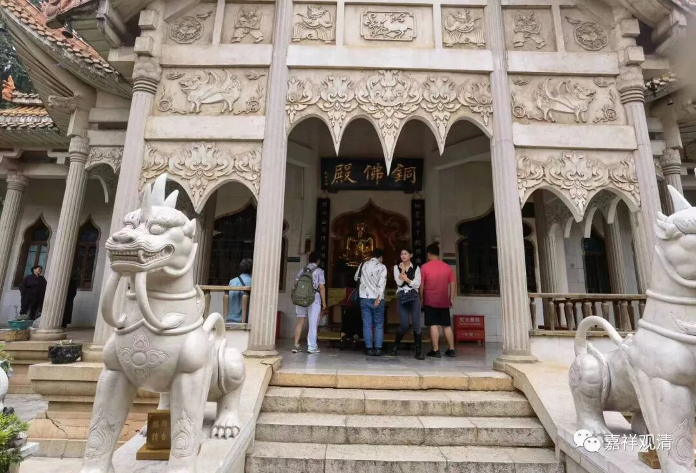

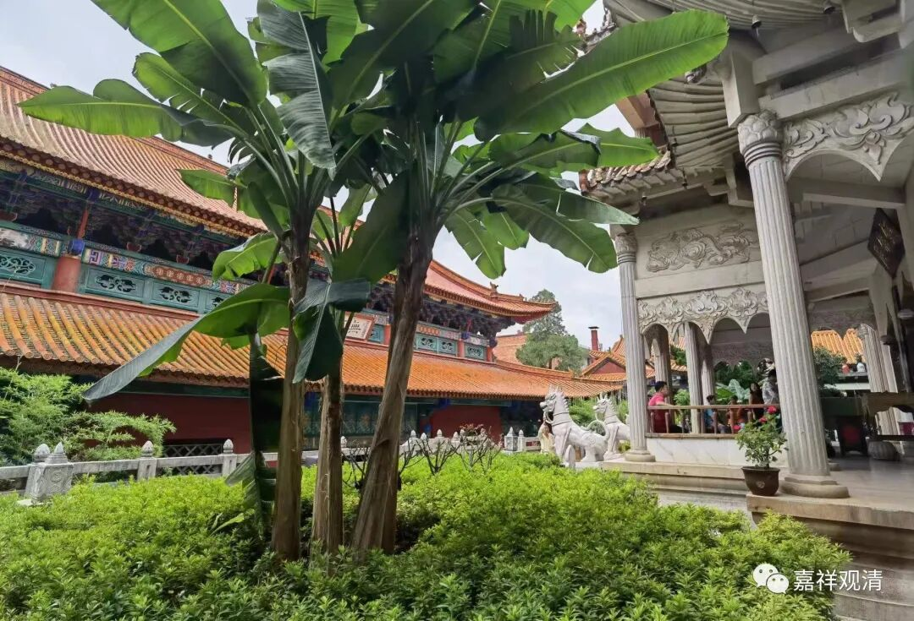

走到铜佛殿门口，念佛七的居士们正出来在三三两两地休息……一只松鼠蹿出来带走了大家的视线……我屏住呼吸，抓拍了几张。

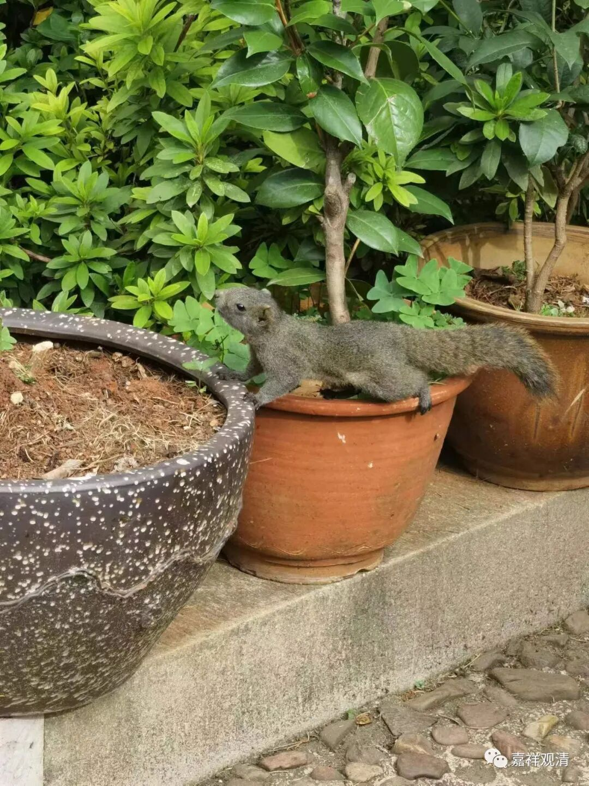

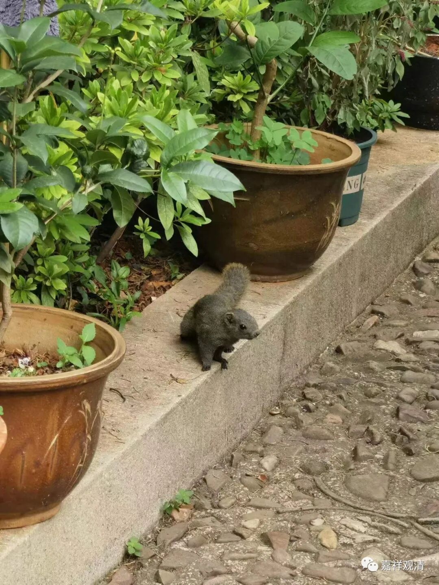

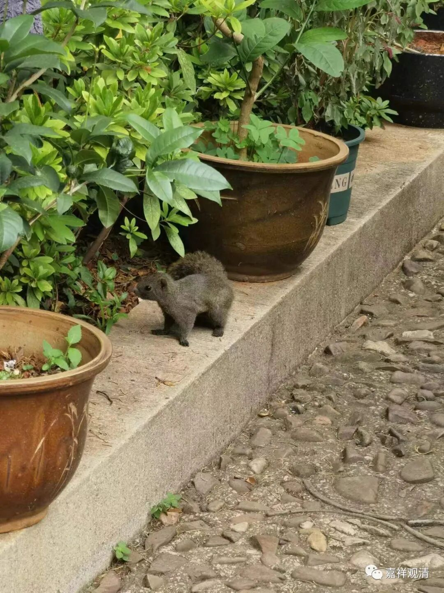

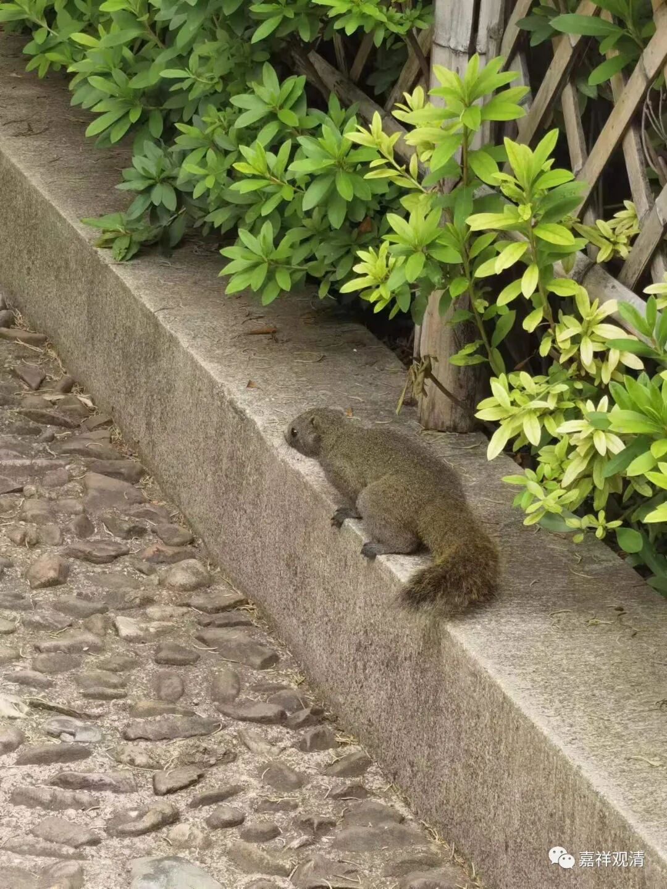

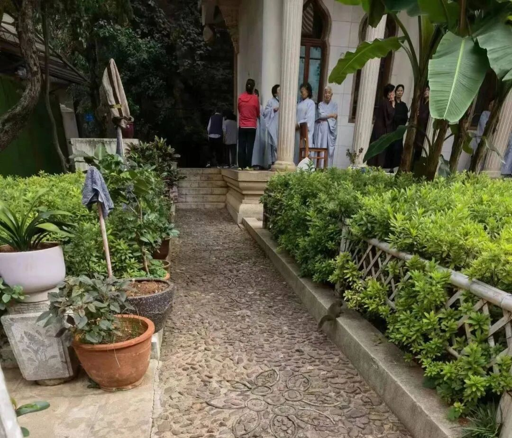

圆通寺历代都有修建，康熙年间，当时的平西王吴三桂作为重要施主也大力扶持，寺院留下了这位大施主的“痕迹”，比如寺院里的这一个牌坊——

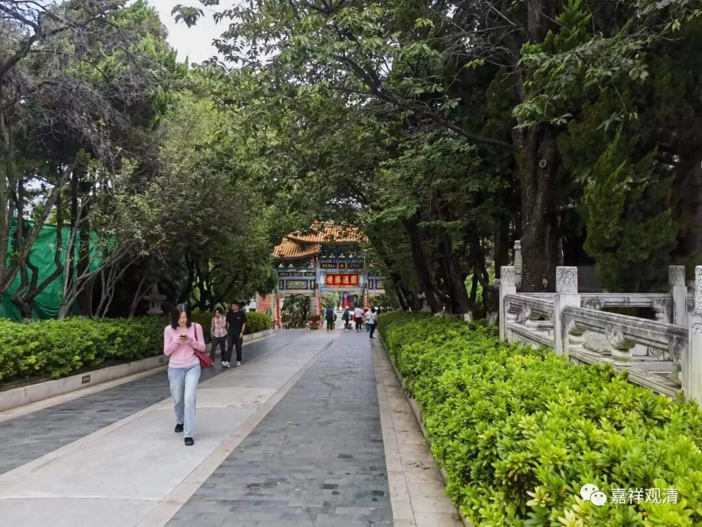

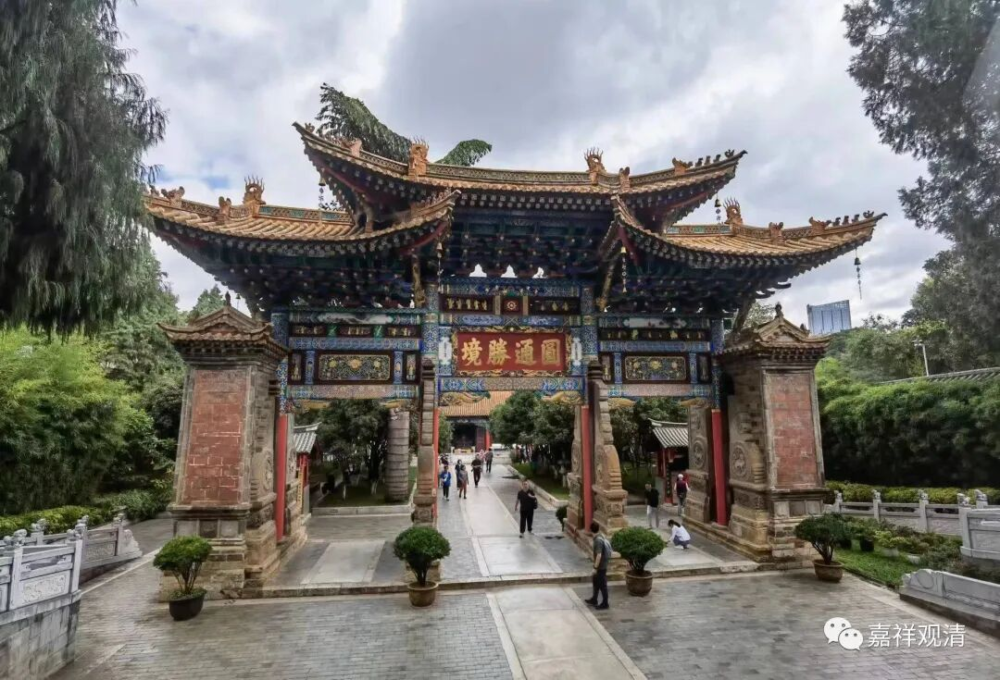

看落款——

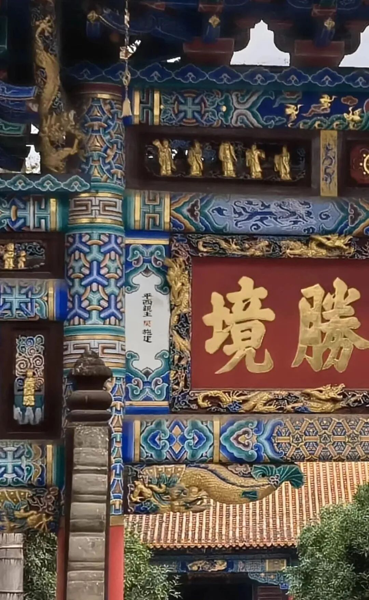

“平西亲王吴施建”。

吴三桂造反兵败后，清廷并没有为难圆通寺，还保留了这块牌坊和落款，这是很难得的。（寺院里还有吴三桂的痕迹，为了避免麻烦，我就不放出来了。）

……

