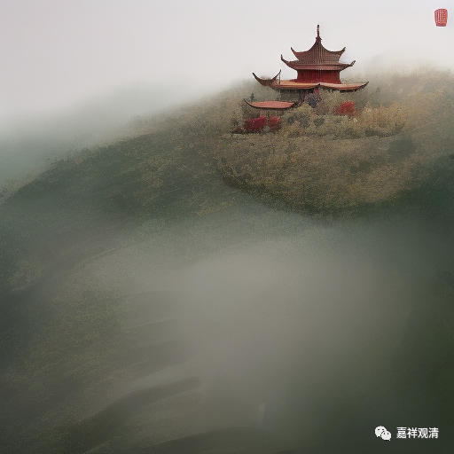
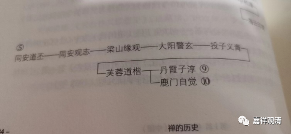
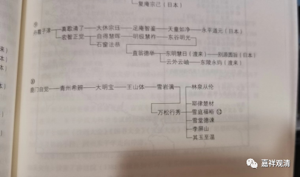

**微课堂佛教史 417·1

我们今天继续佛教禅宗史。

现在讲到投子义青禅师。投子义青禅师是曹洞宗的，他实际的、正式的师父是临济宗的浮山法远禅师，但是他继承的法脉来自曹洞宗的大阳警玄禅师。

我现在给大家看一个传承表。

** 洞云正宗流派传承如下：

**第一世  洞山良价禅师

** 第二世  云居道膺禅师

**第三世  同安道丕禅师

** 第四世  同安观志禅师

**第五世  梁山缘观禅师

** 第六世  大阳警玄禅师

**第七世  投子义青禅师

** 第八世  芙蓉道楷禅师

**第九世  丹霞子淳禅师

** 第十世  长芦真歇清了禅师

**第十一世  天童宗珏禅师

** 第十二世  雪窦智鉴禅师

**第十三世  天童如净禅师

** 第十四世  鹿门自觉禅师

**第十五世  青州普照一辩禅师

** 第十六世  大明僧宝禅师

**第十七世  玉山师体禅师

** 第十八世  雪岩慧满禅师

**第十九世  万松行秀禅师

** 第二十世  雪庭福裕禅师

**第二十一世  灵隐文泰禅师

** 第二十二世  还源福遇禅师

**第二十三世  淳拙文才禅师

** 第二十四世  松庭子俨禅师

**第二十五世  凝然了改禅师

** 第二十六世  俱空契斌禅师

**第二十七世  无方可从禅师

** 第二十八世  月舟文载禅师

**第二十九世  小山宗书禅师

** 第三十世  廪山常忠禅师

**第三十一世  无明慧经禅师

** 第三十二世  永觉元贤禅师

**第三十三世  为霖道霈禅师

** 第三十四世  恒涛大心禅师

**第三十五世  遍照兴隆禅师

** 第三十六世  清淳法源禅师

**第三十七世  东阳界初禅师

** 第三十八世  道源一信禅师

**第三十九世  继云鼎善禅师

** 第四十世  增辉新灼禅师

**第四十一世  圆智通完禅师

** 第四十二世  能持天性禅师

**第四十三世  云程兼慈禅师

** 第四十四世  奇量彻繁禅师、净空彻印禅师

**第四十五世  妙莲地华禅师

** 第四十六世  鼎峰耀成禅师

**第四十七世  虚云古岩禅师

这个就是现在外面流传的传承表，我们先看一下文字。“洞云宗”就是曹洞宗，这个是虚云老和尚改的名称。他认为洞山良价禅师下面是云居道膺禅师，就应该要改名叫“洞云宗”。这个名称我们先不去管它，但是下面的传承就会有问题，我们来谈一谈它的问题在哪里。

洞山良价禅师，没问题；云居道膺禅师，没问题；同安丕（同安道丕禅师）、同安志（同安观志禅师）和梁山观（梁山缘观禅师），这些都是一代一代的曹洞宗的祖师。然后梁山缘观禅师下面就是大阳警玄禅师，那也有写大阳警延禅师的，因为要避讳那个“玄”字。然后大阳警玄禅师下面就是投子义青禅师，这个事情我们已经说过很多次了，具体考证的内容我就不讲了，因为讲太多对大家好像也没什么特别大的意义。接下来是芙蓉道楷禅师、丹霞子淳禅师，这些都还没问题。

再往下，其实这个版本的曹洞宗传承表是出了问题。出了什么问题呢？

 

我们来一起看我发的这个传承图。也就是说，从洞山良价禅师一直到丹霞子淳禅师这里，都是没有问题的。

然后从丹霞子淳禅师往下是长芦真歇清了禅师（有时候我们就说“真歇清了禅师”），我们来看下面第二张图，大家看见没有？

 

就是第二张图上的传承是：丹霞子淳——真歇清了——大休宗珏（天童宗珏）——足庵智鉴（雪窦智鉴）——天童如净——（然后到了日本，就是）永平道元，这一段也没问题。

我们再看虚云老和尚的版本：丹霞子淳——真歇清了——天童宗珏——雪窦智鉴（前面两个字不同，其实问题不大，因为他们可以在不同的地方有不同的叫法）——天童如净禅师，都没有问题。

问题出在哪里呢？出在第十四世这里，就是鹿门自觉禅师，虚云老和尚这个版本写的是鹿门自觉禅师，但是鹿门自觉禅师不是天童如净禅师的学生，他和丹霞子淳禅师都是芙蓉道楷禅师的弟子，也就是说，他应该算是第九世的。大家明白吗？鹿门自觉禅师应该是曹洞第九代的，绝对不是天童如净禅师的弟子。这个是不对的，他们两个的年代差得很远。

这一整片都出了大问题，就是从丹霞子淳禅师到天童如净禅师，这一系到后来主要是传到日本去的，所以这五位禅师应该切掉不算在这一支里的。

然后再下来，鹿门自觉——青州一辩（“青州希辨”）——大明僧宝（大明宝）——玉山师体（王山体）——雪岩慧满（雪岩满）——万松行秀——雪庭福裕，这一支是一点问题都没有的。

所有的问题都出在什么地方呢？出在第九世丹霞子淳禅师到第十三世天童如净禅师。就是，第九世丹霞子淳禅师实际上和虚云老和尚版本中的第十四世鹿门自觉禅师是师兄弟关系，那么，天童如净禅师应该和第十九世的万松行秀禅师差不多是同时的，他和鹿门自觉禅师并不是师徒关系。

那么，这个版本当中就是插进了一段根本不应该放在这里的五位禅师。这五位禅师这一支的传承后来传到日本去了，天童如净禅师这一支传到了日本的永平道元禅师，使得曹洞宗在日本发展成了一个很大的宗派。

