**昆明圆通寺（二）**

圆通寺正门在维修，走的边上的门进寺院。进门没管我要门票。

进门就是一块大石碑，纯现代的（我不是很清楚，纯现代的石碑为什么搞些栏杆拦着，明显不想让我看清楚字啊！那为什么还要辛苦地刻字呢？可能不是让我看的。）。

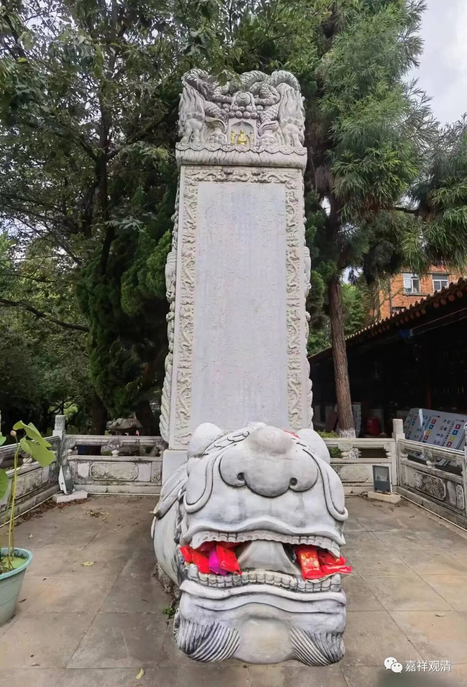

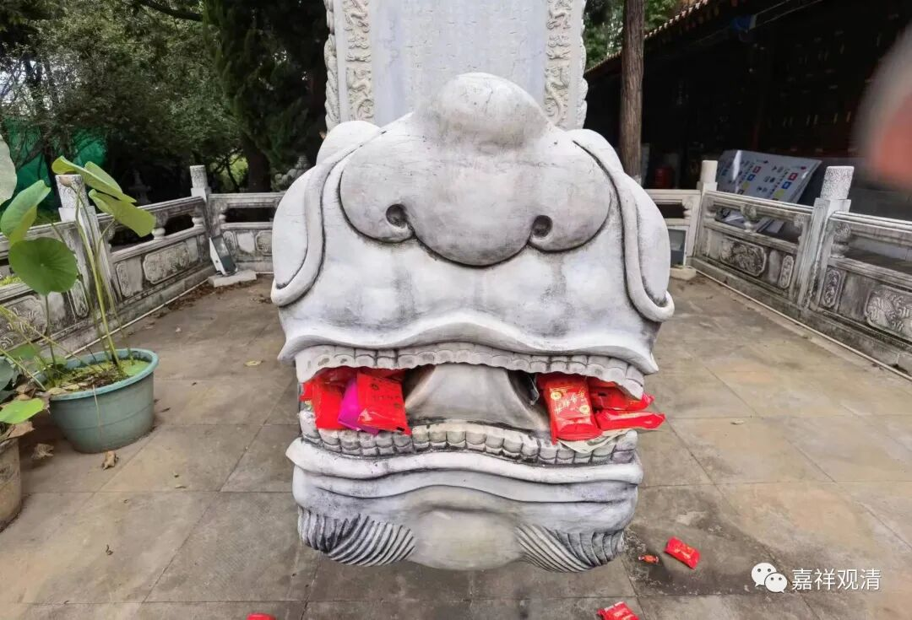

很有趣的，它嘴里被塞了很多红色包装的这个是饼，不知道是什么套路——民间的创造力一直是无穷的，我们的思路一直跟不上。（后来发现庙里供品当中也有很多同样的饼，我估计是因为便宜。）

吴三桂捐建的牌坊。（南向，正面）

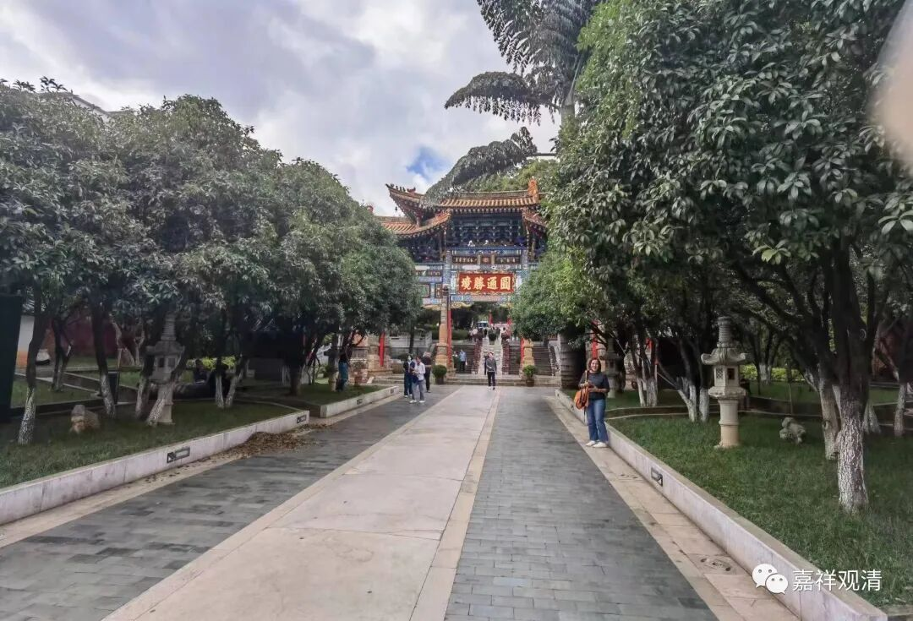

“圆通胜境”牌坊北向，反面。

这座牌坊正反两面是同样的“圆通胜境”（应该是同一份题字），很少见啊，我怀疑（盲猜）原先正反两面的题字并不一样，后来因为什么特殊原因就来了个“拷贝不走样”了。

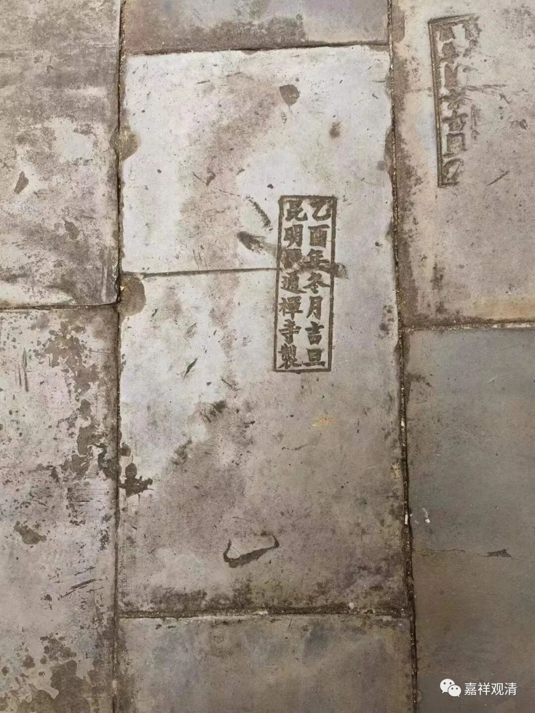

牌坊附近的地砖上有“乙酉年冬月吉旦 昆明圆通禅寺制”的字样。乙酉年，最近的是1969年，在那个年月，专门造砖建寺院的可能性不大。查1669年是康熙八年，而吴三桂重修圆通寺在康熙七年，则这地砖上的“乙酉年”应该就是康熙八年。

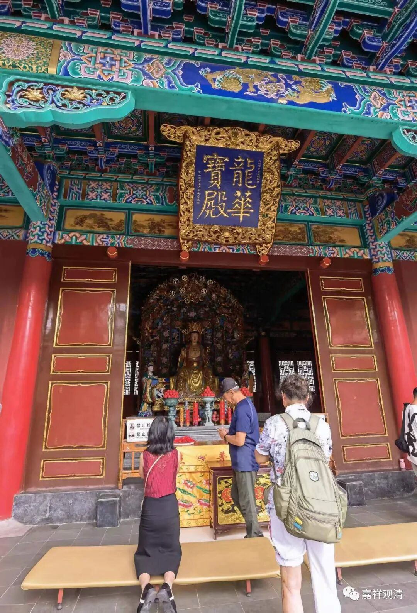

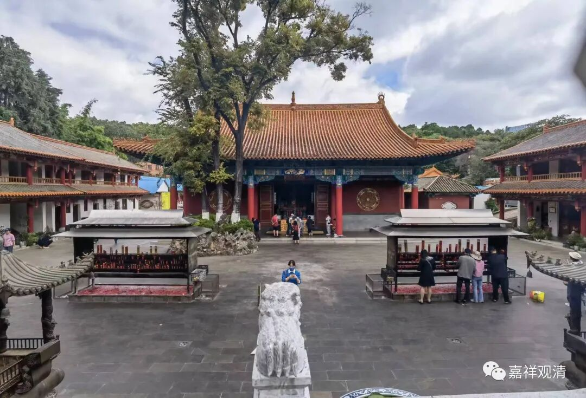

龙华宝殿，就是弥勒殿。弥勒佛出世讲法叫“龙华三会”（龙华，是树名），所以弥勒殿叫“龙华宝殿”。这里供奉的弥勒是天冠弥勒的样式，还不是今天常见的大肚弥勒的造型。大肚弥勒（契此和尚）的造型一般比较后期，也比较民间。天冠弥勒像一般垂腿而坐，意思是马上要站起来成佛了——弥勒佛是佛教里的未来佛，叫“补处菩萨”，就是候补成佛的菩萨。因为马上要成佛了，所以垂腿坐着，随时可以方便站起来……哈哈，这个意象也是很容易理解的。

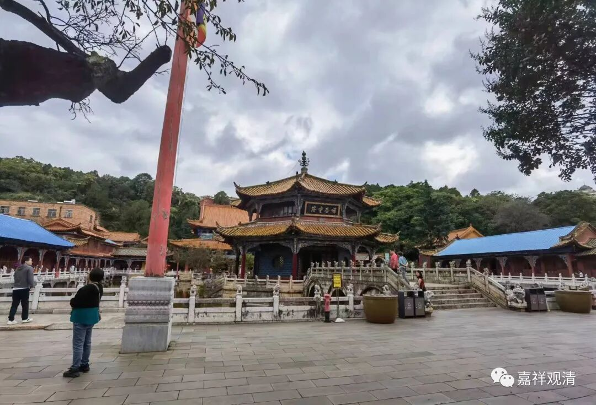

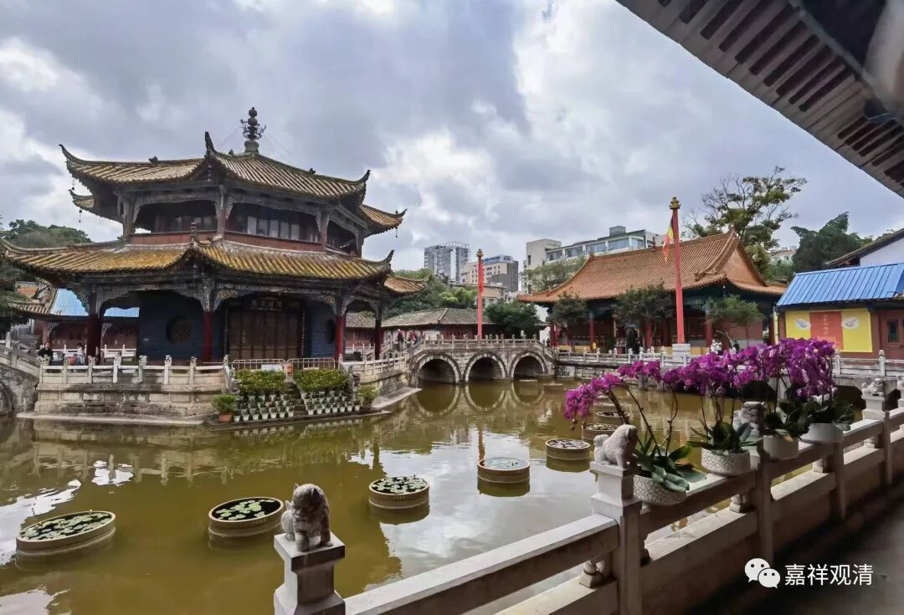

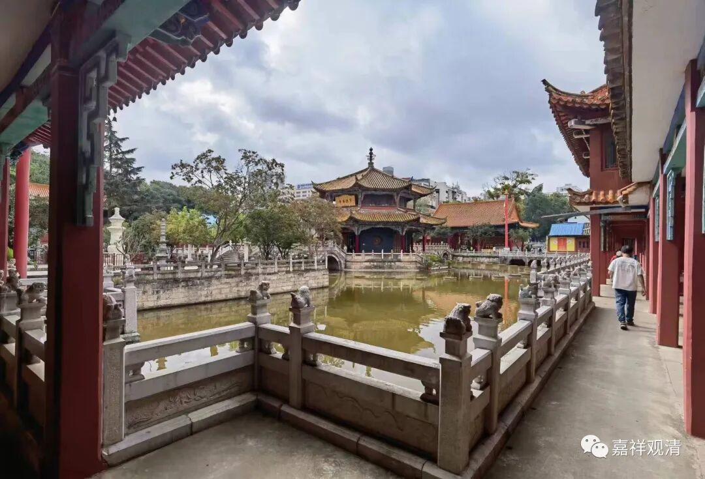

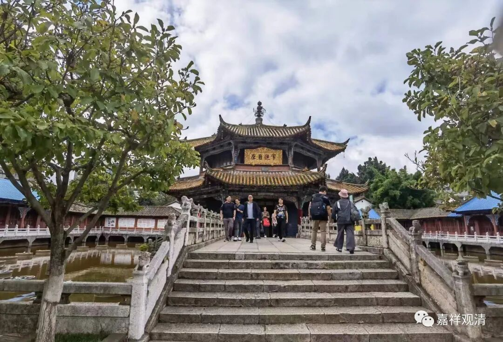

湖中间的六角亭，观音殿。“观自在”，就是观音菩萨。

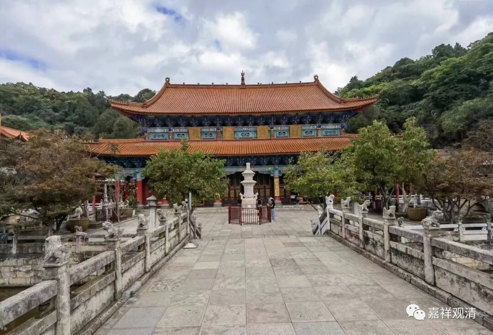

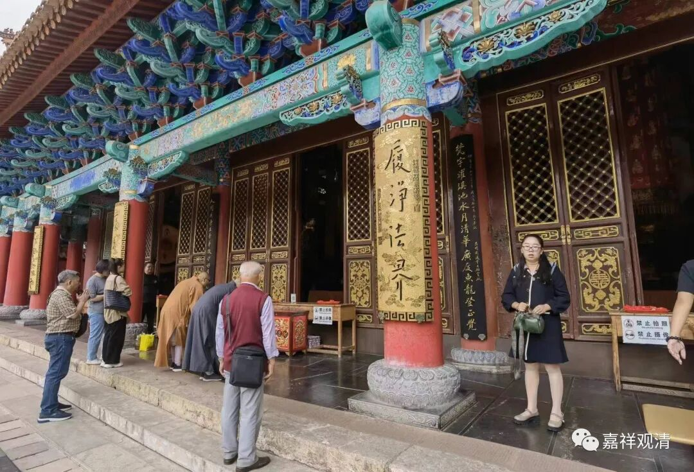

圆通宝殿。供的法、报、化三身佛——毗卢遮那佛、卢舍那佛、释迦牟尼佛。按正规来说略有问题，因为“毗卢遮那佛、卢舍那佛”是同一梵文的不同汉译而已，但从隋唐以来汉地就沿用至今，我们就不追究了。

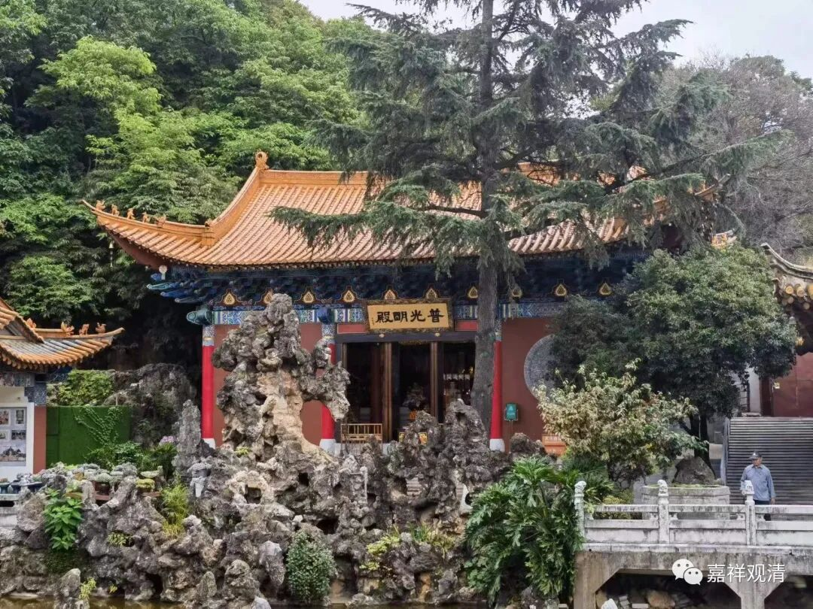

普光明殿

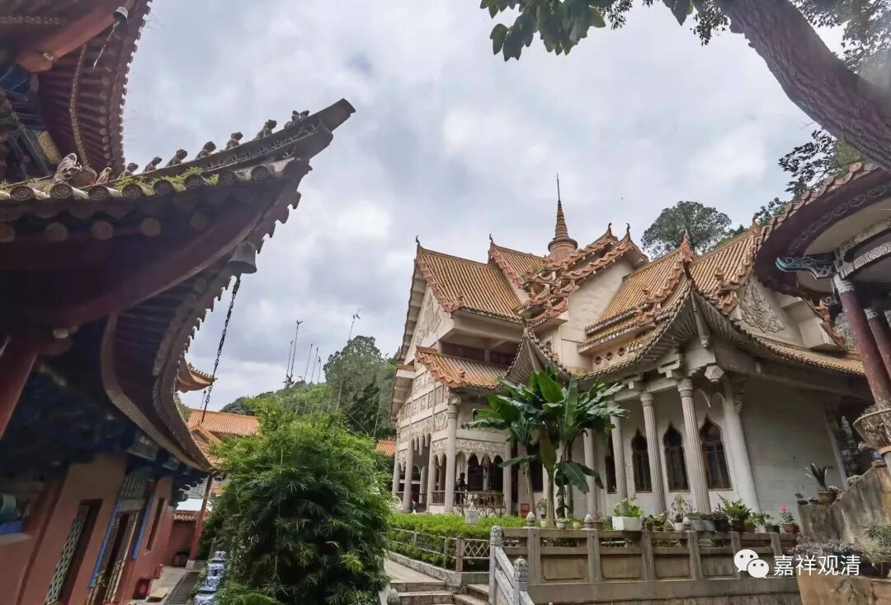

南传式样的铜佛殿。

