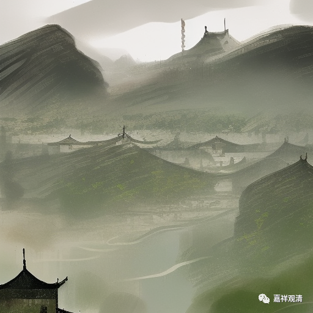

**微课堂佛教史 418·1

好，我们继续佛教史——禅宗。

今天我再稍微申明一下，我们这种讲法，从一开始就挂了一个“科学唯物”的头衔，就比较从现实的角度出发来讲。因为单纯讲这些故事都比较枯燥，所以我们会加一点辨析的内容，加上一些历史故事的辨析。

这个并不是我的主要目的，其实我的想法并不是为了批评禅宗的。这种历史的讲法，放到其他宗派上也会出现类似的问题，甚至放到其他宗教上等等也都会有问题。或者这么说吧，你就是把它放到元史、明史上面，也会出现很多问题。主要是因为很多历史** 记载**并不精确，都是有问题的。

而且，并不因为禅宗这些后期的记载不一，记载出现了问题，就等于禅宗有问题，至少不可以划等号的。我发现有些人好像听着听着，就觉得禅宗有问题。如果要有问题的话，也是记载的问题，记载的问题肯定是有，至于禅宗有没有问题，那是另外的课题了。

完全按照一本书来讲，我觉得没有意义，或者是我自己觉得没劲。正好挑几个不同的材料互相对一对，然后就可能发现很多问题。但中国人已经算好的了，中国人的历史记载算是比较丰富的，要是藏人、印度人的记载，那不知道要错多少了。他们现在的那些历史故事，大家同样当作故事听就可以了，比我们的记载要更加离谱。我们汉文化的记载实际上还更好一点，歪曲的还不那么多。

所以我不得不在这里面稍微给大家提个醒，我们只是从历史记录的角度来谈。但是我讲着讲着，可能还是会对照着讲，因为平铺直叙本来就很没劲。另外，禅宗史当中，确实很少有人专门从头到底地“治”过，应该说个别的也有——有人写东西，写专著，可能会提到。那么，我现在借着这次讲课的机会，前后梳理一下，发现有问题的，就提出来，是这个意思。我们并不是要罢黜百家……

我们这个也不是讲禅宗的“内容”、修法，比如打坐、数息这些，那是需要单独讲的，或者是要单独禅修才对。另外，如果我们讲的是天台宗史，那我们对天台宗这些法师的教法方面的讨论，可能会谈得稍微多一点，当然也是点到为止了，毕竟不是讲《天台宗思想史》。“教下”至少有很多教理性的记载的内容，而禅宗没有。

另外一方面我也在考虑，因为越到后期这些禅宗的“人物像”就越趋同。就是前面一个禅师，后面一个禅师，如果没有特异性的故事的话，基本上没什么差别。这个事情放在其他宗派也是一样的。哪怕放在那啥的某某派的谁谁谁也是一样，他们的传记当中，如果你把哪一位师父的传记换一个名字，估计也差不多的，就是哪一年出生，然后哪一年出家，然后跑到LS去，最后在哪个寺里面待了多少年，最后考格东等等，差不了太多，流水账。所以我也在考虑，后面该怎么讲，是不是采用跳跃性的方式，挑几位比较重要一点的人物来讲。

