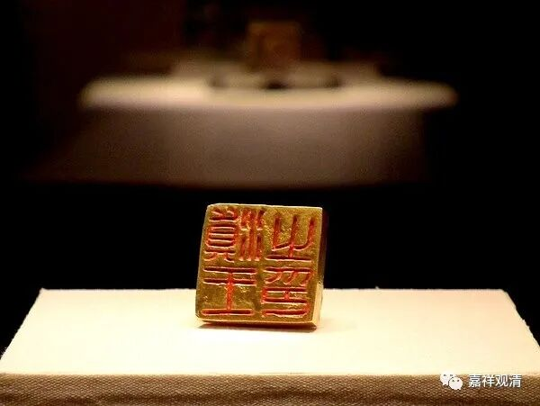
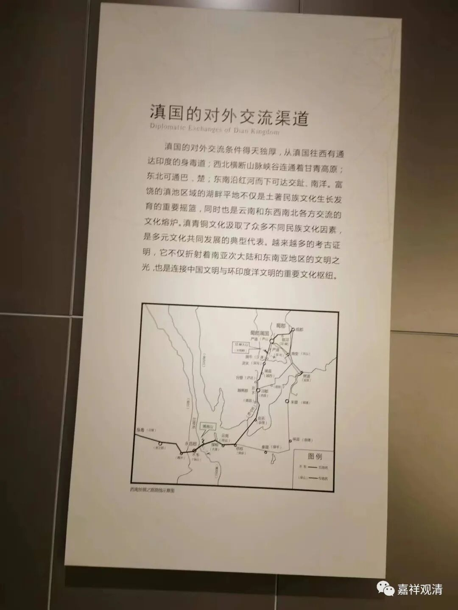
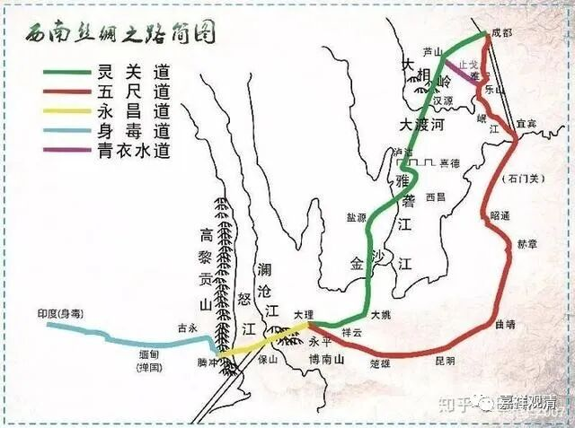
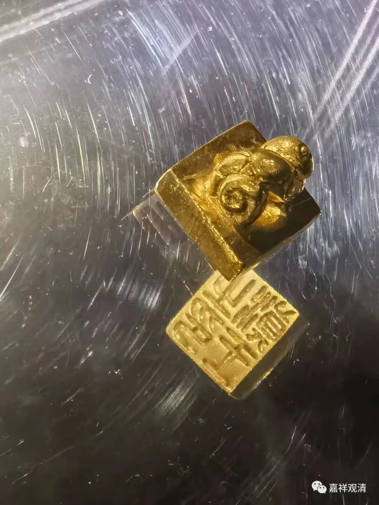
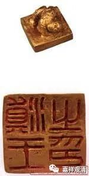

**云南博物馆（二）**

古滇国的“身毒道”。

记得大概八九年前了，有一次在杭州的某个佛教论坛，某年轻学者发表论文，还在大谈“汉明帝时期”“佛教最初经河西走廊从西域传入”blablabla，我不客气地直接怼了：你把两百年前的“历史知识”拿到今天“高峰论坛”上来谈，不嫌过时吗？！我们今天的常识是：佛教传入中国，有南印度经东南亚再到广东甚至直接可以到山东的海路（法显法师、义净法师就是走的这条海路）；有从西北印度经巴基斯坦、阿富汗、新疆经河西走廊到长安的丝绸之路（玄奘法师）；也有从东印度经缅甸到云南的腾冲、保山，再到大理，然后去成都的“身毒道”（汉初就已明确存在的民间商路）。

身毒，就是印度。当年张骞出使西域去了伊朗，说发现当地有蜀锦交易，一问而知，有一条从成都至印度的商道（有人称为“丝绸之路”南路），起初，从东印度经缅甸到云南境内的腾冲、大理，再分两路：西线一路北上，经泸沽湖、西昌进入成都；东线一路经楚雄、昆明、昭通、宜宾进入成都……早期的佛教应该从这条路进入成都，启发张道陵组织了五斗米道……

当年“汉习楼船”，汉武帝之打通云南，就是要和这条身毒道接上打通国际商路。

国宝，滇王之印。金印，90克。原件已调入国家博物馆。“滇王之印”的发掘，证明了汉武帝时期对古滇国的征服和管理。

