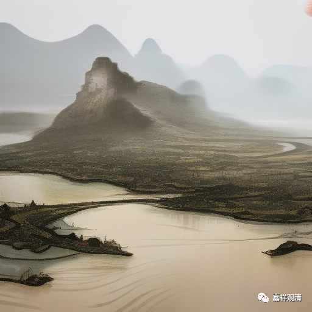

**微课佛教史418·2**

好，我们继续讲投子义青禅师。

投子义青禅师继承的是大阳警玄禅师的法脉，但实际上给他传法的是浮山法远禅师。那么，大阳警玄禅师还有一个预言，你也可以认为是预言，也可以认为是警告——警告这个词可能不太好，或者说劝告，就是劝告继承我这个法脉的人，十年之内都不要传法，这个若干年内自修不出山的情况，好像和六祖大师有点接近。

于是，投子义青禅师他确实就是到处参访，** “持续游诸方，遍礼祖塔”**，到各个地方去朝拜，有点像我们今天的朝山。他来到庐山慧日寺，阅《大藏经》。那个时候就有雕版的《大藏经》了，《大藏经》最早的刊刻是在宋初——《开宝藏》，总共5048卷。

后来，投子义青禅师又回到舒州。这个时候舒州还是禅宗的核心，前面我们讲过的白云守端禅师就曾经在那里，对吧？这个时候白云山的寺院叫海会禅院，方丈空缺了，然后大家就推举投子义青禅师。这是个丛林大寺院哦，他一出世就是丛林大寺院。

我们前面讲过白云守端禅师是临济宗的，而现在投子义青禅师是以曹洞宗的身份出世的，所以这也可以用来继续证成前面我们所讲的，就是以前的寺院和宗派是不划等号的——也不叫“划等号”，或者说寺院和宗派是不捆绑的，至少在禅宗内部是不捆绑的。

投子义青禅师在海会禅院住持了八年，然后再去了投子山，所以他叫投子义青禅师。我看到网上有文章说投子义青禅师是开悟了以后给自己取名叫投子义青，这个说法不对啊。投子，是地名，指他后来到了投子山，舒州（安徽）投子山胜因禅院，他自己本来的名字叫义青，所以称他为投子义青禅师。

