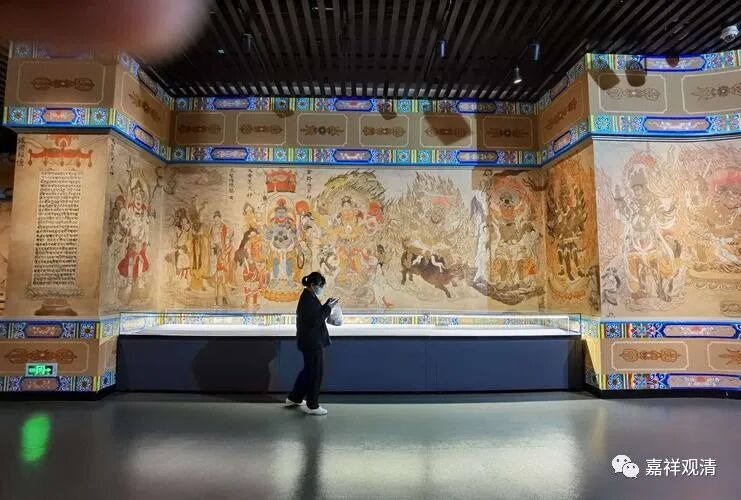
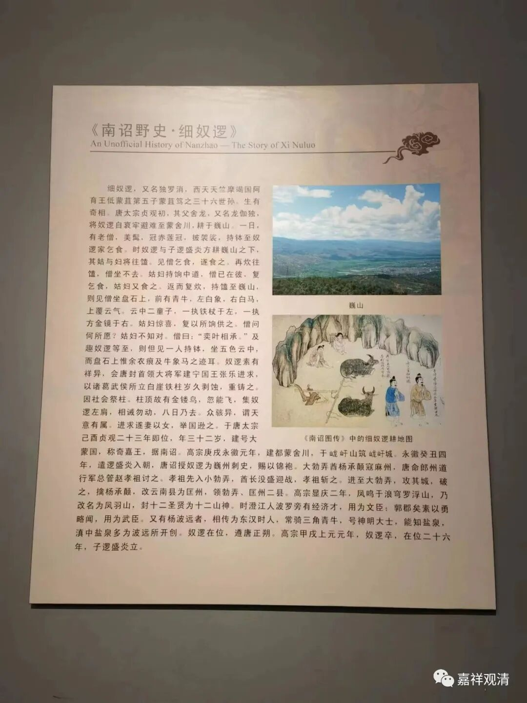
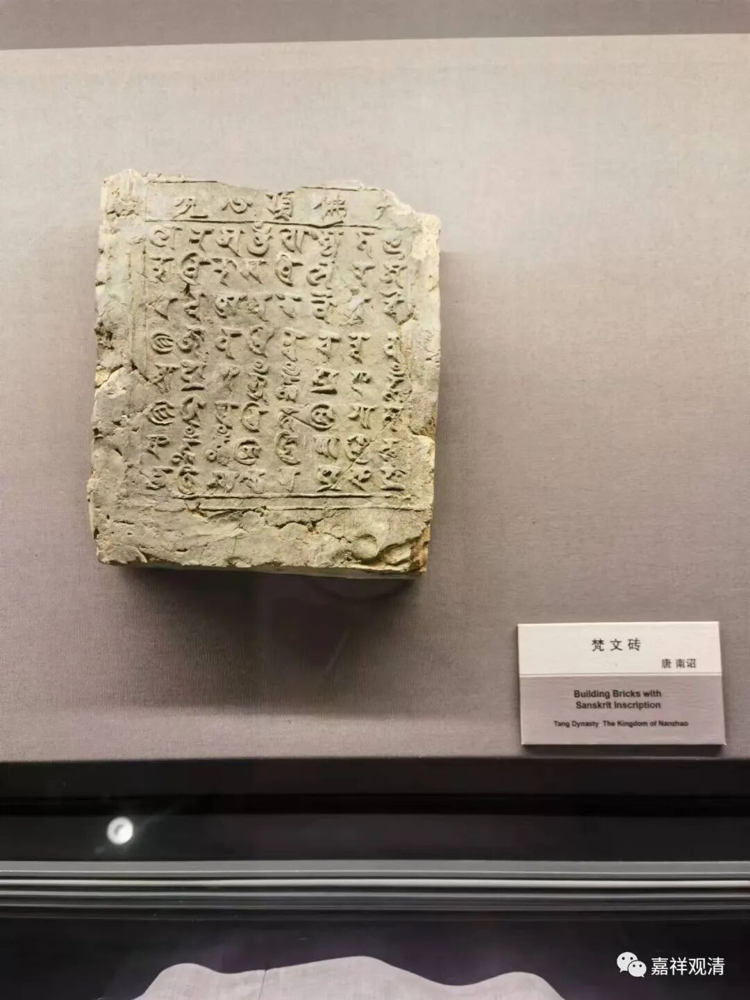
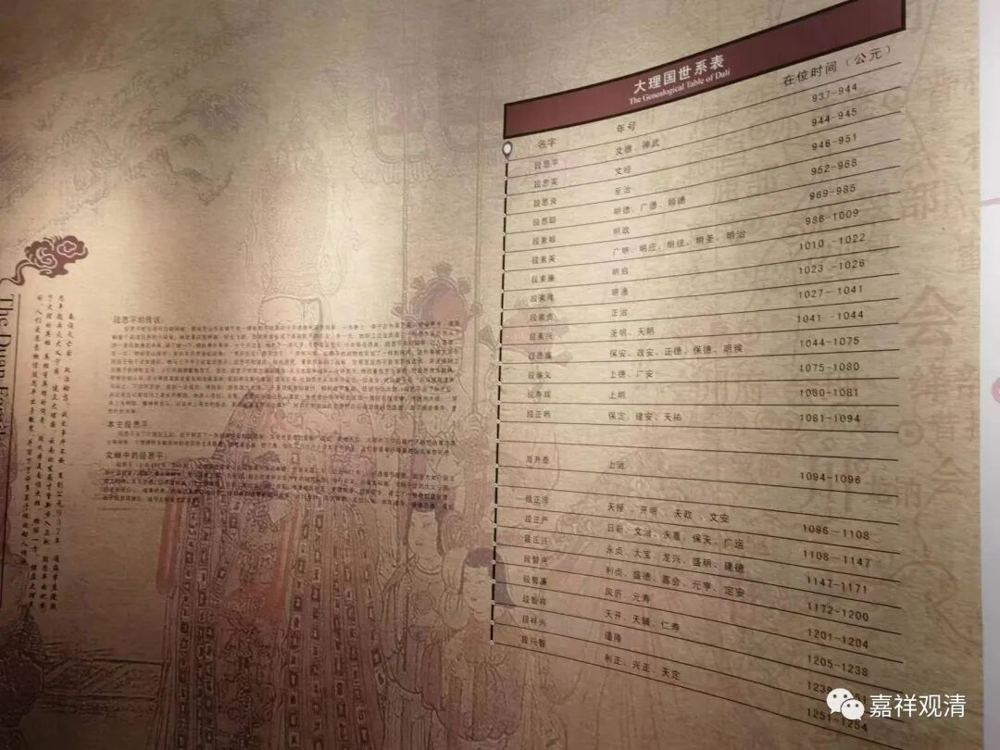
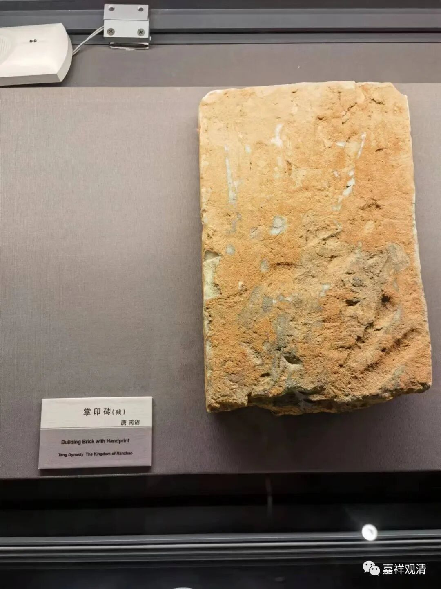
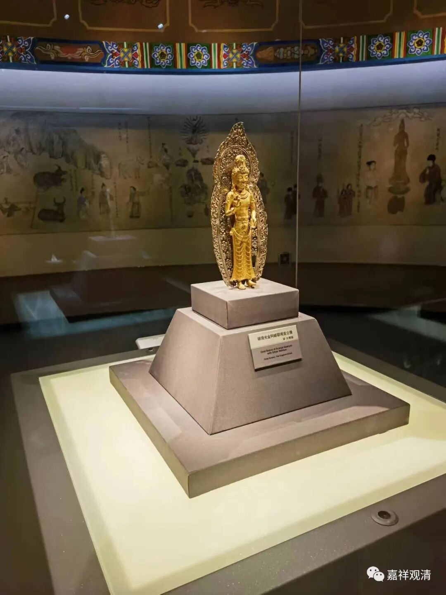
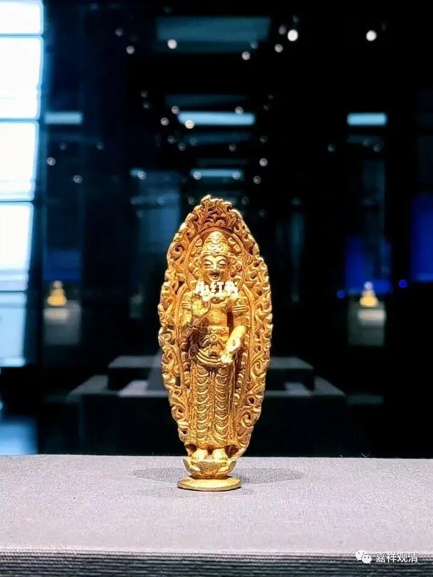
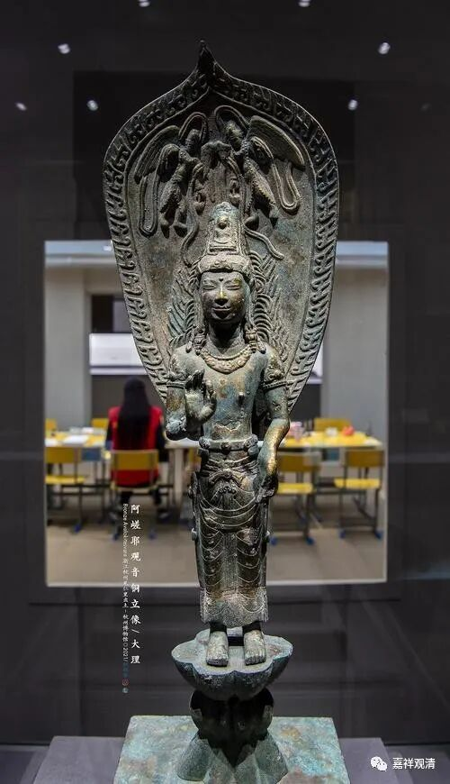

**妙香佛国**

云南省博有一个展馆叫“妙香佛国”，我原以为是专门的佛教陈列，进去才发现，是南诏大理时期的云南历史的展馆。因为这一时期佛教文化特别重要，所以就叫了“妙香佛国”。

南诏第一代国王细奴逻。据传他父亲的名字叫“迦独庞”“舍龙”“龙伽独”，这很明显是译音，其中，“舍”是地名，即蒙舍川；龙、庞都是龙；“迦独”“伽独”则应该就是梵文“naga”龙！这不就是“蒙舍川的龙”嘛！怕大家不认，还用汉文+梵文双重肯定一下！

云南这个地理位置，就是夹在印度和汉文化圈中间的，必然受到这区域内两大文化圈的影响，那么表现在宗教信仰上，他就会有很浓的佛教文化，但又和中国内地有别——因为（地理上的缘故）他不可避免地要受到印度本土“非佛教”文化的影响，也就是说他的“佛教文化”是被（所谓的）印度教渗透的（假如我们要在印度宗教、云南宗教、中国内地宗教上做一个分别的话，那么由前到后表现为，印度教背景在减弱，佛教背景在增强。），而且由于本土教学体系没有建立，所以他的宗教哲学并不发达，目前能看到的大部分是偏向于民间的、宗教性的佛教。

对大理国的了解，金庸是绝大多数人的启蒙了吧。这张图里面好几位都在金庸武侠小说里出现过。大理国22位国王，9位禅位出家，不谈zz的原因，也很能表现为什么可以称为“佛国”了。

南诏大理的“神僧”很多，但“神性”和故事情节趋同，对我这种人，目前没什么吸引力。

这是云南佛教的特别符号，叫“阿嵯耶观音”。

“阿嵯耶”是梵文Acarya译音，就是阿奢黎，简单讲就是师父的意思。云南的“佛教”部分地称为“阿叱力教”，这确实和密宗还是有点关系的。（这里的“密宗”包括但并不限于“佛教密宗”）。

……

