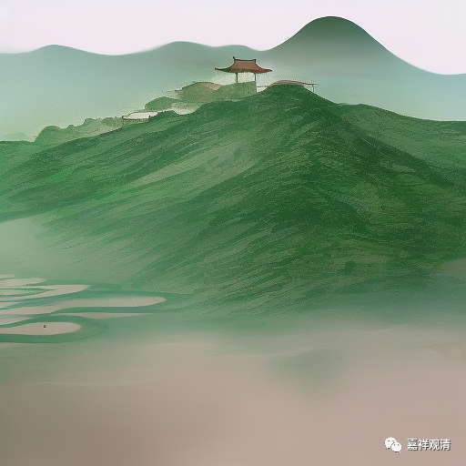

**微课佛教史418·3**

投子山胜因禅院以前有一位开山祖师叫慈济禅师，他就曾经授记，在当时留下一个预言，说什么呢？** “吾塔若红**（就是我去世以后，我的塔如果变红了），** 是吾再来。”**正好那个时候当地人把这座塔漆成了玛瑙色，不久之后，投子义青禅师就来做方丈了。于是大家就说他是“祖师再来”。

后来当地的地方官太守也给他定性了，这又是一个什么故事呢？

因为在山上建寺院，很重要的一点就是水源，如果没有水源的话是非常麻烦的，所以一定要找到是泉水。实际上各个地方都是这样，不管是道教、佛教等等，只要你是在山上，包括马谡打仗这样的也是很重要的。

山上造庙住人，是一定要有足量泉水的。那段时间呢，山上人比较多，泉水不够用了。等到投子义青禅师来了以后呢，就涌出了甘泉。然后太守就在这个地方题了个字——“再来泉”，就等于把“祖师再来”这个事情给坐实了。说这个甘泉** “汲之不尽”**，大家用都用不完。

这个对丛林是很有帮助的，很有作用的。大家想想，比如说你是五百人的丛林规模，如果水不够五百人吃的，那你只能是三百人，如果够一千五百人吃的的话，寺院就可以更大。

现在就更加困难了，像我们现在自己造过寺院就知道了，现代人的用水量实在是太大了，吃的水其实用得很少，但是抽水马桶大家都用习惯了，一抽水、一洗澡，这个量就太大了。像九华山的后山也是一样，一个很小的泉水就要供很多人，供洗澡是非常麻烦的，特别在山顶。这个，只有造庙的才知道啦。

那么，投子义青禅师一出世就是在大丛林，然后又和祖师的预言符合上了，本身实力又强、见识也广，江湖上大家又给面子，官员又捧场，所以投子义青禅师的名气马上就很响亮了。

他在元丰六年有病，然后就写信跟官民告别，说什么呢？** “两处住持，无可助道。”**他就住持过两个地方，不像之前的石霜楚圆禅师住持了五、六个地方，他就两个地方。** “珍重诸人，不须寻讨。”

投子义青禅师去世的时候五十二岁。我们前面讲过了，北宋时代的这些法师们去世的时候年纪都不大，好像那个时候还出现了一个小冰期，是吧？好像是忽然之间变冷了，于是北方游牧民族南下……

今天先到这里，谢谢大家！

