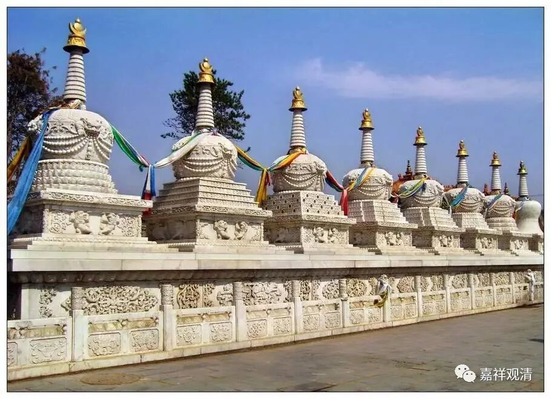
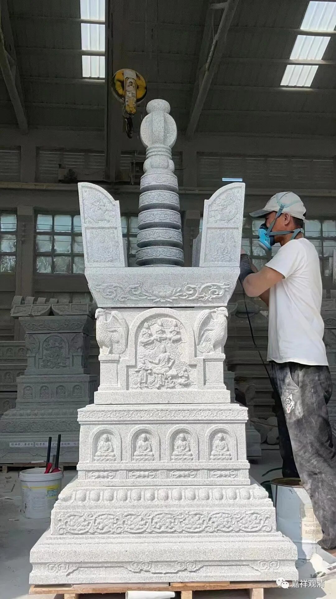
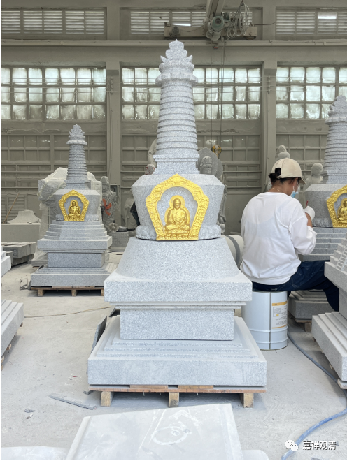
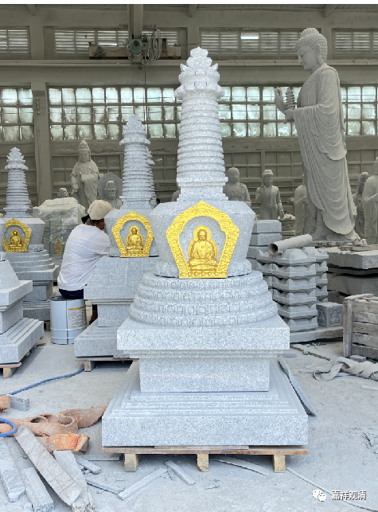
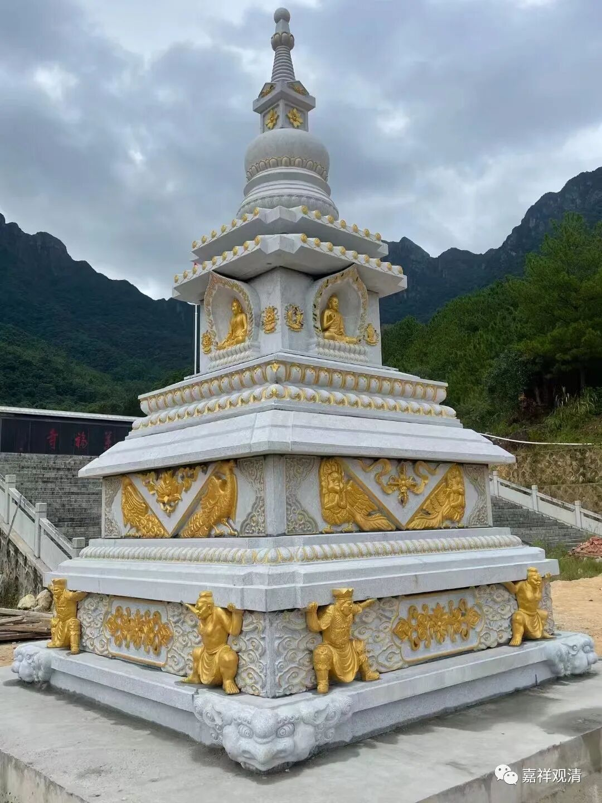

**印度佛教八大圣地和如来八塔（一）**

最近寺院要做一些工程，包括十二个塔。其中包括一整套“如来八塔”。

阿育王塔

“如来八塔”，是纪念释迦如来的一个“套装”意向，其来源是——

印度有和释迦佛相关的八个圣地，分别是：1、蓝毗尼（出生地）；2、菩提迦耶（成道处）；3、鹿野苑（初次说法）；4、舍卫城（神变处）；5、曲女城；6、王舍城；7、毗舍梨；8、拘尸那洛（圆寂）。一般印度朝圣也主要走这八个地方，我们上次好像就只有一个（应该是毗舍梨）没去。

定做的如来八塔，部分

“如来八塔”的中间有几个我没在括号里给解释，因为它们作为佛教符号被赋予的意义在各个宗派（系统）里解读略有不同（历史的和宗教的，大乘的和小乘的），容我慢慢聊聊看。当然有些东西未必都能聊得开……

上次去印度跟林子的“大涅槃号”旅游团，路上聊的时候口无遮拦，跟我们拼团的仨居士都吓坏了，后来到了地方他们都独自行动，绕着我们走，回国以后，仨居士的师父专门把林子逮去骂了一下午……都是我害的。

世界和平塔

接着说——

“如来八塔”的符号就是为了纪念这八个佛教圣地（或者说佛陀的八大事业），经典也有记载，出自《大乘本生心地观经》等……

