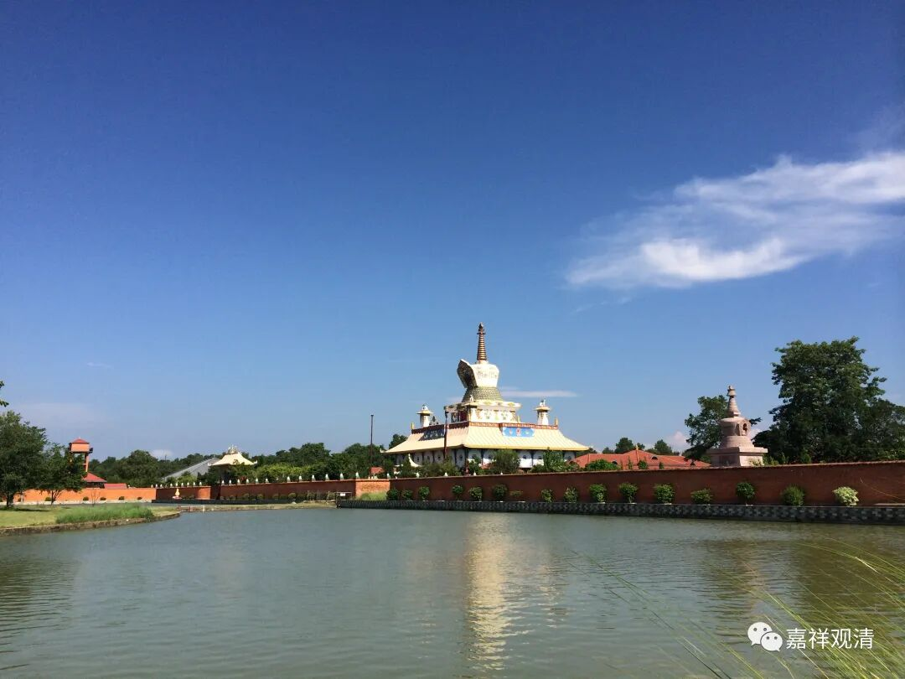
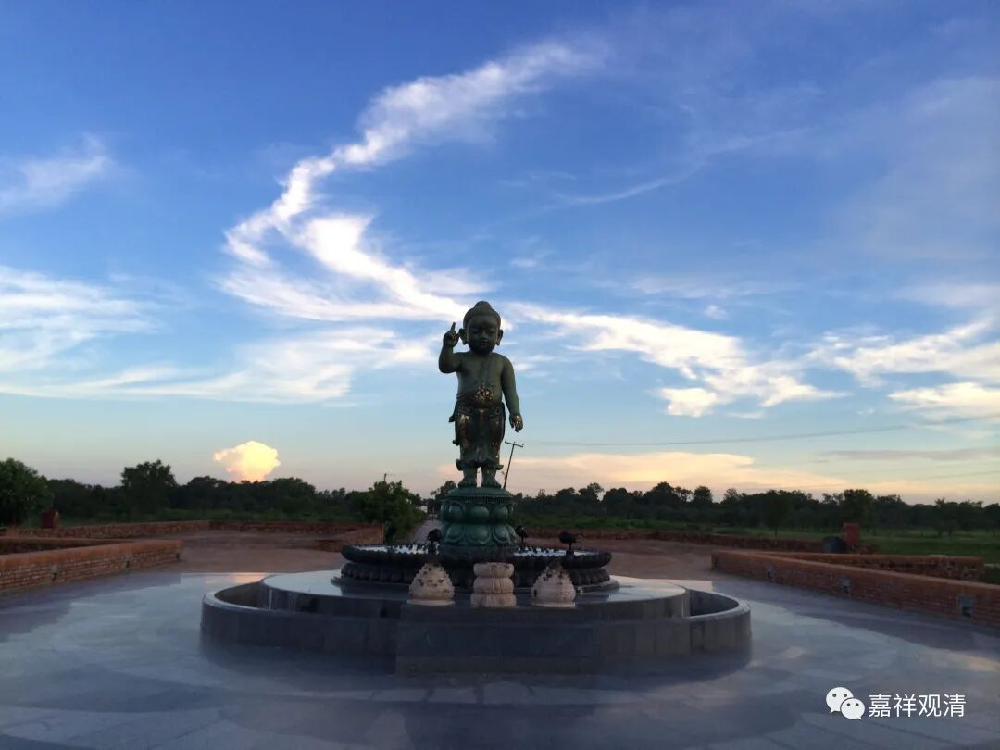
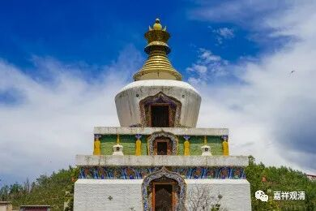
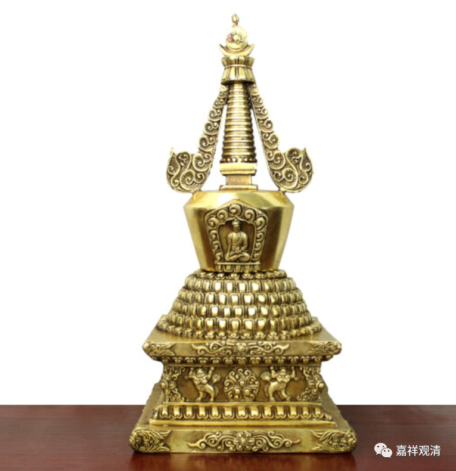
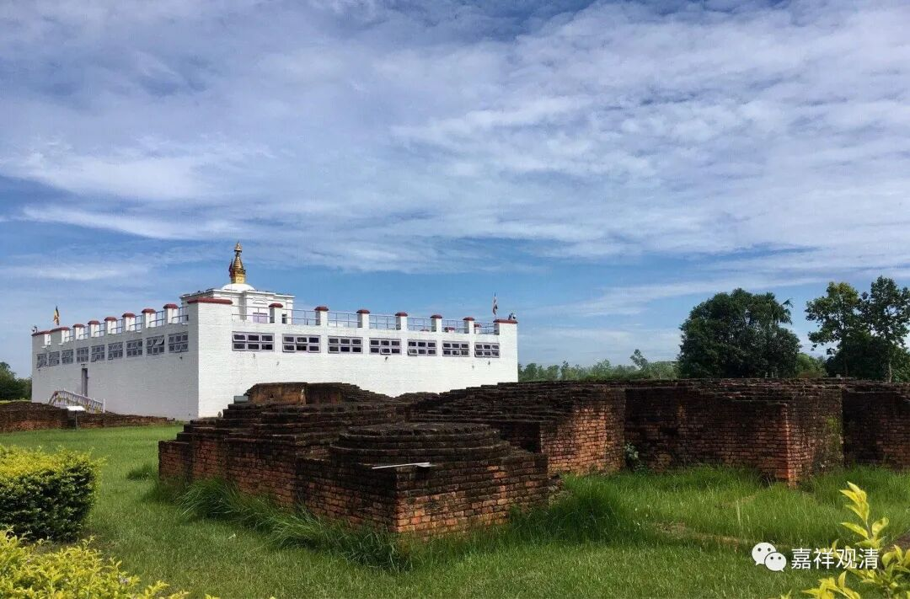

一、蓝毗尼园佛陀降生——莲聚塔

如来八塔，第一个叫“莲聚塔”，是纪念释迦佛诞生的，对应的就是佛教八大圣地的蓝毗尼园。

莲聚的意思，来自于释迦佛出生时的一个故事。故事说，小王子出生以后迈出七步（也有一种说是向四个方向各迈出七步），每一步踩出去，脚下都承接了一朵莲花，所以称为叫“步步生莲”——因此，第一个纪念释迦佛诞生的塔便带了“莲”字。

表现在塔的建造上，这个塔主要要突出“莲”“聚”的形象，就出现了多层的莲花座——三（五）层覆莲，三（四）层仰莲。

莲聚塔

三（五）层覆莲是分开的。

三（四）层仰莲是上下的三层。

一般我们讲印度佛教的八大圣地，实际这第一个圣地——蓝毗尼园不在印度，而在今天的尼泊尔。当年尼泊尔廓尔喀人帮助大英镇压印度人起义，大英后来就奖励尼泊尔，把蓝毗尼这一块割让给了尼泊尔。廓尔喀雇佣兵至今仍旧是大英有名的雇佣兵，伦敦郊外也有廓尔喀战士移民的聚居地，他们信仰佛教，也建了寺院，也有塔，只是不记得塔的式样了。

蓝毗尼是世界佛教徒的圣地，所以各国佛教徒都纷纷捐建。我记得蓝毗尼园区很大，甚至有穿梭的巴士，中国、日本、韩国、泰国这些佛教国家都建了寺院（我去的时候还没有建完），不过中国的寺院好像也没啥人，汉地的和尚们还是不习惯去那里待着吧。

……

