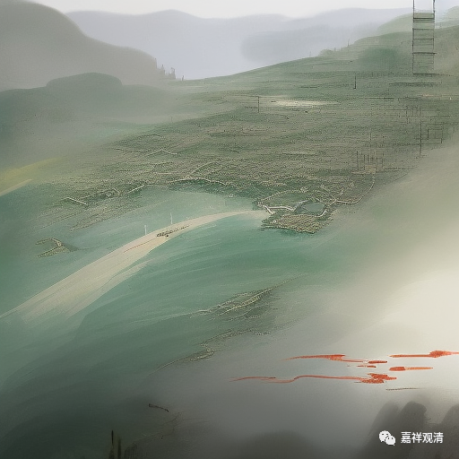

**微课佛教史419·2**

（宋徽宗）这时候有个道士叫林灵素（看样子他是学过点中医的，“灵”就是《灵枢经》，“素”，就是《黄帝内经·素问》。哎？金庸笔下有个“程灵素”，就是那个“灵素”）。这个道士林灵素就开始忽悠了，而且吹牛吹得很多，他对宋徽宗说：“天上有神霄宫，您就是长生帝君，蔡京就是左元仙伯。”宋徽宗很高兴，就封林灵素为“金门羽客”，称自己为“道君皇帝”，自己变成道君，变成天神了。（这宋徽宗的脑子还有点不太好使。）

这个时候林灵素又开始说：“佛教害道教的时间很久了，您现在已经当皇帝了，而且您又是道君，那您应该改变一下。”他说：“佛其实就是天尊，菩萨就是大士。”

宋徽宗听进去了，然后就下旨令：以后就不称佛了，佛都改名叫“大觉金仙”，穿道服。菩萨也不称菩萨了，叫“大士”。和尚也不叫和尚了，叫“德士”。尼姑也不叫尼姑了，叫“女德士”。和尚都换道服，再拿着道士的那种木令牌。寺改名叫“宫”，院改名叫“观”，住持改名叫“知宫观事”。凡有不服的和尚，杖杀！当时，有一位比较有名的永道大师就劝谏宋徽宗，结果就被流放到湖南。

之前不是建了很多寺院吗？这些太平兴国寺，全部被废弃！命令全国建道观。但是新建道观太花钱了，各地方州府就把原来的州府首刹大庙直接改名为“神霄宫”。和尚之前不是都把衣服给换了吗？就让和尚做道士——原单位换一块牌子重新装修一下，老员工换个身份继续上岗！

这个事情在禅宗的《传灯录》当中也有记载，就是当时寺庙改道观，和尚改道士，在截止的那最后一天，有些和尚倔强地不奉诏，都自杀了，这件事情在当时闹得很大。然后，林灵素还让宋徽宗迁都……前后差不多闹腾了大半年，和尚也死了不少，有自杀的，有被杖杀的。

前面我们讲了，一些信奉佛教的朝臣在当时还是挺有势力的，宋代的大臣和皇帝可以说是有一定的分权，所以台臣、僚守（官员和宰相们）就开始弹劾说林灵素是个骗子，“奸邪小人，妄议迁都，毁除佛教，罪当诛戮”，说他该死。当年的年底宋徽宗就放他回温州，其实就是贬回温州，在路上就把他赐死了。

第二年呢，佛还是叫“佛”，就不叫“大觉金仙”了，“男德士”改回僧人，“女德士”再改回尼等等，把之前所做过的重新再改回来。第二年的八月份，“罢黄老之学”，把道教又禁绝了。所以这中间有一段崇道禁佛的时期，佛教在宋徽宗的这个时期是受到了很大的影响，佛道教来回折腾。

接下去我们将讲芙蓉道楷禅师的时候可以提到这个事情，他也是这段闹腾的时间里被贬的和尚之一。

就先讲到这里吧，让大家知道一下，在宋徽宗的时代曾经有过一次对佛教影响非常大的自上而下的举动，时间不见得很长，但是由于政令下达的速度很快，也没少杀和尚。

今天就先讲到这里，谢谢大家！

