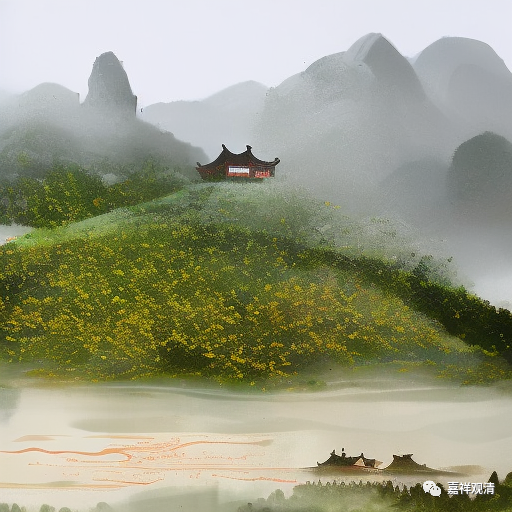

**微课佛教史420·2**

我最近也听到一些反映，就是有人觉得我讲佛教史的时候批评的部分太多了，大家有点慌慌。我还是这么说吧，其实讲“史”的时候可能就是有这样的问题。如果我们要讲中医史的话，从历史的角度来看，也会出现这样的问题，会出现中医当中的很多问题和民间中医自己圈内的传说是不一样的。如果我们看印度的历史或者西藏的历史等等，如果我们真正从历史角度去推理的话，就会发现很多流传下来的习以为常的说法，实际上也就是小说。没办法，我们现在碰到的课题或者我们在讲的就是历史，所以大家就先听听吧，哈哈。

接下去呢——我确实也讲过好几次了，禅宗后面我不知道怎么个讲法。因为再往后的话，大量的重复性的内容就会比较多。而且不用过多久，基本上就精华已尽了。宋代的禅师我们再稍微说几位，然后是元代，我最多讲到明初，我觉得明初还有几位有名的人物可以谈谈，明以后真的没法多讲了。

明代的禅宗还是从宋元传下来的，元代的时间实际上很短，其实还是从宋代传下来的人物。到了明代，基本上就“咣当”一下子——禅宗就完蛋了（佛教就垮了）。不过在那个时期，几乎所有的宗派都完蛋了，这个等我们讲到明代的时候再讲。

我们现在还是回来再谈芙蓉道楷禅师。他在道教学了辟谷，后来就不学道了，改学佛教，就“试法华得度”，也就是背了《法华经》。这个事情我们就不多讲了，类似的事情太多了。

我们现在觉得能够背诵《法华经》就很厉害了。另外一点我们也要说一下，就是既然《僧传》里面说“试法华得度”，就说明当时能够背《法华经》的人并不算很多，也不是那么多，所以才要多加一句“试法华得度”。但对背诵强的人来说。

（现在，呵呵了，几百年以后，我们传记里将会是“试《朝暮课诵》得度”，NN的，丢死人了！一下子变成了“应赴僧”，这“香花和尚”的人设直接就立起来了！我觉得，当年想出考“功课本得度”的人，现在一定天天在被祖师爷们揍！“叫你小子瞎折腾！文盲也敢立规矩！”）

比如说，在唐代以前或者在初唐时期，如果我们在传记当中夸一位和尚的时候，就会说他“戒行谨严，终生茹素”，一直吃大白菜，哈哈，一直吃菜。这就说明在早期并没有专门吃素的说法，如果有些人因为护生的原因而专门吃素的话，《高僧传》里面是会专门提一笔的。但是到了后期，反而不提这个情况了，因为大家都在吃素了，是吧？既然在早期的时候要专门提一句，就说明这个情况在当时其实也是不多见的。

我们在讲禅宗的历史当中，已经看到了好几位禅师都是“试法华得度”，这并不是说当时所有的人都要“试法华得度”，只是如果你能够背诵《法华经》，就说明你是非常厉害的。这就相当于你去报考的时候，就会比较容易过关。因为能够背诵的人数是比较少的，所以才要加这样一笔。

