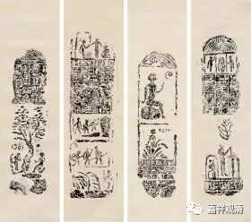
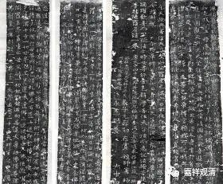
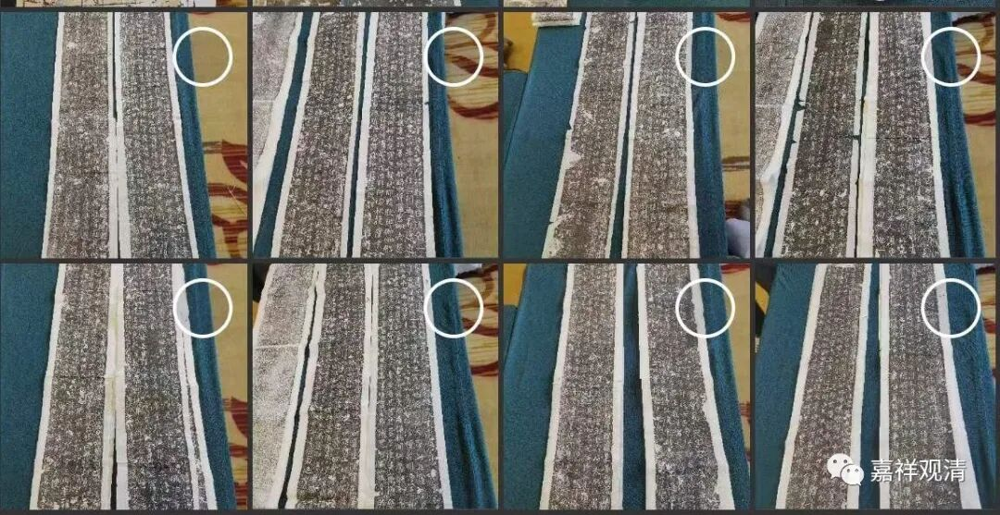
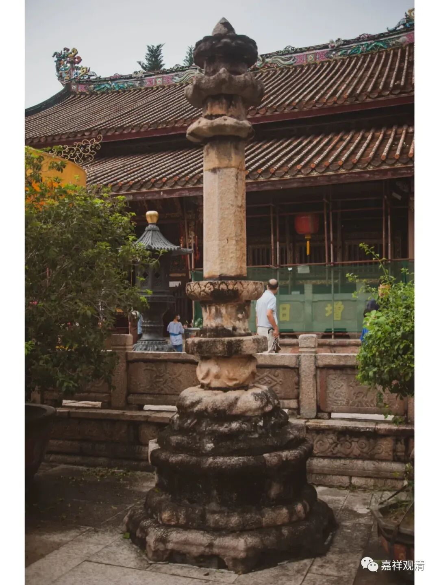

**端方的“埃及金石拓片”与“尊胜陀罗尼经幢”**

今天去赶了一个拍卖会的预展，看到两件和端方有关的拓片。

端方，是晚清的重臣了，我们知道他，就是课本里的在四川保路运动中被杀……《清史稿》中说端方“笃嗜金石书画”，有《陶斋吉金录》，算是金石大家了。

1906年，端方奉命出使欧洲考察宪法制度，以“准备立宪”……回国时停留开罗，因为自身对“金石”的敏感，遂购置了一些埃及石刻文物，回国后传拓以赠诸友好。以上就是“端方埃及拓片”的来源。

这件《尊胜陀罗尼经幢》一套八张，留白处有端方等人的题记。

介绍说此经幢为唐大中四年（公元850年）刻，系元存劭、元存赏等为亡考追福所立，书法有《集王字圣教序》之笔意。原立于长安，后端方移至江苏镇江焦山定慧寺安置。

一套八张

《尊胜陀罗尼》，汉文本一般说现存八译，若加潮州开元寺尊胜经幢之不空“译”本，则为九译。

潮州开元寺尊胜陀罗尼经幢

端方出题记的这个“元存劭、元存赏所造尊胜陀罗尼经”则为佛陀波利本。造尊胜经幢曾经是唐宋佛教界常见的祈福、度亡的行为，目前所见大量的尊胜经幢亦主要为佛陀波利译本（而有少异），潮州开元寺尊胜经幢的不空仪轨本（《加句灵验佛顶尊胜陀罗尼》）则为海内孤本，独此一份。

我也收了几件尊胜经幢的拓片，有机会拿出来整理一下。

