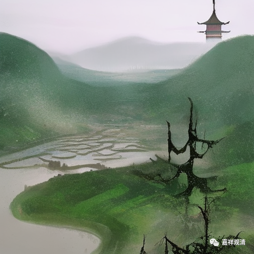

**微课堂佛教史 421·1

其实还有个别的情况，在《华严经传记》当中也提到过，甚至有人是“试华严得度”的。当时背诵的还不是《八十华严》，而是《六十华严》。能够把六十卷的《华严经》背下来，背完以后就出家了，就在山里面天天背诵《华严经》。这个太狠了，太厉害了！

另外一方面来说呢，那些人也没有成为大师级的人物，或者说是历史并没有特别地记住这些人。我不知道他们有没有在修证上成为大师……但是至少在传播上，他们没有成为大师。

这个也一直是在历史传播当中一些矛盾的地方。比如说，佛教的大师应该是以智慧、德行、慈悲等等为主的，但是从历史的角度上来说，却应该是有多少内容可以用文献记录下来，就是他留下多少文献，我们才能说他是大师。所以有一些时代可能没有被文献记录，也不见得当时没有大师，不见得没有顶尖的、最最厉害的人物。所以这个事情也是很难去把它讲得很圆满的。

但是反过来，我们不能说“因为我不知道他的修行，所以他就是大师了”，这个肯定不能这么说的。当然，任何一个人都是有可能的，对吧？藏地有一个谚语：“贼和佛，无法能够了知在何处。”小偷和佛，他在什么地方，他不会告诉你啊。但是你不能因为这个，就说“所有人都是佛”，这个不行啊。

芙蓉道楷禅师是试《法华经》得度的，受了具足戒以后，“游淮西”，他应该到安徽去了。而这个时候呢，投子义青禅师正好在白云山海会寺，前面我们讲过，就是白云守端禅师的那个寺院，投子义青禅师也去了那里，再后来才是去的投子山，是吧？

那么，芙蓉道楷禅师就去问投子义青禅师——这句话问得非常厉害，说明他是很聪明的人，这句话叫：** “佛祖言句，如家常茶饭。”**佛祖的这些话，就像家常的茶和饭一样。** “离此之外，别有为人言句也无？”**离了佛陀的这些文字以外，还有没有其他的言语呢？

这句话的意思是什么呢？其实这句话是有点刁钻的哦，他的意思就是说：师父，你讲法的时候能不能不用佛所讲过的话来给我们说两句？这个话很刁钻，而且属于比较内行的话啊。

投子义青禅师没有顺着他的话来回答，反问他：** “汝道寰中天子来。还假禹汤尧舜也无？”**你见过当今圣上下敕的时候，所有的文字都是用的尧舜禹汤吗？是不是啊？（就是韦小宝说的那个“鸟生鱼汤”——尧舜禹汤。）现在的皇帝颁布命令的时候，是不是每个字都从那里面出来的呢？——皇帝的话当然是利国利民的话和尧舜禹汤一样，但他肯定不是用三五千年以前的话来直接说的嘛！

