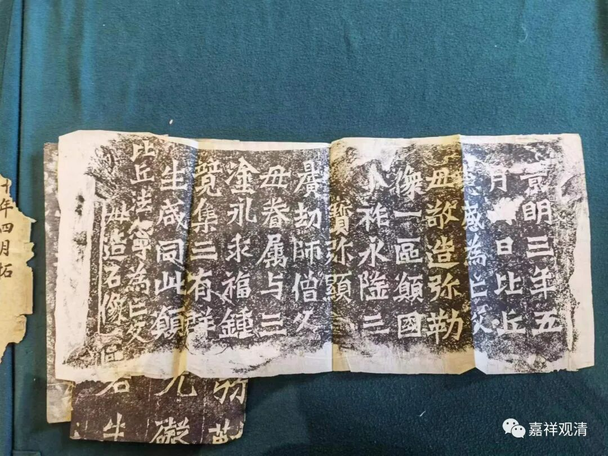

**最近和《龙门二十品》有缘**

最近和《龙门魏碑二十品》有缘——刚刚新得到一套《龙门二十品》的完整新拓片，来源比较靠谱。

恰巧昨天在拍卖会预展上也看到有一套完整的《龙门二十品》。

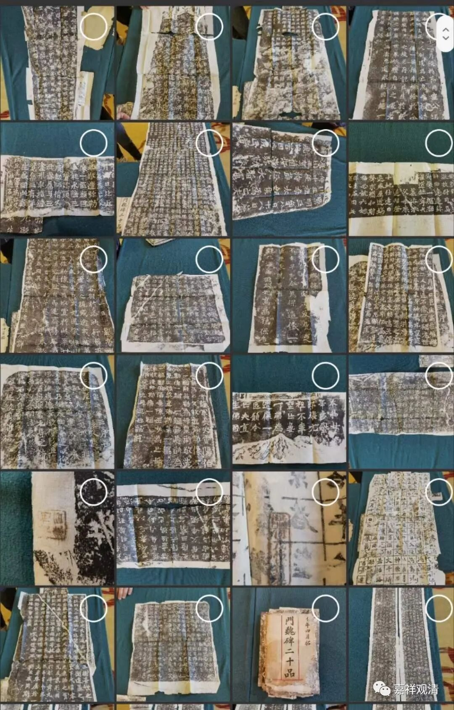

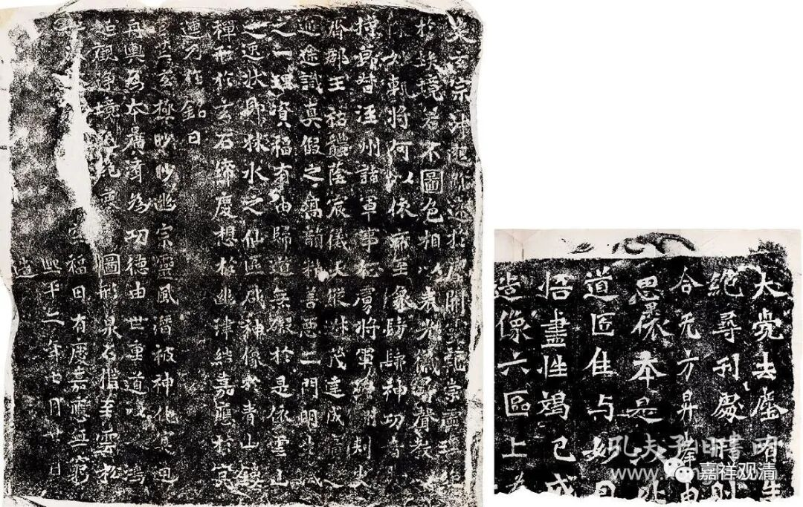

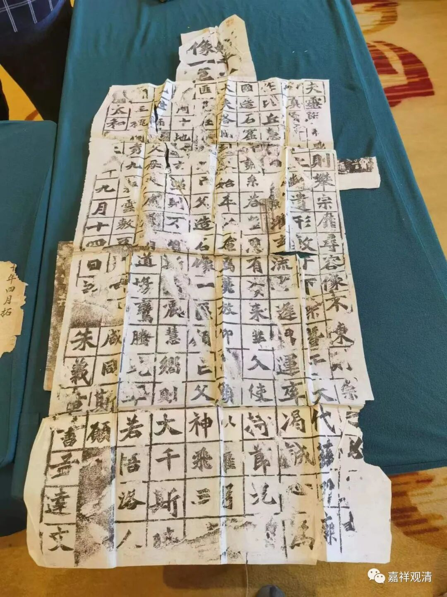

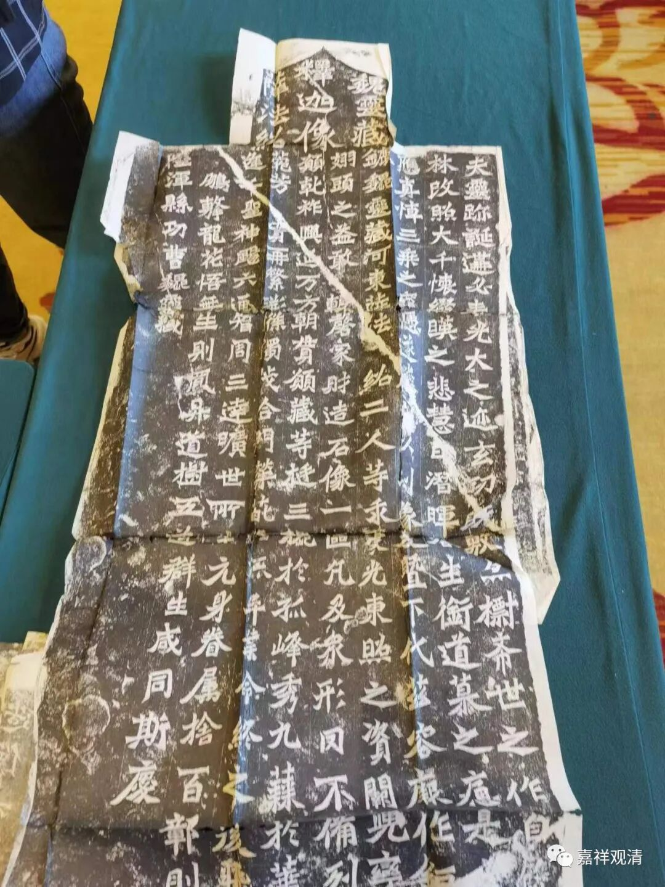

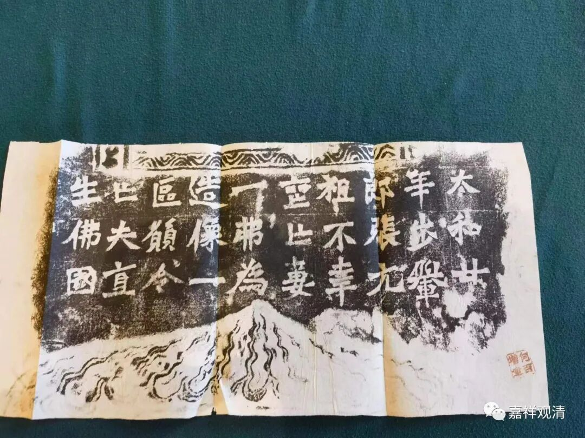

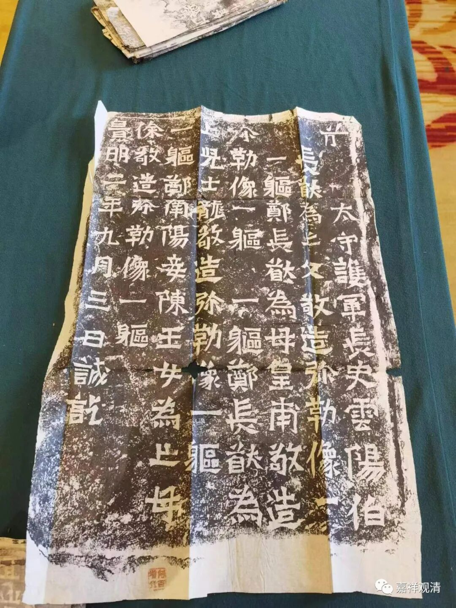

其实这个拍卖场，除了这件标为《龙门二十品》的拍件以外，还有几件也在《龙门二十品》里面，比如这件《杨大眼题记》——

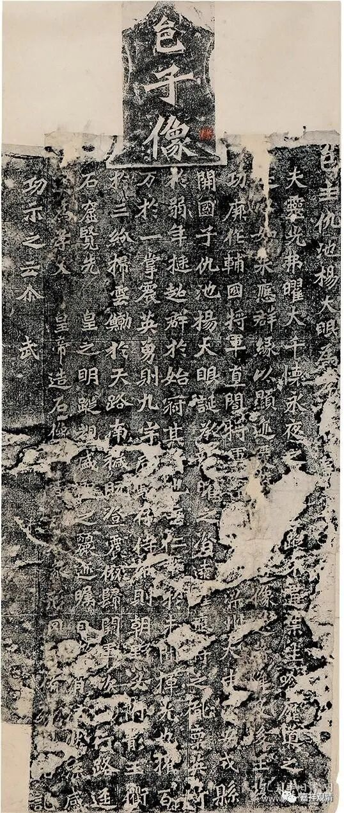

这件《龙门造像》——

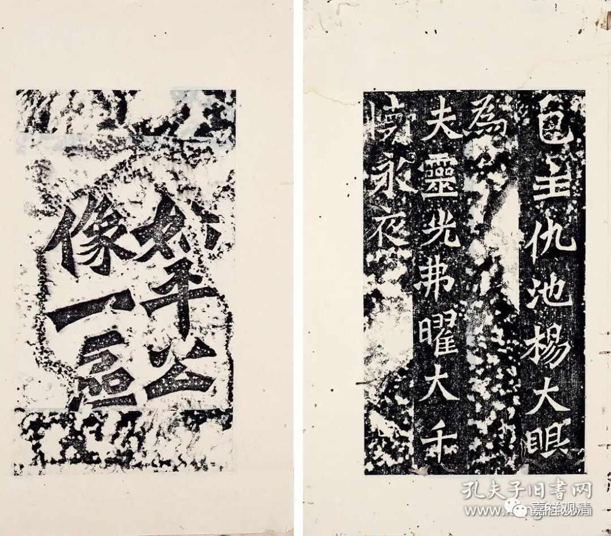

和这件《龙门造像记》——

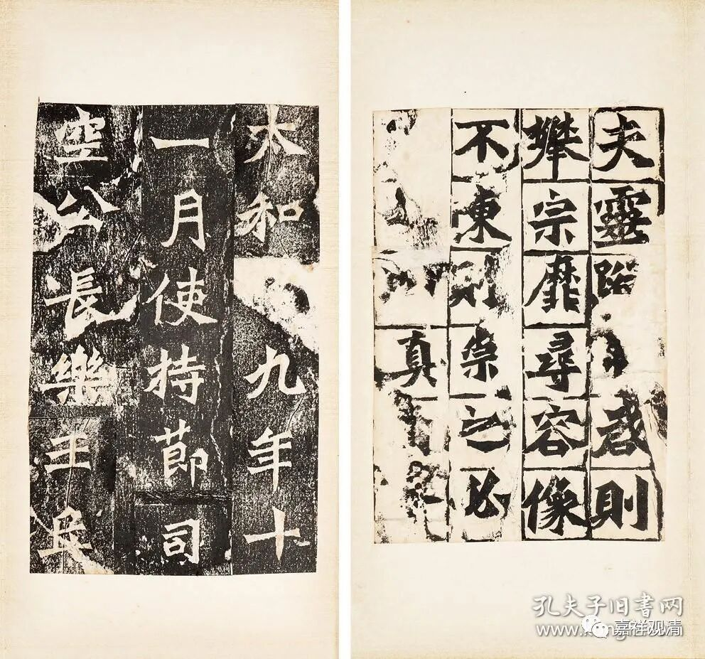

只是装帧方式略有点不一样。

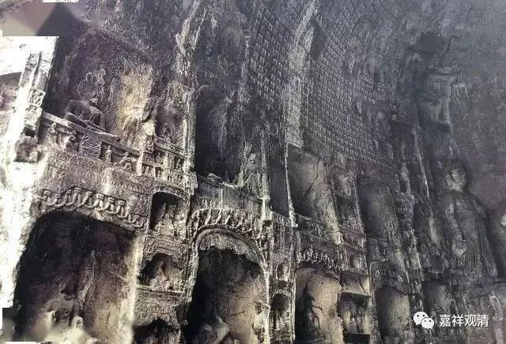

《龙门二十品》，是洛阳龙门石窟里面属于北魏时期的二十处造像题记，其中十九处在古阳洞中，一处在慈香窟（660窟）。古阳洞我们之前讲“交脚弥勒像”的时候提到过，古阳洞有很多大小不一的“交脚弥勒像”。这些造像在刊刻的同时留下很多题记，有些书法价值高的就被传拓流通，最早出名的是《龙门四品》，即上面提到的《杨大眼题记》和《始平公》、《孙秋生》、《魏灵藏》四处造像题记的并称。后来又出现另有《龙门十品》并称的，最后至晚清康有为定型为《龙门二十品》，记录于他的《广艺舟双楫》中。名人效应之下，《龙门二十品》就出名了。

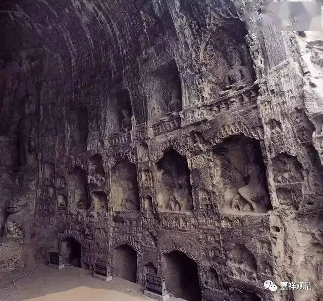

《龙门二十品》算是书法界非常著名的魏碑题材了，不过我的关注点主要不在书法，而在佛教。

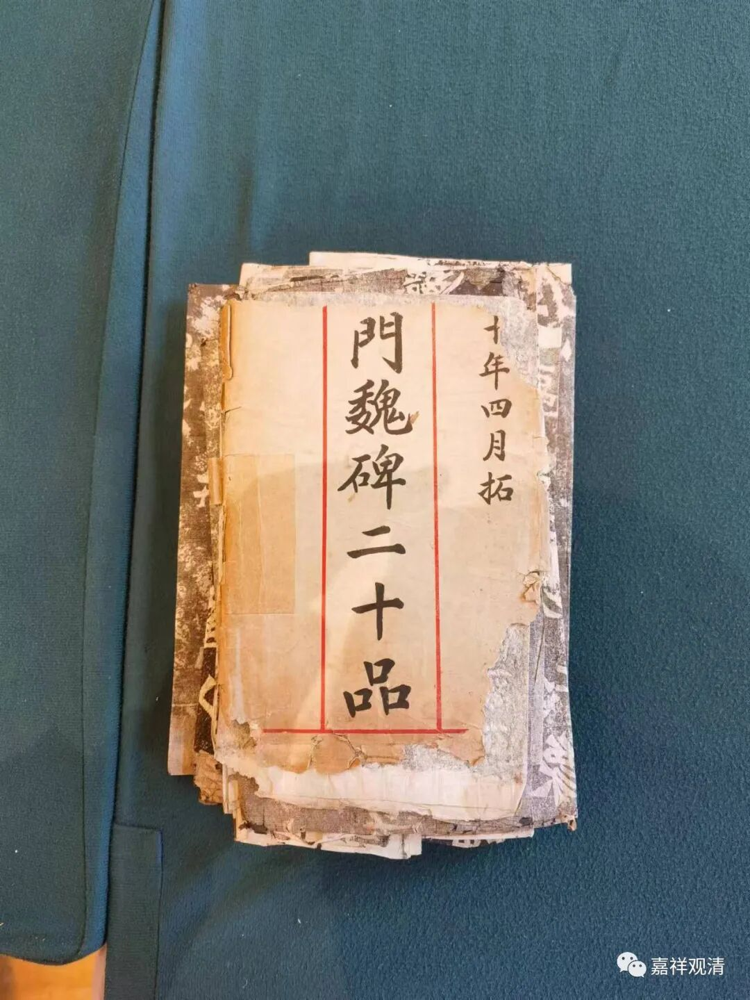

拍卖场的这件《龙门魏碑二十品》为清末所拓（肯定要晚于康有为提出《龙门二十品》），没有经过装裱，有一点点残破，原来应该有个简单的封套，也碎了。

