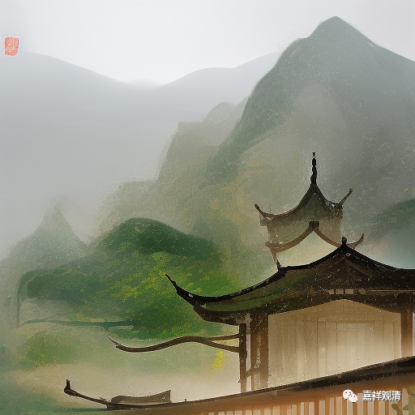

**吉藏所传的胜论宗“德”句义（三）**

……

吉藏又说，“德”（求那）句义其实不止有“十七法”，其《百论疏》中说：

** “求那非止有十七。如法、非法、功用、長、短、老、少等皆是求那，此十七為本也。”**

吉藏说：除了前述十七种以外，另外还有“法、非法、功用、長、短、老、少等”都属于“德”句义，说明德句义并不仅限于十七种，但以这十七种为其根本。（其中，长短等应该类似于某一“德”——量——的分类，如果这样算的话，颜“色”中也能分出青、黄、赤、白等多种。）

吉藏这里列出多于十七种的“德”有七种，若加上前之十七，则恰为二十四种，倒是和后期的“二十四德”暗合。

这里，吉藏所增的“法”、“非法”，即《胜宗十句义论》里的“法”dharm、“非法”adharma（《印度教导论》译为“善”、“恶”）；

吉藏所增的“功用”，应即《胜宗十句义论》里的“行”samskāra（《印度教导论》译为“机能”）；

吉藏所增的“长、短”，应即“量”parimāna中的“长体”（hrasva）、“短体”，《胜宗十句义论》：“……量云何？谓微体（aṇu）、大体（mahat）、短体、长体、圆体等，名量。”

吉藏所增的“老、少”，或即上述“量”中“短体、长体、圆体等”中的“等”（亦可属于“时”句义，亦可属于“数”？）。

……

