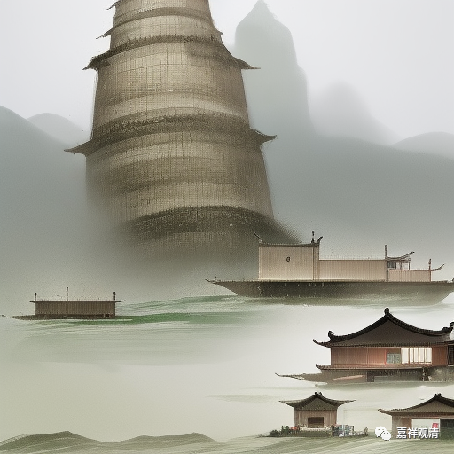

**微课佛教史422·2**

还有一段故事其实也有点意思，也跟芙蓉道楷禅师曾经的道士身份有关。

有一天，芙蓉道楷禅师和投子义青游园，在寺院里面。我们说过的，其实古代的寺院还有一个作用，就是相当于公园的性质，大家都可以来逛一逛。比如说今天苏州的西园寺，里面一半的面积都是园林，以前大家游寺院的时候，都可以逛一逛，在里面请客吃饭也可以。

那么，芙蓉道楷禅师就跟着师父游寺游园，其实在寺院的边上有个小园林。这时投子义青禅师就把拐杖交给芙蓉道楷禅师，来问他：“道理上我应该给你吗？”

芙蓉道楷禅师就说：“我给和尚提鞋拿杖，也不算是我的分外事，也可以。”

投子义青禅师说：** “有同行在。”**边上还有其他人呢？这里的意思是说：那么把我的手杖给他行吗？

** “对曰：”**芙蓉道楷禅师说：** “那一人不受教。”**边上这人水平不够。

这段对话的背后其实有一个意思，就是投子义青禅师有点承认他，给他一个自己用的东西：“你有能力拿吗？”

然后芙蓉道楷禅师就说：“我帮您拿没问题，我有资格。”

“那边上还有一个人呢？他也应该有资格拿。”

“他的水平不够。”

这段话其实也是有点开玩笑的性质，就是用开玩笑的方式把正事说出来。

接着到了晚上，正好这个时候芙蓉道楷禅师也在，投子义青禅师就说：“早上我们说话还没讲完呢。”

芙蓉道楷禅师说：“那么您继续吧。”

投子义青禅师说：** “卯生日，戌生月。”**“卯生日”就是太阳在早上5点到7点的卯时起来了。“戌生月”就是晚上7点到9点，或者说天晚了，月亮升起来的时候。

芙蓉道楷禅师就去点了个灯。咦？除了太阳和月亮有光，那还有其他光呢？

投子义青禅师说：** “上来下去，总不空然。”**就这样，一个上来了，另一个下去了，一个跟着一个，也没有间断……

芙蓉道楷禅师回答说：** “在左右，理合如此。”**我在您边上就应该这样，日月交替，也有灯火奉上。

投子义青禅师接下去就说：** “奴儿婢子，谁家屋里无？**”哪个大户人家家里没点庶出的三房三房……这个“奴儿婢子”可能也是在跟他开玩笑：那你到底是不是嫡传的？

** “对曰：‘和尚尊年，阙他不可。’”**因为您年纪高了，年纪大了，也少不了我这样的人。

投子义青禅师就说：** “与么殷勤？”**hoho，怪不得看你最近怎么突然之间这么殷勤（原来是看上我的家产了）？

芙蓉道楷禅师回答说：** “报恩有分。”**我是来报和尚恩的。就是尽管被他嘲笑，哪怕不是正宗的，不是嫡子，我也要给你继承。在你面前，总要做点事情。

后来芙蓉道楷禅师就出世了——就是开始住持寺院。他出世以后，所住持的几个寺院都是很大的寺院。一开始出世是在沂州的仙洞，这个不知道在哪里。然后去了西洛的招提龙门，就是洛阳的龙门石窟。今天我们叫石窟，实际上是以前的大寺院。比如奉先寺，其实它是一个寺院，石窟上面那些方形的洞洞里面，应该都是要插木头的，在这个背景下才有楼阁建起来的。现在我们看起来好像仅仅是石窟，其实不完全如此，它是一个大型的寺院。所以说给他的寺院很大，也很好。

然后芙蓉道楷禅师又去了大阳山，我们前面讲过大阳警玄禅师，是吧？这就等于是承认了他的地位。这些都是大寺院，他一出山就是这些大寺院。然后又去了随州的大洪山，说是** “皆是一时名臣公卿所劝请”**，都是大佬们推举他出世的。

