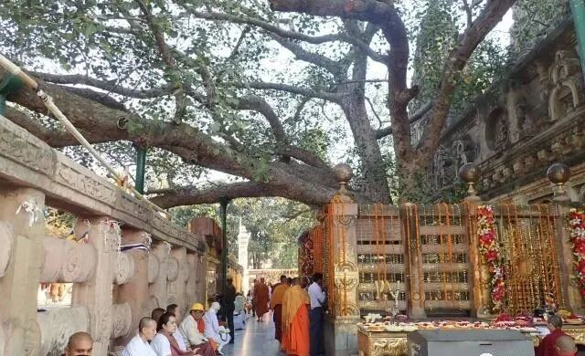
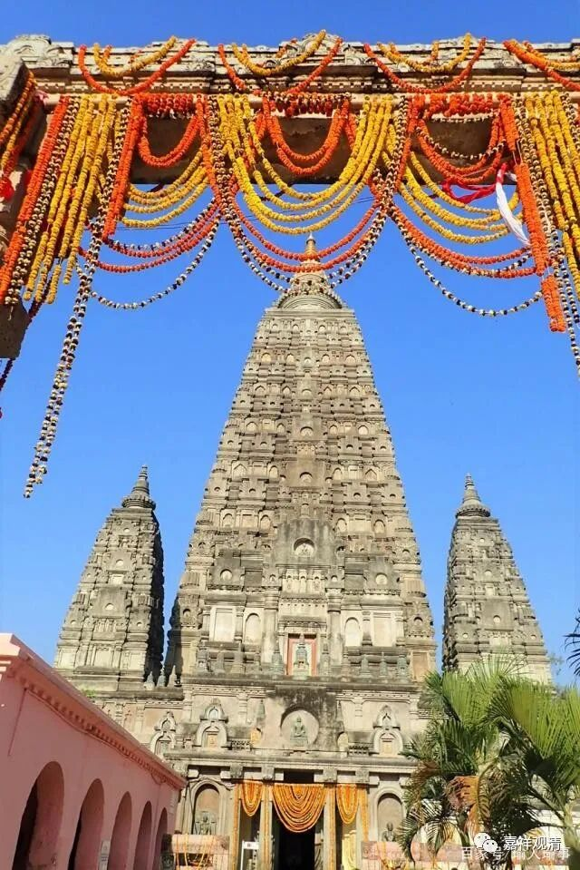
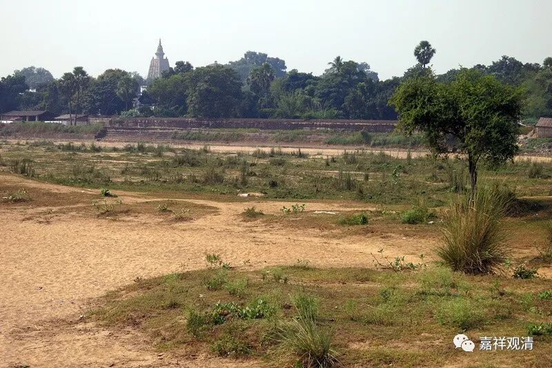
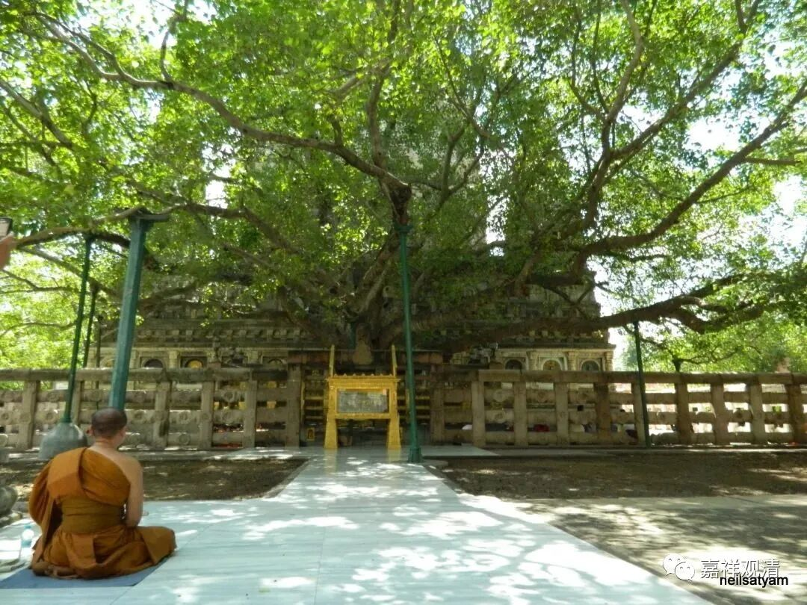
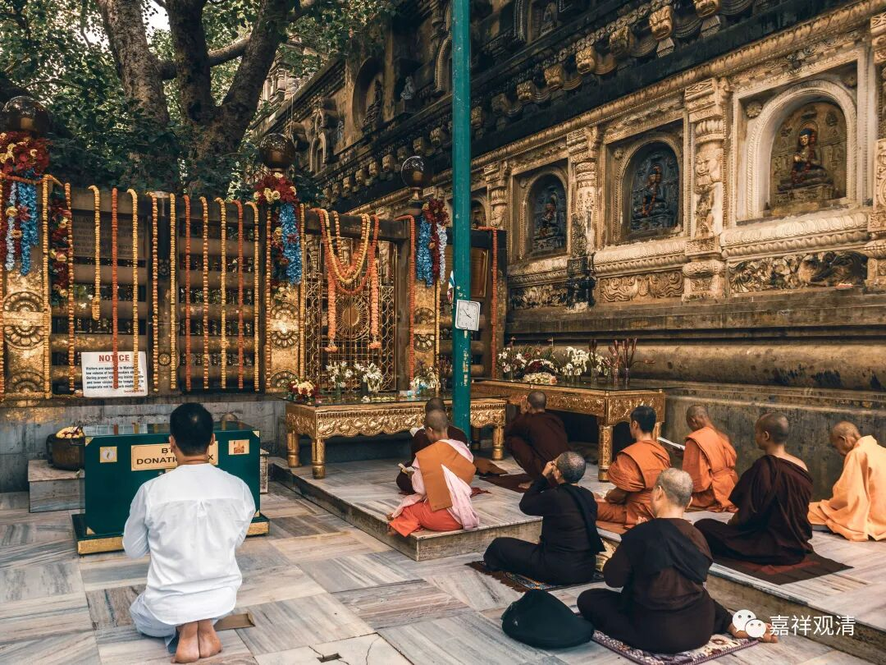
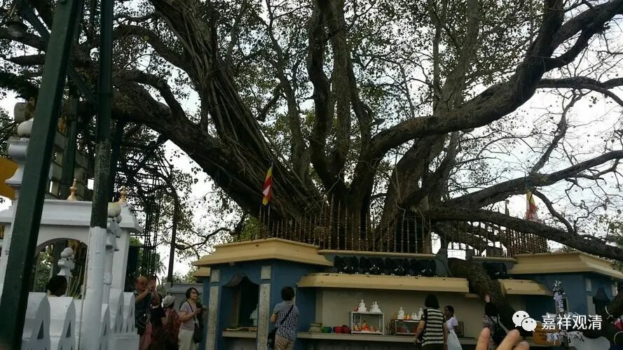
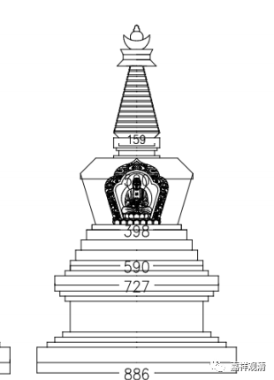

印度佛教八大圣地中第二是菩提迦耶佛陀成道的尼连禅河边的“菩提场”，这可能是这些圣地中最著名的一个了。菩提迦耶的大菩提寺和大菩提寺塔我们之前已经介绍过了。

摩诃菩提塔最初由斯里兰卡王室来建，后来年久被毁（实际主要是被洪水带来的泥沙给整个埋了）；近代考古发现以后，由缅甸佛教徒重建。

记得那年跟菱子的团坐大菩提号专列去的时候，在尼连禅河边，很多团员都捡了一把沙子带回去。当时很大的雾霾之下，太阳可以目视。

朝圣的人群其实比我想象当中要少得多，肯定比不上国内五一、十一的客流。大菩提寺塔的后面就是“菩提树”，大家都愿意去那里打坐一会儿以获得加持——当年悉达多王子就是在树下成佛的。

这个“释迦成佛”地方就被称为“金刚座”。

我的一个师父就是在这棵树下面考的LRBGX，他告诉我，当时他考试的开场白是：“当年释迦王子在这里成佛，今天我也将在这里成功（毕业）！来吧！（放马过来！辩论吧！）”很“嚣张”的话啊！

斯里兰卡的那棵菩提树

现在的这棵菩提树是“孙子”辈的——公元前3世纪前后，摩思陀从原来的菩提树上折了一根枝条带去斯里兰卡……十九世纪斯里兰卡佛教回传印度，又从斯里兰卡的这棵菩提树上折了一枝种回了菩提场。

如来八塔中纪念菩提迦耶菩提场的“菩提塔”并没有照搬大菩提寺菩提塔的式样，而是和有其“如来八塔”的一致性。

