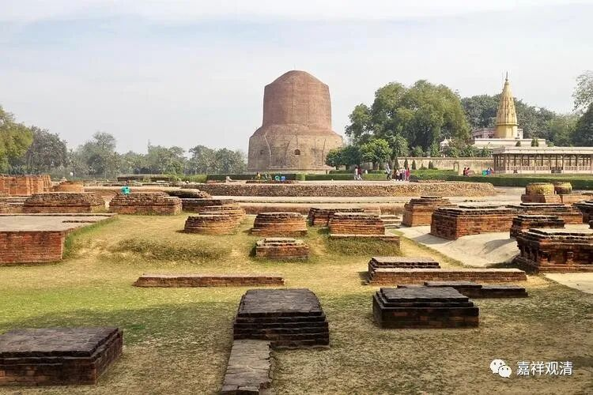
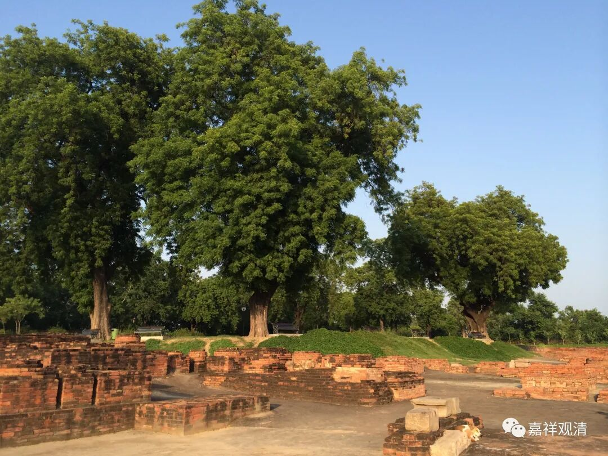
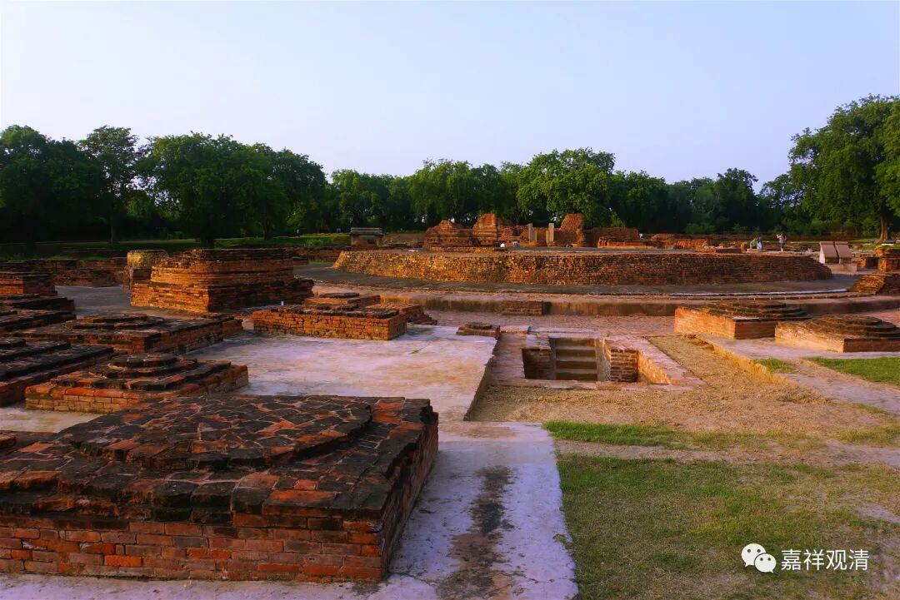
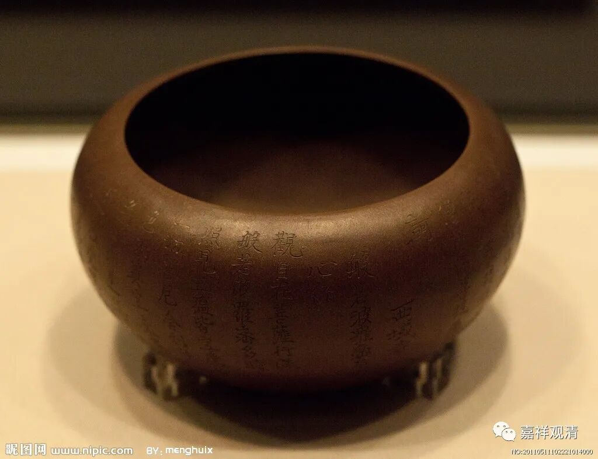
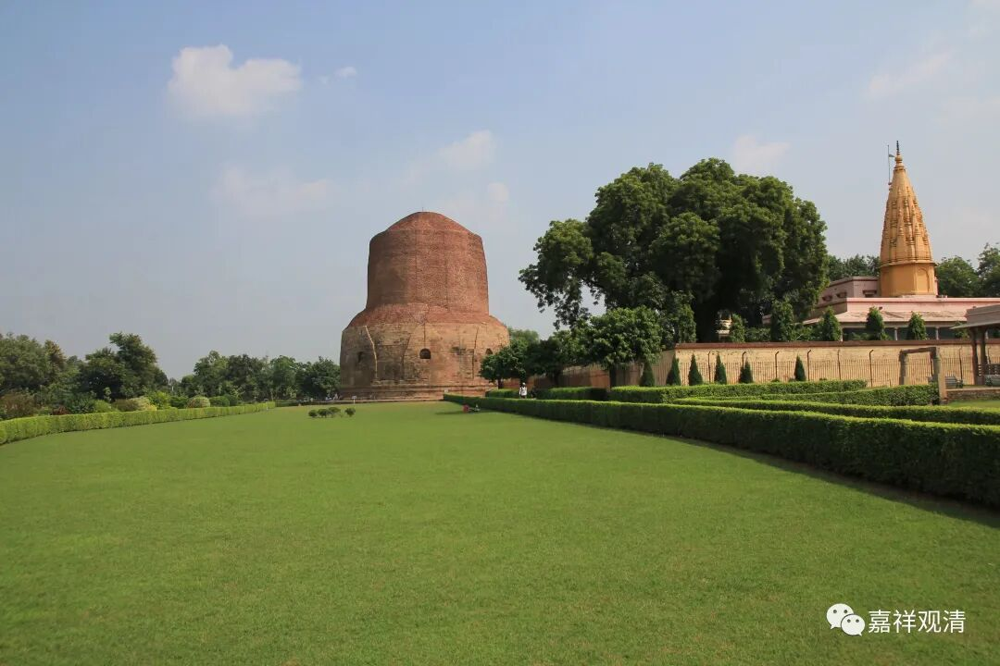
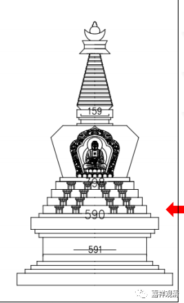
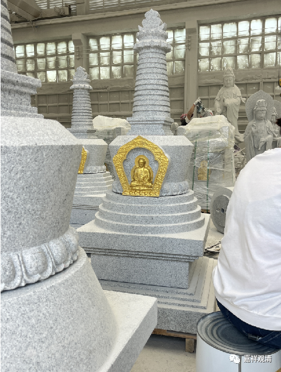

两千五百年前的“鹿野苑”，据说曾经生活着很多鹿群；又因为此地有大量修行人聚集，也称“仙人住处”，后来讹为“仙人堕处”……

释迦佛洞明真理以后想找人分享，他最初觉得应该和之前的两位老师分享，因为心意相近，容易理解。但神通观察下来，两位老师已经去世。那接下来容易理解他思想的就是和他长时间一起修行的五位亲戚了，他们是父王派来的友伴。由于这五人在鹿野苑，佛陀便来到鹿野苑向这五人分享他的洞见……

五人从最初的嫌弃，到听佛陀宣讲，进而被折服，最后得道……自此世间有了“三宝”——佛陀释迦、趋向于解脱的言教、实践教法的僧众。

有的经典说，佛陀讲了没几句话这五位就迅速解脱了，实际据戒律经典记载，佛给他们讲了一段时间，有时候两个人听，三个人去化缘食物；有时候三个人听，另二人去化缘食物（两个人化缘回来六个人吃，也就是一个人要负责化缘到三个人的饭食），化缘到的食物一起分享。所以后来僧团为了纪念这最初的讲法，规定，“钵要大到能存三个人的饭量”！所以大家可能看到僧人的钵很大，有的寺院（八十年代初）索性每人发一个搪瓷脸盆当饭钵。

鹿野苑遗址有很多殿堂、僧房的基础，还有一个阿育王造的塔。考古发现，此地被毁得极其仓促，有半成品的麦饼，也有熔化的铜器，糊墙的粘土都被烧成了陶……

现在鹿野苑成了遗址公园。我记得对面有一个博物馆，其中一件展品解决了我一个关于佛造像的问题。可惜那里面不让照相……

对应纪念鹿野苑释迦如来最初说法处的“如来八塔”（第三个）叫“吉祥门塔”，还有另外一个更合适的名字不太方便说，意思就是“最初讲法塔”。

明天我动身去泉州某个石雕厂，现场看看雕刻进度，和老板聊聊“世俗”和“生意”。

