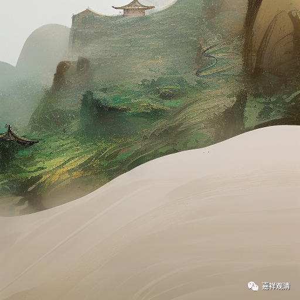

**微课佛教史423·2**

“免罪”“自便”以后，道楷禅师就来到芙蓉湖上，建造了一个芙蓉塔，后来他就被称为芙蓉道楷禅师。很多人都来了，有几百人之多，他每天就只给大家一碗粥，大家都吃不饱，离开的人很多，最后留下来一百多人。

政和七年，宋徽宗又给他这个芙蓉湖上的小庵堂赐名“华严禅寺”。又过了几年，芙蓉道楷在七十六岁的时候去世了。

这个故事单纯看起来好像没什么，甚至会觉得芙蓉道楷禅师有点过分刚了，其实是有原因的。就是单纯看历史的话，可能看不出什么，实际上他为什么这么刚呢？因为宋徽宗给他赐号、赐袈裟的那一年，还下了一份诏书，对和尚不太友好，就是把道士放在和尚前面，实际上是开始抑佛了，开始推崇道教和道士而抑制佛教和和尚了。前面我们也讲过，徽宗后来甚至把寺院改成道观。

那么，芙蓉道楷禅师在当时属于顶尖的佛教大师，因为他不仅身处京师，还住在皇帝的寺庙，有点像皇帝的家庙，等于皇帝给自己培福的寺院——“崇宁”、“天宁”都是宋徽宗的年号。让芙蓉道楷禅师在这样的寺院里面做主持，当然是很给面子的，所以他的地位也非常高。

作为地位如此之高的僧人，芙蓉道楷禅师就不得不或者说必须对宋徽宗的这份诏书做出反应，就是：“我跟你不是一条路的，你就是再收买我，我也不理你。我就得硬刚你。”

当时佛教界还有几个硬刚的，还自杀了，不是在这个时候自杀，而是后来宋徽宗要把寺院改成道观，让和尚成为“德士”，让尼姑成为“德士女”等等，等皇帝的诏书到达寺院的时候，那些和尚在接完诏书后的第二天就自杀了。也正是因为佛教有这样几个硬刚的，相当于整个佛教界都在和徽宗皇帝杠，后来徽宗皇帝对这些事也就不了了之，甚至把罪魁祸首林灵素也给杀了。真正灭佛的时间就一年左右，当然，如果从对佛教不太友好开始算，那也要好多年了。

所以，单纯来看这个故事的话，会觉得芙蓉道楷禅师太刚了，为什么会这样呢？如果在当时的历史背景下来看，这也是有原因的，可以和前面那句** “适犯天威”**相互印证，大家都知道他说那些话正好触犯了皇帝的天威。为什么这么说呢？因为当时皇帝把佛教的地位下降，把道教的地位提高，所以这实际上是双方面的一场较量。

好，今天就讲到这里，谢谢大家！

