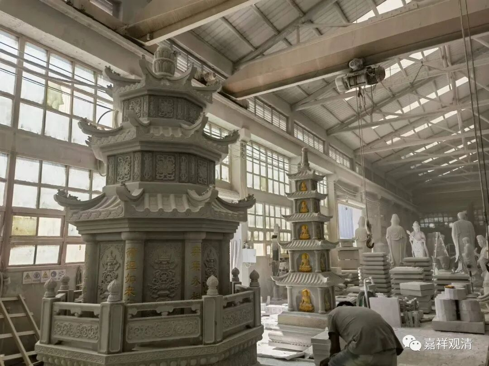

**惠安石雕之考察报告**

到泉州惠安石雕厂来现场考察，准备进货……

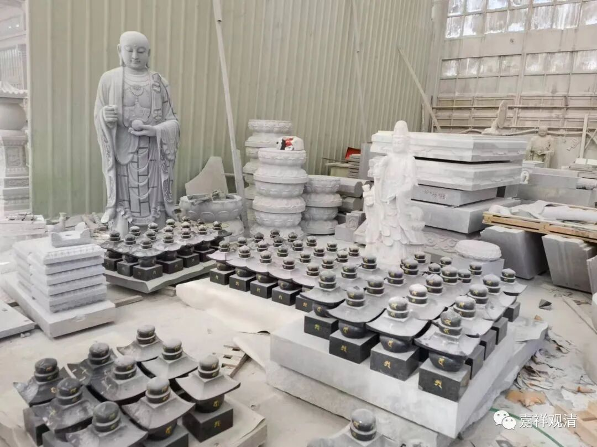

庙里要添点石佛、石塔，这在福建泉州是有名的……订完以后，拍马赶来……

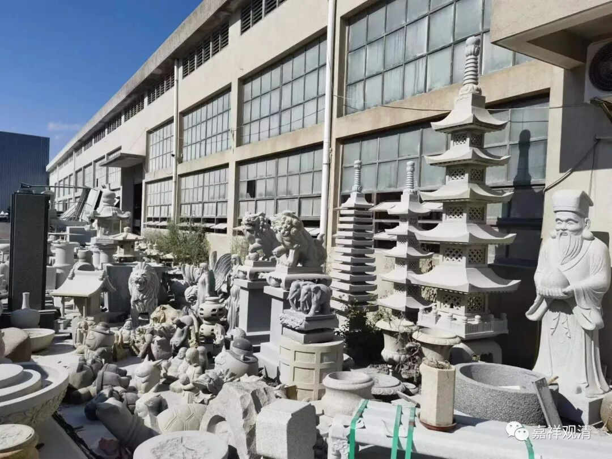

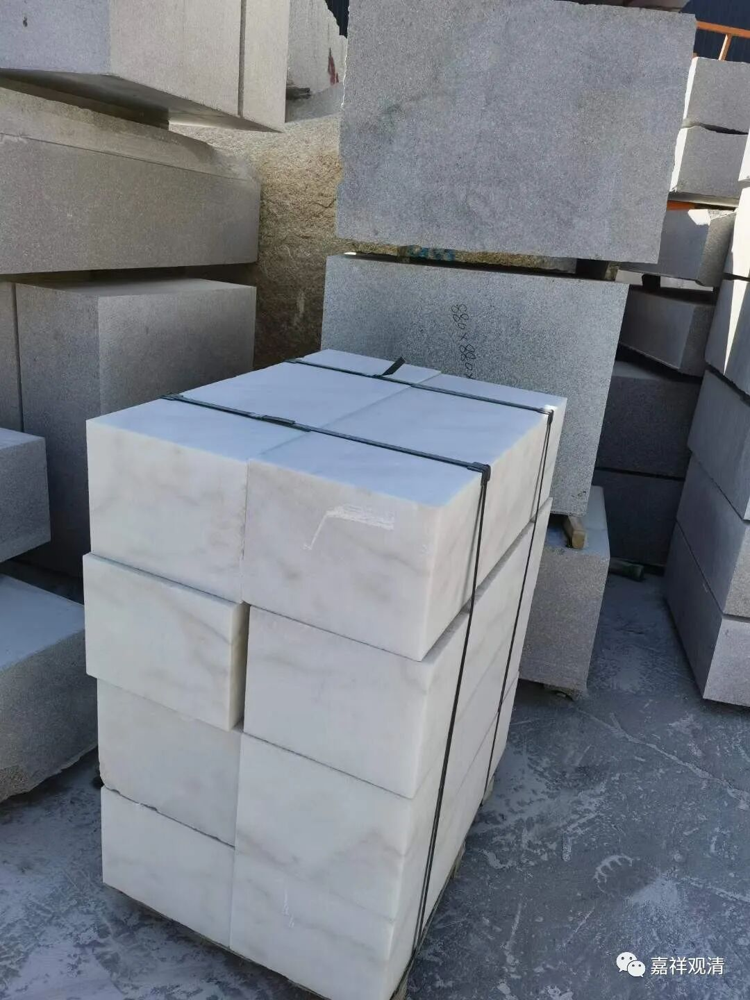

泉州惠安这里，石雕和石材进出口都是有名的（隔壁晋江主要是出口鞋子）。原先是就地取材，石材便宜，现在当地石料已经不再无节制开采（而且贵得离谱），反而是进口的石料便宜了——现在石料从越南、缅甸、柬埔寨等地都有进口。最近几年进出口难做，有的厂子关了，外来人口（工人）也少了，当地租房、消费都下降了……环境治理的力度加强了，以前街上都灰尘很大，现在石料切割禁止露天作业，要求必须环保达标——这也是有教训的。

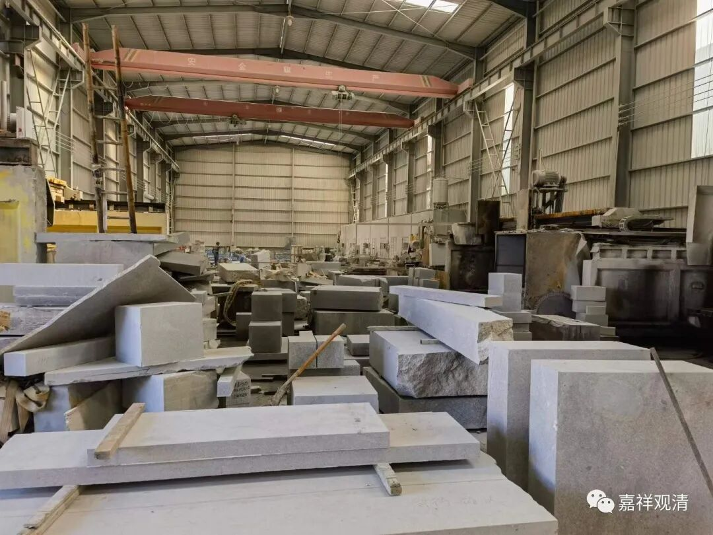

如果石料、建材进出口算粗加工，那雕刻就要算精加工了。老板带着我出来逛了一圈，看了很多早些年前的“作品”，他说，现在从工具到技术到具体细节都要比以前“卷”多了。以前切割用钢钎，现在有各种大型电锯，现在还有数控机床、3D打印，各种切割、打磨、做旧工具……工艺水准已经“不可同日而语了”。

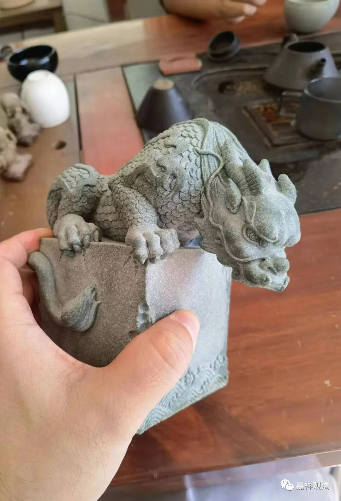

这是3D打印的

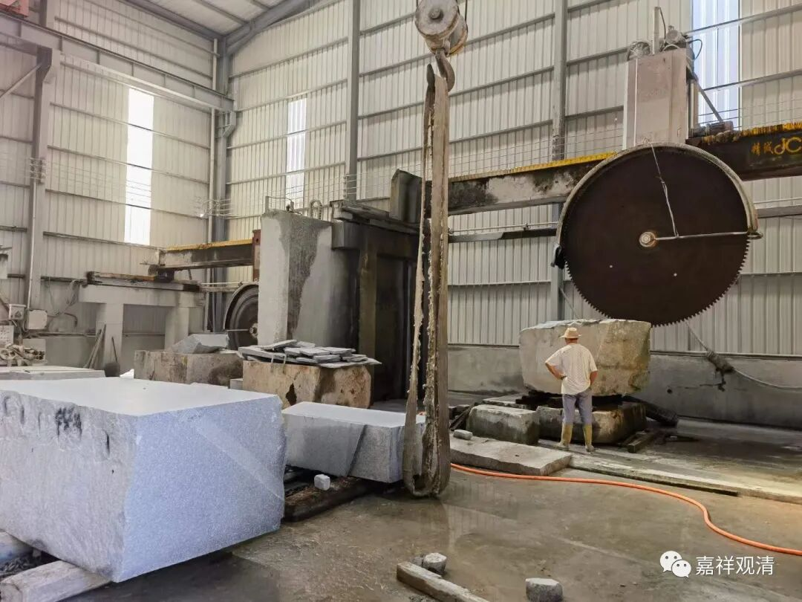

技术的更替中，也牺牲了一批“老人”——（前面说到环保，）最早做石雕的工匠都不太注意自我防护，大多都不戴或很少自觉戴口罩，加上刚进这一行对石料的各种特性不了解，所以有一批工匠大概十年后都不同程度地得了尘肺、肺癌，基本没治，很多都换了肺。现在，老板和工人们都老实了，特别细腻的石料尽量避开，口罩严格佩戴，而且那些专业的口罩都是进口的，“要两百多一个”……老板带我参观的时候，也给了我一个口罩，看着像两分钱的

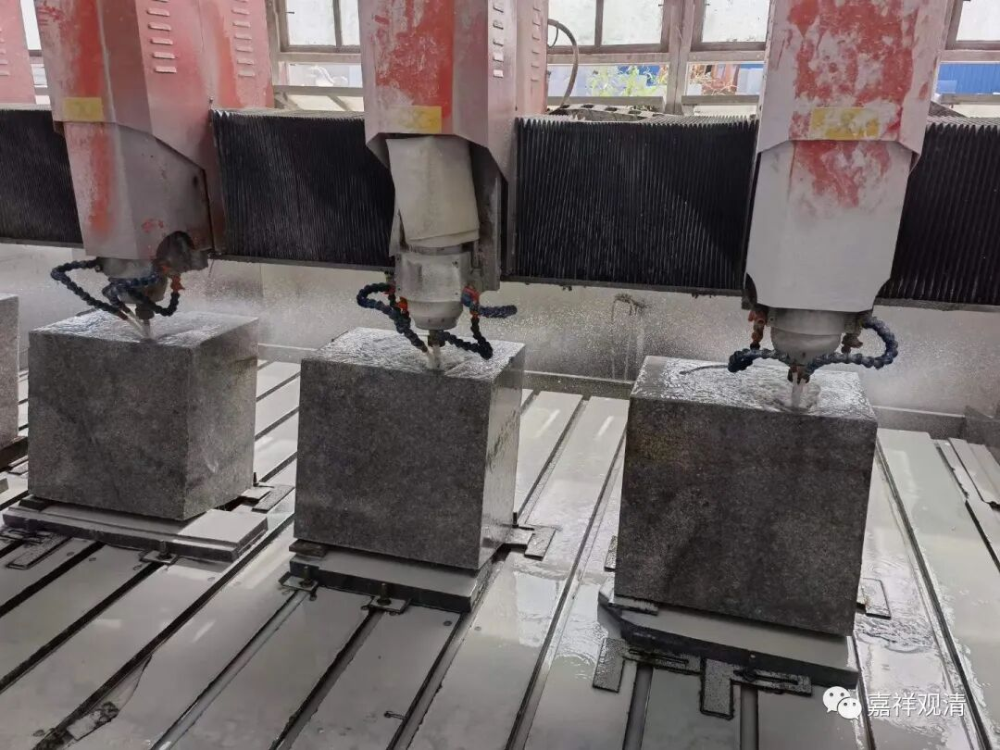

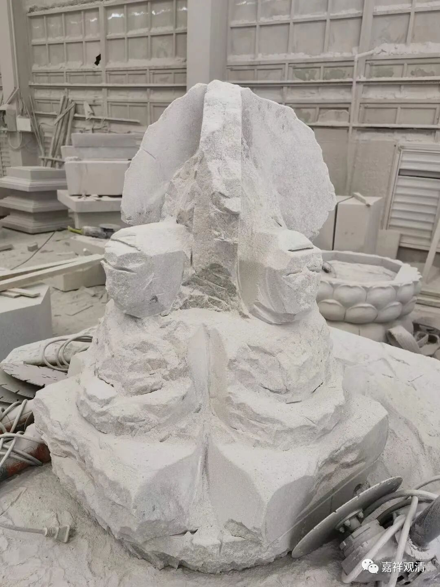

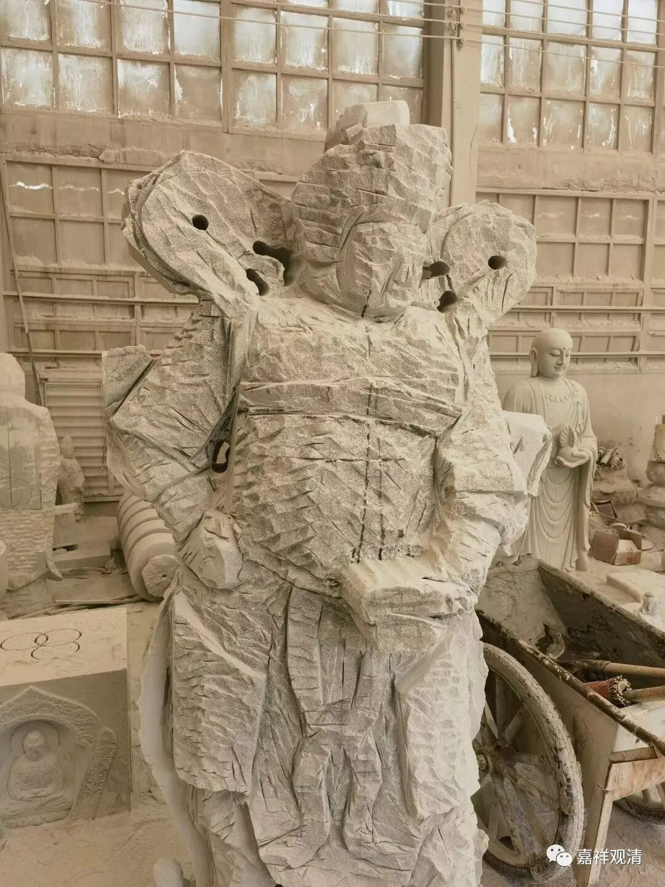

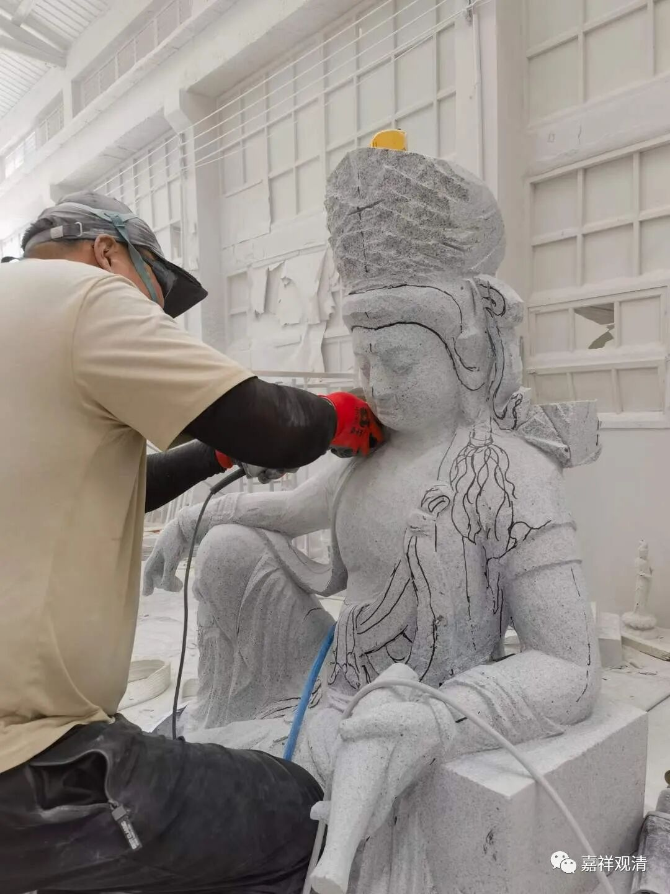

现在这些浮雕，加工都可以直接上机器，最后做些修补、精加工即可。部分拼装的佛像也可以用机床完成大部分工作，大概只有圆雕的才最废人工。“现在人工贵、材料贵。”

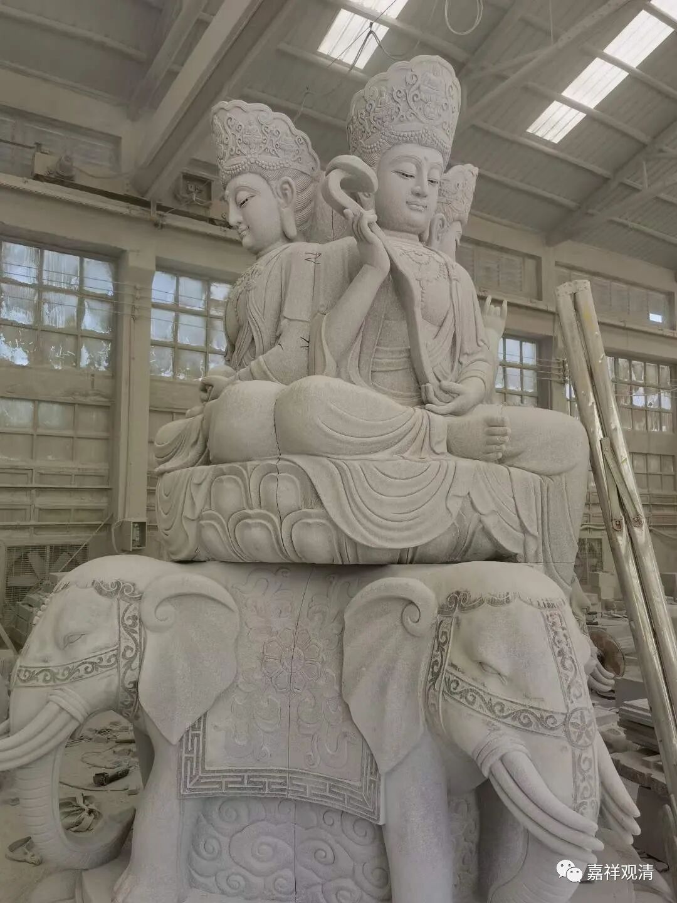

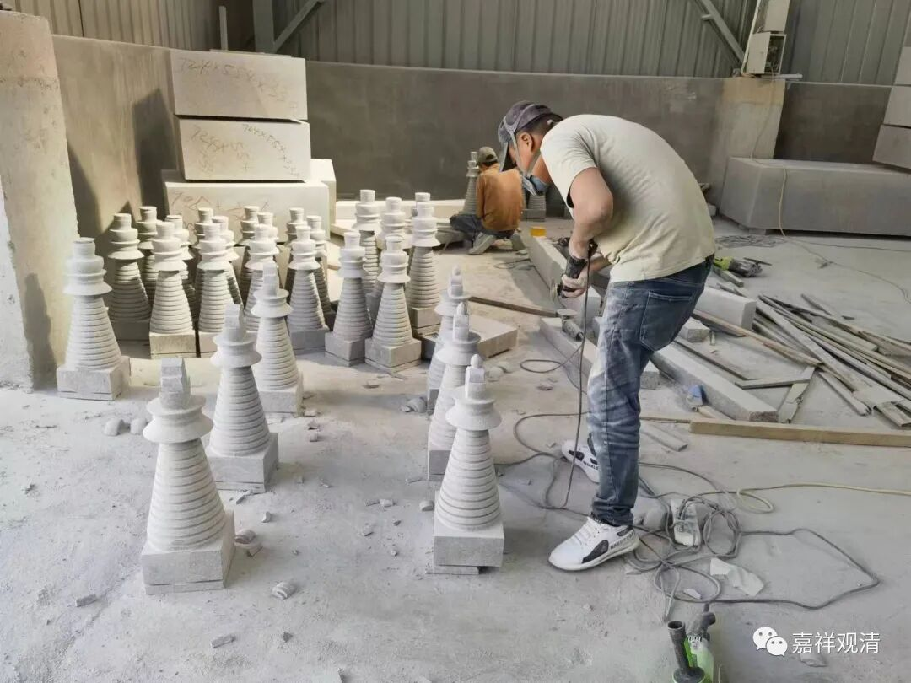

我说你们可以做一个展示中心，让我看看你们能做啥。老板说做出来的都恨不得立刻卖掉（最好还没做就卖掉了），货主也都要求尽快提货，所以基本上没机会有东西剩下来展示……不过我看路边上有些就是有些货摆放在外边算是展示的，老板说，那大部分都是没厂子光接订单、销售的——接到的单子再去找厂家做，“也有厂子就开在大路边上的，那就同时做销售展示了。”

……

