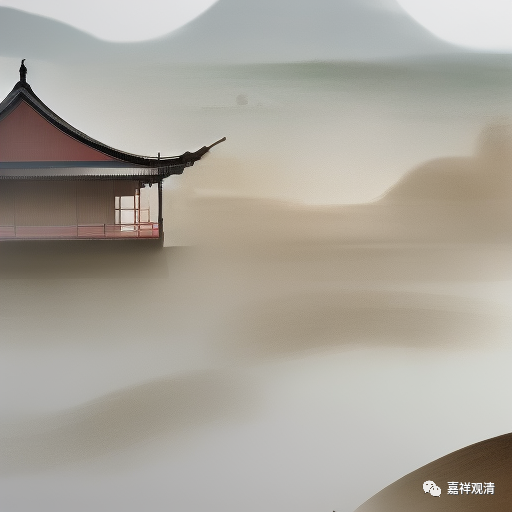

**微课堂佛教史 424·1

好，我们继续唯物地……呵呵，我们继续讲佛教史里面的禅宗史。

禅宗史我们现在讲到了北宋，这个时候主要的宗派已经是临济和曹洞了。我们之前也讲过，曹洞这一系的发展实际上和临济也有很大的关系。

我们已经从投子义青禅师讲到了芙蓉道楷禅师。芙蓉道楷禅师脾气很硬，是吧？宋徽宗给他的封赏都不要。皇帝赐他紫袈裟，是非常荣耀的事情。但是他直接退回——不要！皇帝再派人去劝他，他也不听。总共派了两拨人去劝他，一拨是推荐他的人去劝，他也说不行。另外再派一拨人——有司，就是现管的人去劝，甚至说你可以托病，他都不肯，非常刚。而且他还是人家宋徽宗的皇家寺院的住持，这么不给面子，宋徽宗火大了。

但是我们说过，这个背后是有其他原因的，因为宋徽宗这个时候开始对佛教下黑手了。呵呵，也不好说是下“黑”手，人家是皇帝嘛，是吧？反正就是对佛教开始不友好了。

前两天是出于什么原因我忘了，又看到了关于宋徽宗的一些事情。不过说起来，他也是在历史上能够开创一个体的人，这种人在书法史上也不多，是吧？还包括画画，是吧？他真的是在中国历史上绝对能够留下名字的一个文人。但是，对于佛教、治国等等都不是他的强项……至少到后来，治国是很不行，是吧？对佛教也是曾经下过黑手，但是后来又略略矫正过来了。

在历史上大家比较了解的就是，宋徽宗叫道君皇帝，是吧？自己称自己是道君，其实是被道士骗的。有时候这种一般程度的文人（中级知识分子）真是也很容易被骗的，就是那种不是很高等的，不是真的抱有自己主见的文人，底层的知识分子蛮容易被骗的。芙蓉道楷禅师就很不给他面子。

哎，是为什么呢？前两天我在哪里看到的宋徽宗的东西了？我都忘了，是博物馆吗？还是有个碑什么的？有点忘了，反正跟我们这次的五台之行有关。

那么，我们说芙蓉道楷禅师是投子义青禅师的弟子，投子义青禅师后来就把他从浮山法远禅师那里得到的大阳警玄禅师的皮履（皮鞋）、直裰（你可以理解为海青，便服）这两样就交给芙蓉道楷禅师了。芙蓉道楷禅师就相当于被承认是正宗付法弟子了。

