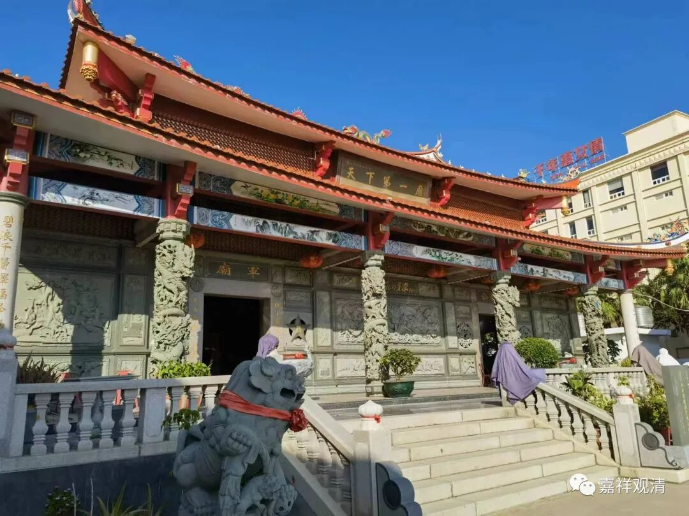

**天下第一庙**

惠安有一座很有名的“天下第一庙”，又叫“解放军庙”，我在网上找宾馆的时候偶然看到它，就决定，这个地方必须要去。

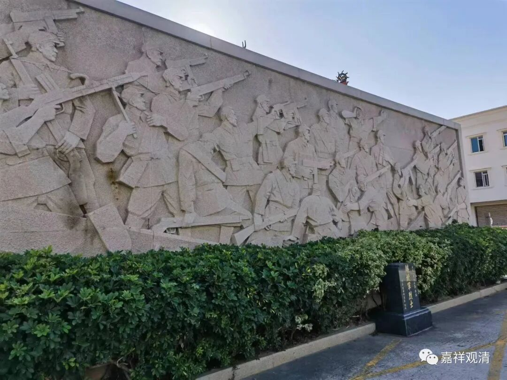

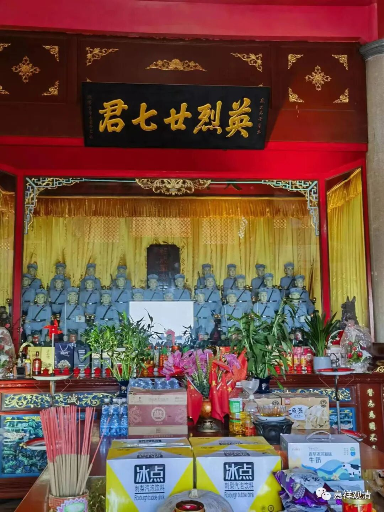

“天下第一庙”就在海滩边上，不算太大。

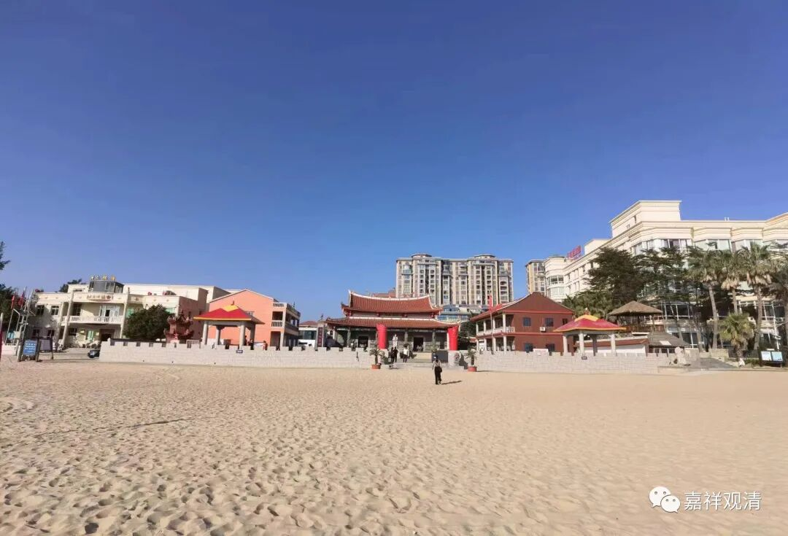

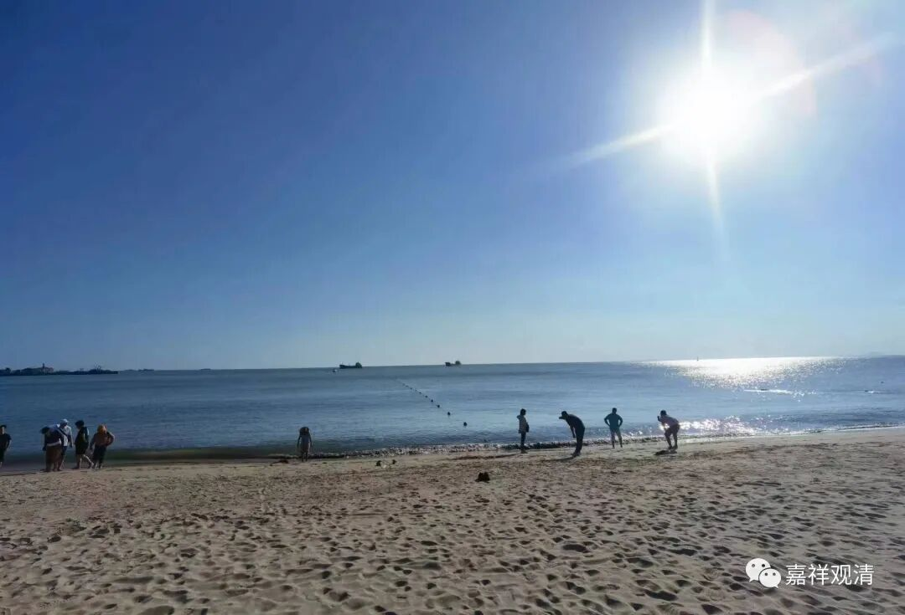

当年，海峡对岸军机袭来，沙滩上人群四散，有一个新加坡归侨的孩子吓愣了，没动地方。当地解放军毅然决定暴露自己阵地开枪射击敌机，有五个解放军战士护住小女孩……小女孩得救了，战士牺牲了……此次事件一共牺牲了24位解放军战士。

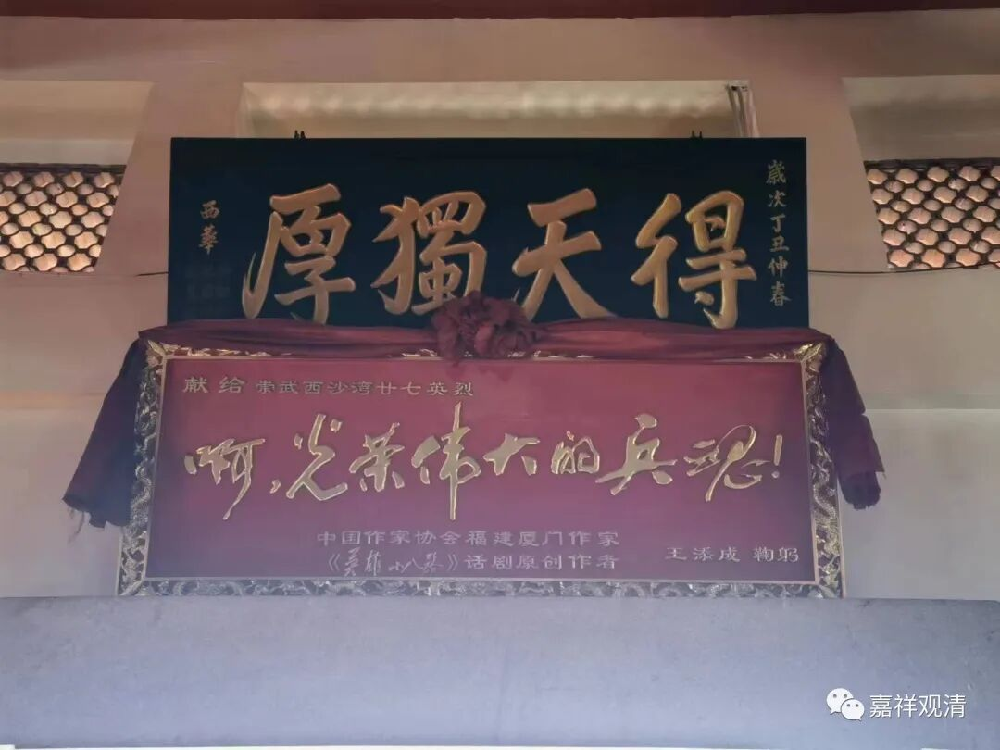

当地人收葬了烈士，并按当地习俗立了小庙纪念。女孩家人给女孩改名叫“曾恨”，用以记住对敌人的仇恨。小女孩子长大后奔走四方，最后建了这座解放军庙。原部队领导开国上将叶飞将军闻讯欣然题词——

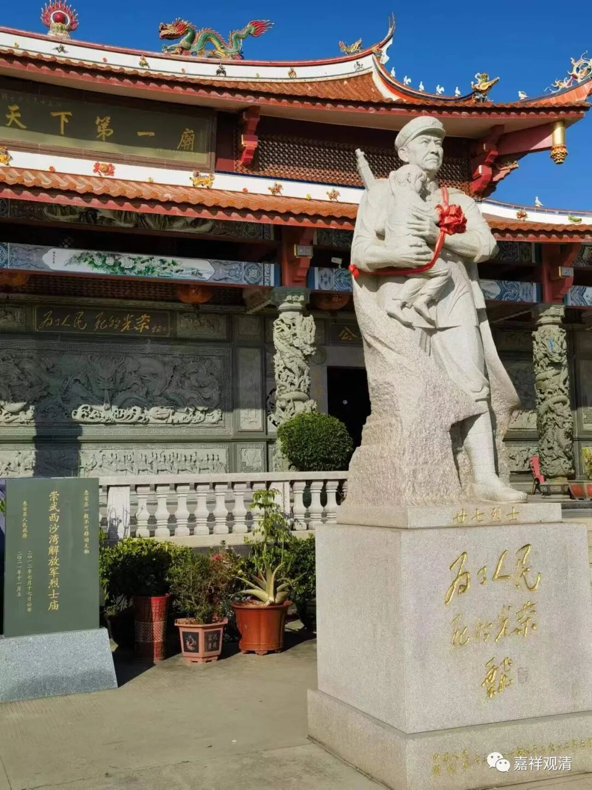

“为了人民，死的光荣”

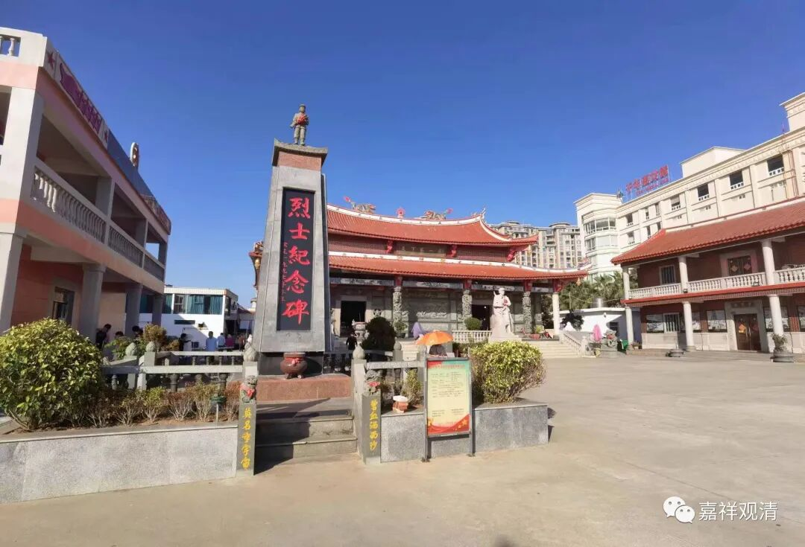

建庙后，有关单位专门寻找烈士的家人，最后仅找到六位烈士的家人……

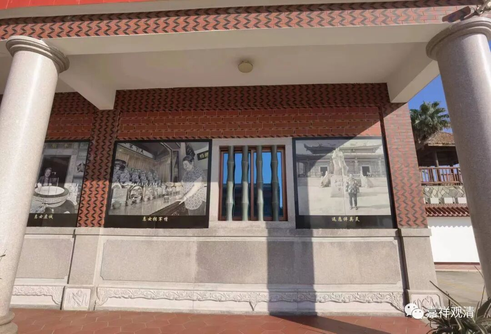

这就是那位当年被救的小女孩。我们问了，今天老阿姨不在（平时就是她主要帮忙打理。）。

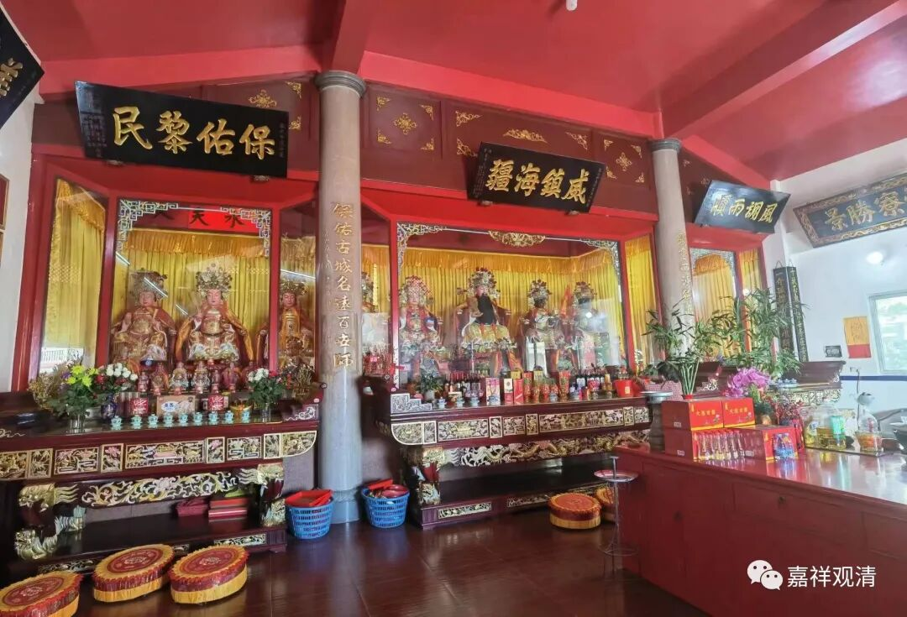

解放军庙的边上是当地的和寮公庙，供的是和寮公和四大总巡，这也是清代制止过地方械斗的真实人物，有功于地方，所以修了庙。

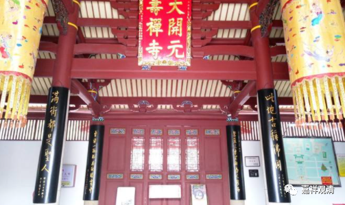

朱熹说泉州“此地古称佛国，满街都是圣人”，我怀疑他说的大概是——这里是个人就可以被供起来！

