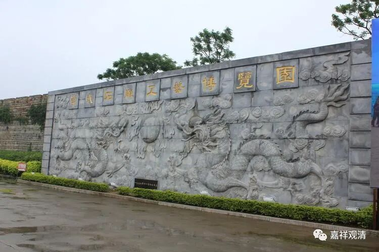
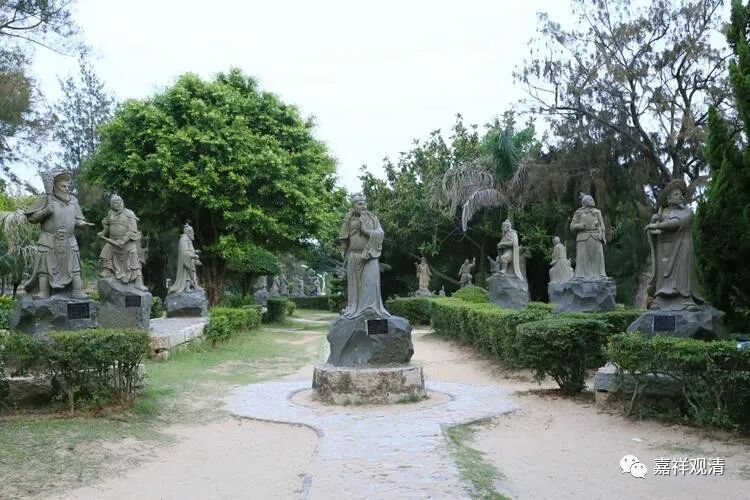
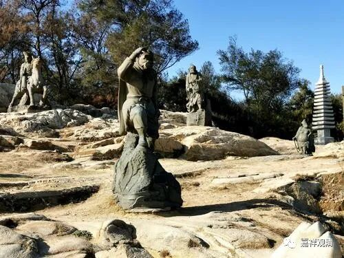
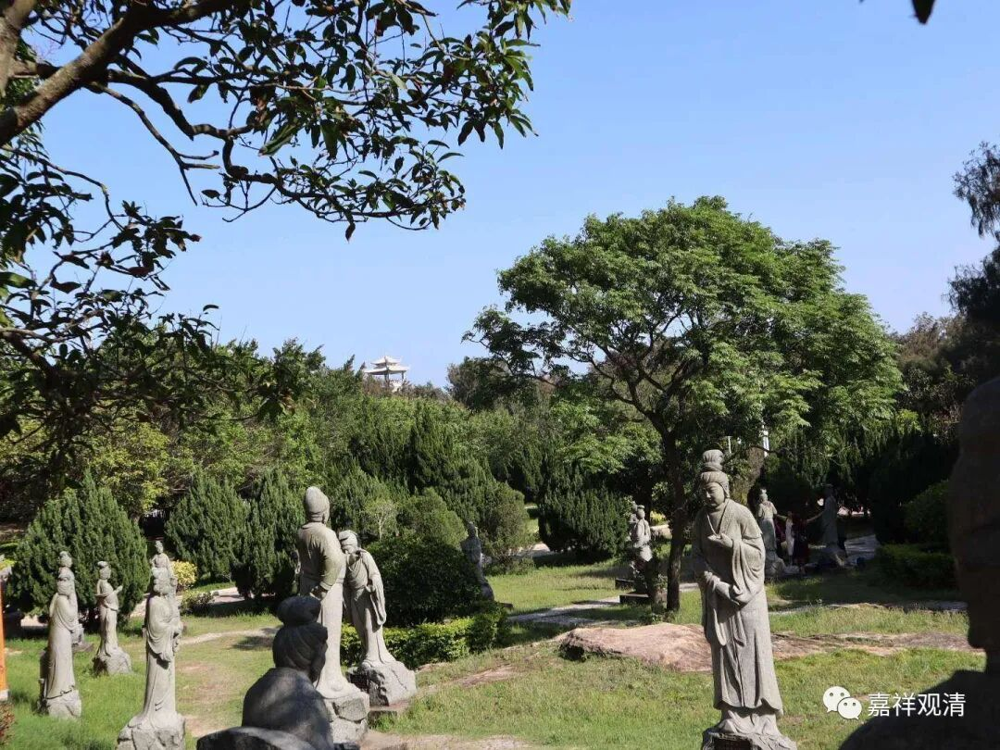
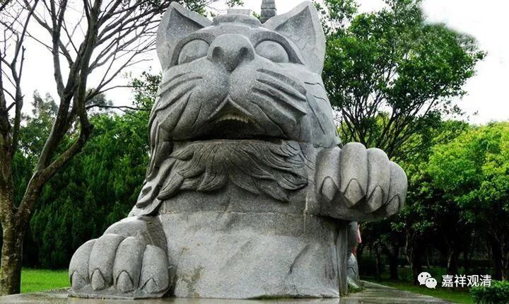
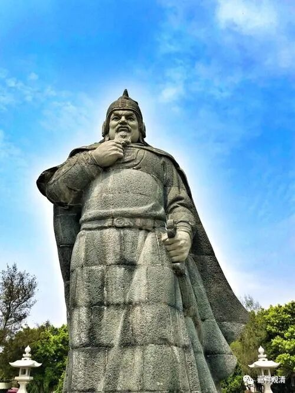
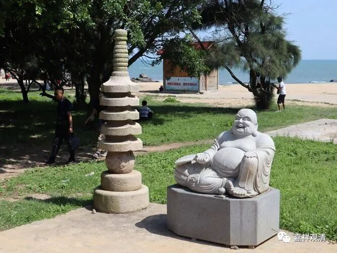
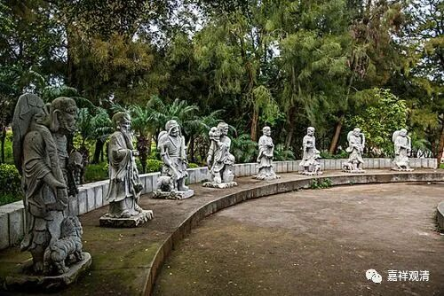
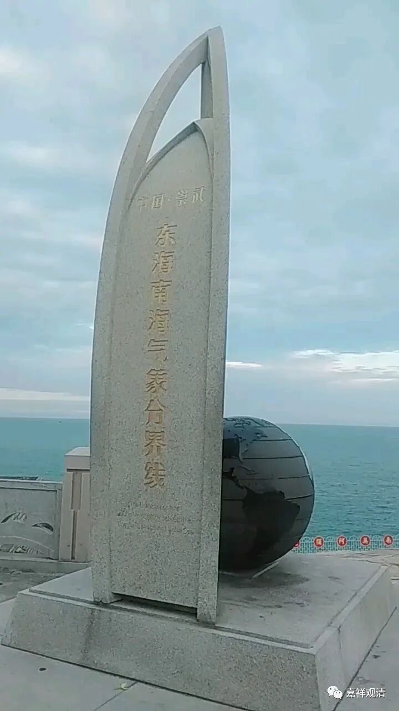
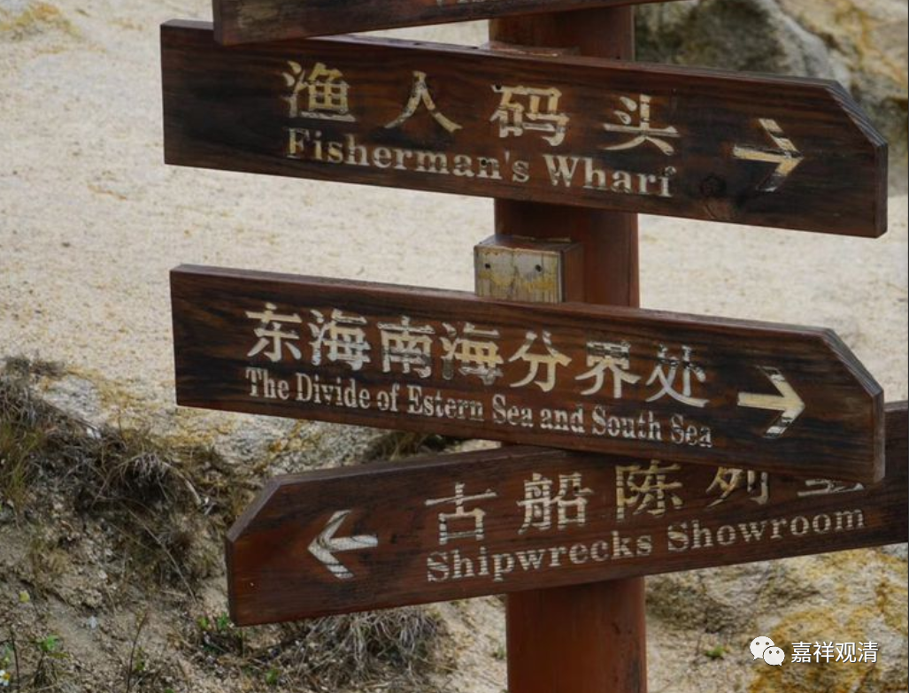

**崇武石雕工艺博览园**

为了石雕而来，所以到了惠安崇武，必须要去崇武石雕博览园。

石雕厂老板“亲自”带我去的。他说，上一次来的时候，还在和姑娘谈恋爱，后来姑娘成了他老婆……现在，孩子都上中学了。

石雕园就在崇武古城外的海边上。老板说，当年做石雕园的时候，意思就是给当地的石雕产业做一个对外的展示窗口，当时对本地的石雕厂大量征集作品，要求每个厂子按人头一人一件。我问大家还踊跃不？老板说，这就是打广告啊，很多肠子直接就包下一个系列，《水浒》一百单八将、红楼梦人物、西游记人物、三国人物、十二生肖、戚继光大型石雕、黑猫白猫……石雕适当的位置都打上厂家名，老板说，当年他还没入这行，如果当时也有厂子的话，那铁定认认真真交几件“尖货”！

我说你们这种专业的给我介绍介绍这些石雕都怎么样？（其实我在军庙就问他“这里的石雕怎么样？”按他的说法，当年做的东西，现在看起来就像半成品。）他说现在的工艺和工具全面超越刚开园的时候了：他给我仔细说：“这里应该打磨光滑”、“这里应该磨砂”、“这里细节表现不够”，“这里是当年用铁扦凿的，今天用砂轮，出活儿快，还更光滑”、“这块是拼接的，今天用电脑计算、电锯切割，可以没有这么明显的拼接痕迹”“这种样子的塔，现在可能都卖不出去”……但是他说：“别看工艺上现在进步了，但这些老东西的原料价格可贵了。现在这些原料要比工价贵！”

东海南海气象分界点

石雕园里还有一个标志——东海南海气象分界线。这里以南和以北的气候、气象条件有明显差别，气温平均差2～3度，风力也要差2级左右。

福建漳州东海南海分界处

不过这是气象分界线，东海南海实际分界线在漳州的东山岛。（看到网上有几种说法，一种说我国南海和东海的分界线是广东南澳岛——台湾鹅銮鼻一线，也有说是粤闽交界点至台湾鹅銮鼻一线。）

